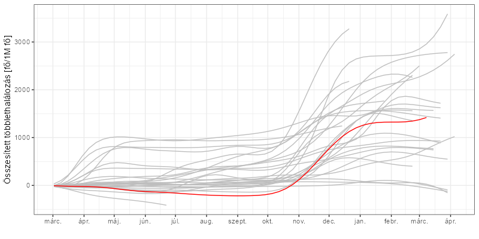
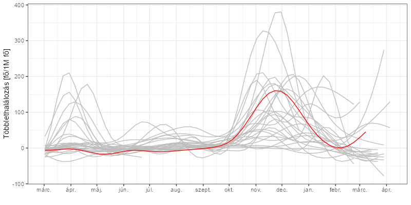
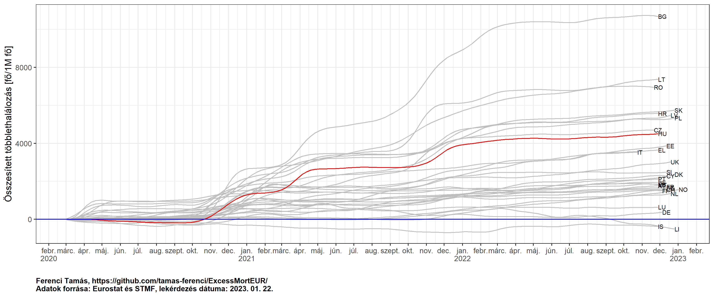
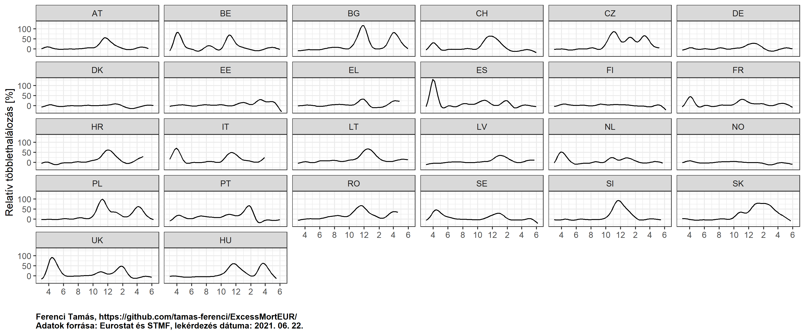

Többlethalálozási adatok európai összevetésben
================

Ez az oldal

## A többlethalálozási mutatóról általában

Jelen írásomban megpróbálom a többlethalálozási mutató hátterét és
tágabb kontextusát bemutatni, megvilágítva a kérdés tudományos hátterét,
nehézségeit. Úgy vélem, hogy ezek a kérdések nem lehetnek a tudósok meg
politikusok belügyei, a számok áradatában való tájékozódáshoz
mindenkinek meg kell adni a lehetőséget, hogy megismerje a járványügyi,
módszertani hátteret, mert csak így lehet értékelni, kritikusan
értékelni és értelmezni az elhangzó adatokat.

### A haláloki statisztikák problémái

Elöljáróban fontos rögzíteni, hogy *minden* haláloki besoroláson alapuló
statisztika közös problémája, hogy ezt a besorolást szinte soha nem
lehet jól elvégezni. A probléma oka, hogy kivételes esetektől eltekintve
– egészséges fiatalt elgázol egy autó – egy embernek általában nem *egy*
haláloka van. Ez a mostani járványtól függetlenül is igaz, de a COVID is
jó példát szolgáltat rá: elveszítünk egy tumoros, cukorbeteg
koronavírus-fertőzöttet; ő akkor most mibe halt bele? A rákba? A
cukorbetegségbe? A fertőzésbe? Nem arról van szó, hogy ez bonyolult
probléma, hanem arról, hogy ez *megoldhatatlan* probléma. Valamennyi ok
*hozzájárult* a halálához, tehát, ha szigorúan vesszük, valami olyasmit
kellene mondani, hogy 48 százalékban a tumorba halt bele, 33 százalékban
a cukorbetegségbe és 19 százalékban a fertőzésbe. Hiába is lenne
*elvileg* ez a helyes, az orvosi realitásnak megfelelő kép, ilyet nem
csinálunk (annyiban érthető módon is, hogy ember legyen a talpán, aki
ezeket a százalékokat megmondja): mindenkit egy halálokkal számolunk el.
Csakhogy innentől ezt nem lehet jól megtenni, illetve erős definíciós
bizonytalanság lesz abban, hogy hogyan tesszük meg. Mint látható, ez nem
egy kiküszöbölhető probléma: nem arról van szó, hogy jövőre majd
okosabbak leszünk, vagy fejlődik az orvostudomány, és akkor majd ezt
jobban tudjuk csinálni. Mindaddig, amíg a halált egyetlen okhoz
rendeljük, ez egy megoldhatatlan probléma.

Hozzá kell azt is tenni, hogy ez csak a probléma egyik fele, a másik,
konkrétabban a mostani helyzetre jellemző nehézség, hogy valójában a
halálozási statisztika is függ némileg a tesztelési aktivitástól. Az
igazolt esetekből alkotott járványgörbe hatalmas hátránya, hogy erősen
függ a tesztelés intenzitásától, és az is kétségtelen, hogy ezen a
problémán a halálozások görbéjének használata sokat javít – de azért
tökéletesen nem oldja meg. Rosszabb esetben elképzelhető, hogy még egy
gyanús tünetet mutató elhunytat sem tesztelnek a halál után sem, de nem
csak erről van szó, minden rosszhiszeműség nélkül is előfordulhatnak
„hát igen, a nagymamának gyenge volt a szíve, erre sajnos fel kellett
készülni" típusú esetek, ahol senki nem végzett tesztet, és soha nem
derül ki, hogy azért a dolog nem volt teljesen véletlen, mert a
háttérben volt egy infekció is. Az ilyen esetek előfordulása azonban
függ a tesztelési aktivitástól.

Itt tehát nagyon komoly definíciós kérdések vannak, ebből fakadóan pedig
sajnos nagy tere van az országok közötti adatszolgáltatási eltéréseknek.

### A magyar haláloki statisztikák adatszolgáltatási folyamata

Hazánkban két alapvető adatszolgáltatási folyamat révén nyerhetünk
információt a mostani koronavírus-járvány halálozási adatairól.

Az egyik az az eljárás, amely bármely haláleset bekövetkezésekor
megtörténik: törvényben pontosan meghatározott rend szerint a
halottvizsgálatot végző orvos kitölt egy Halottvizsgálati Bizonyítványt
(röviden HVB, orvosi köznyelvben elterjedt nevén a „hatpéldányos"),
melyben rögzíti a halálozással kapcsolatos fontos tényeket,
standardizált formátumban. (Apróbb kivételek vannak, például magzati
halálozás esetén, bizonyos folyamatok elektronizáltak, de ez most
számunkra nem lényeges.) A HVB egyik példánya ezt követően a KSH
megfelelő szervéhez kerül, ahol az Egészségügyi Világszervezet
ajánlásának megfelelő, részletekbe menően szabályozott algoritmus
szerint elvégzik a haláloki besorolást. Ez aprólékos munka, például, ha
nem egyértelmű a kitöltés, akkor a KSH validálja az adatokat a
területileg illetékes kormányhivatallal együttműködve. Természetesen az
eredmény nem mutathat pontosabb képet annál, ahogy a HVB-t kitöltötték,
illetve fontos hangsúlyozni, hogy akármilyen aprólékosan is dolgoznak,
az előző részben ismertetett limitációt nem lehet feloldani, hiszen az
elvileg lehetetlen.

Ez a folyamat nagyon lassú, heteket vesz igénybe, így egy éppen zajló
járvány esetén, ahol napi sűrűséggel van szükség adatra, nem
használható. Szükség van tehát egy gyorsabb besorolásra is; ez az,
aminek az adatait mindannyian halljuk a napi kommunikációban.

Sajnálatos módon Magyarországon a mai napig nincsen nyilvánosan, írásban
rögzítve, hogy milyen eljárásrend határozza meg, hogy ezen besorolás
szerint ki minősül koronavírusos halottnak. Tovább rontja a helyzetet,
hogy elhangzott ezzel kapcsolatban egy nyilvánvaló nyelvbotlás,
miszerint „valamennyi olyan elhunytat, akinél a betegség időtartama
alatt, vagy előtte bármikor
!
pozitív személynek regisztráltak, tehát készült nála laboratóriumi
vizsgálat, ami pozitivitást mutatott, mindenkit beszámolunk az elhunytak
közé". Ez természetesen – szerencsére – nem igaz, hiszen ha szó szerint
vennénk, akkor valakit, aki tavaly áprilisban megbetegedett majd
meggyógyult, majd ma elüti egy autó, azt elvileg koronavírusos
halottként kellene elszámolni. (Most olyan apróságokról nem beszélve,
hogy így a koronavírus halálozási aránya, tehát, hogy a fertőzöttek
mekkora hányada hal bele a betegségbe, garantáltan 100 százalék lenne…)
Erről természetesen nincs szó, a gyakorlatban senki sem fog törődni
azzal, hogy egy éve az elgázoltnak volt egy pozitív tesztje, de az
nagyon fontos lenne, hogy közzé legyen téve, hogy elvileg milyen
szempontok döntenek abban a kérdésben, hogy kit lehet koronavírusos
elhunytnak minősíteni. Az európai járványügyi szervezet, az ECDC például
[azt az
ajánlást](https://www.ecdc.europa.eu/en/covid-19/surveillance/surveillance-definitions)
fogalmazza meg, hogy nem koronavírus a halálok akkor, ha (1) van
egyértelmű, alternatív, a koronavírustól független mechanizmussal ható
halálok (pl. trauma autóbalesetben), vagy ha (2) a diagnózis és a halál
között teljes gyógyulás következett be. Több ország nem ez követi, hanem
egyszerűen bevezetett egy időbeli küszöböt is, tipikusan a diagnózistól
számított 28 napot, ameddig koronavírusos halálozásnak mutat ki egy
halálesetet, minden további vizsgálat nélkül. Persze, ez sem tökéletes
(valakit elüthet az autó a tizedik napon, vagy fordítva, feladhatja a
fertőzéssel való küzdelmet a negyvenediken), de ez legalább egy
definiált, reprodukálható algoritmus.

Senkit nem szeretnék kérdőre vonni egy szerencsétlen nyelvbotlás miatt,
de az már probléma, hogy ennek a nyelvbotlásnak a korrekciója, és a
valódi eljárásrend közlésével való helyesbítése a mai napig nem történt
meg.

### A többlethalálozási mutató előnyei és hátrányai

A többlethalálozás nagy előnye, hogy *tényleg* semmilyen szinten nem
függ a tesztelési aktivitástól. Ilyen szempontból úgy tűnhet, hogy ez a
legjobb indikátor (eltekintve most attól, hogy az összes mutató közül a
legnagyobb a késleltetése), azonban a helyzet sajnos nem ilyen egyszerű.

A többlethalálozásnak ugyanis két problémája is van. Az egyik, hogy a
többlethalálozás – definíció szerint – a tényleges halálozás és a
járvány nélkül *várt* halálozás különbsége. Az első adatsorral még nincs
is probléma, na, de azt honnan mondjuk meg, hogy hány haláleset lett
*volna*, ha nincs járvány?! Erre vannak egyszerűbb módszerek: például
alapul vehetjük a 2019-es halálozási adatot (közel van a vizsgált évhez,
de csak egyetlen évnyi adat, így bizonytalanabb), vagy vehetjük a
2015-2019 évek átlagát (a hosszabb periódus miatt biztosabb számok, de
gond lehet, ha időközben változtak a halálozási trendek), és akadnak
bonyolultabb módszerek is (görbét rakunk a megelőző évekre és azt
meghosszabbítjuk), ám végeredményben mindegyik egy *becslés*. Ebből
fakadóan mindig ott lesz a kérdés, hogy igazából mi sem tudhatjuk, hogy
tényleg ennyi halálozás lett-e volna, ha nincs a járvány.

A másik probléma sokkal jelentősebb: a többlethalálozás egy nettó
jellegű mutató, ami egybeméri a járvány direkt hatásaival (belehalnak
emberek) annak indirekt hatásait is. Hogy még rosszabb legyen a helyzet,
ezek a hatások egyaránt lehetnek pozitívak és negatívak. Pozitív
indirekt hatás, hogy a védelmi intézkedések más légúti fertőzések ellen
is jót tesznek, de kicsit elengedve a fantáziánkat, az is pozitív
indirekt hatás, hogy kevesebb autóbaleset történik. Negatív indirekt
hatás, hogy más betegség ellátása nehezedik meg, de itt is lehet
távlatibb kérdésekre gondolni, például mi van, ha megnő az
öngyilkosságok száma a szociális elszigetelődés miatt, vagy emelkedik az
– egészségügyi állapotot közismerten rontó – munkanélküliség a gazdaság
visszaesése miatt. Ezek feltárása véleményem szerint rendkívül fontos
feladat, és az első empirikus eredmények már meg is jelentek. (Amerikai
adatok szerint például megnőtt a kórházon kívüli szívmegállások
előfordulása és halálozási aránya, de az öngyilkosságra vonatkozóan
nincs egyértelmű negatív trend.) Nagyon fontos azonban hangsúlyozni,
hogy ezek elkülönítése lehetetlen a többlethalálozás alapján!

Sajnos a dolog mindkét irányban előfordulhat: elképzelhető olyan
helyzet, hogy nem halnak meg sokan, de a többlethalálozás magas (komoly
negatív indirekt hatások vannak), illetve az is, hogy sokan meghalnak,
még sincs lényeges többlethalálozás (komoly pozitív indirekt hatások
vannak). Ez szükségszerűen korlátozza a többlethalálozás gyakorlati
hasznosíthatóságát.

(A többlethalálozás további problémái és kérdései kapcsán bátran merem
ajánlani Janine Aron és John Muellbauer átfogó
[cikkét](https://ourworldindata.org/covid-excess-mortality).)

Remélem, a fentiekből is érzékelhető, hogy nincsenek univerzálisan
„jobb" és „rosszabb" mutatók, az ilyen indikátorokat mindig egészében
kell vizsgálni, és az átfogó kép alapján értékelni.

### A hazai többlethalálozási adatok, és nemzetközi viszonyításuk

Próbáljuk meg áttekinthetővé tenni a többlethalálozási mutatókat!
Először is, ne év alapú mutatókat nézzük (semmilyen kitüntetett
járványügyi jelentősége nincs a december 31-nek, hogy akkor vágjuk el az
adatokat), hanem egyszerűen folytonosan kezeljük az időt. Másrészt,
érdemesebb relatív mutató gyanánt a lélekszámmal osztani, így ugyanis
egy olyan mutatót kapunk, ami analóg a regisztrált halálozások
közlésével, hiszen azt is halál / millió főben szokták megadni. Ha a
többletet is millió lakosra osztjuk rá, akkor a kettő egymással is jól
összehasonlítható lesz.

Én az Eurostat
[adatai](https://appsso.eurostat.ec.europa.eu/nui/show.do?dataset=demo_r_mwk_ts&lang=en)
alapján kiszámítottam a többlethalálozást, mégpedig heti alapon,
egységesen az országokra, és valamennyi európai országra. Az elemzéshez
és ábrázoláshoz használt programot – a „nyílt tudomány" jegyében –
teljes egészében [nyilvánosságra
hozom](https://github.com/tamas-ferenci/ExcessMortEUR), így bárki
reprodukálhatja, ellenőrizheti és továbbfejlesztheti a számításaimat,
illetve itt elolvashatóak a módszertani részletek is.

A többlethalálozás számítása az egyik legkorszerűbb eljárással, [Acosta
és Irizzary
módszerével](https://www.medrxiv.org/content/10.1101/2020.06.06.20120857v2)
történt, mely kifinomult statisztikai eljárással igyekszik jól
meghatározni a múltbeli adatokból a viszonyítási alapot. Kihagytam
azokat az országokat, melyeknek 1 milliónál kevesebb lakosa van, illetve
nem volt megfelelő adat Svédországra és Lettországra. (Az 1 milliónál
kisebb országokat a lakosságszámra való ráosztás miatt hagytam el,
Svédország és Lettország pedig sajnos nem elhanyagolható mértékben nem
közölte a halálozások hetét.)

Kezdjük a járvány kezdete óta összesített adatokkal (piros görbe
Magyarország, a szürke görbék a többi európai országot jelölik):



(Az ábra a 2020. 04. 15. szerinti állapotot mutatja.)

Látható, hogy a legfrissebb adatok szerint – persze ne felejtsük, ez egy
hónappal ezelőtti állapotot jelent! – nagyjából a középmezőnyben
vagyunk, a rossz hír, hogy a nálunk rosszabb 5 ország mindegyikében már
javult a helyzet, míg nálunk gyorsan romlott ebben az időszakban, így
könnyen lehet, hogy őket meg fogjuk előzni. (Azaz már megelőztük, és így
a legrosszabb harmadban vagyunk, csak még nincsenek meg róla az adatok.)

Mit tudunk mondani az aktuális helyzetről? Ezt mutatják a heti adatok:



(Az ábra a 2020. 04. 15. szerinti állapotot mutatja.)

Mint látszik, itt már „most" (azaz március elején) rosszul állunk, tehát
április elején nagyon valószínű, hogy az aktuális járványügyi helyzetünk
– még e mutató szerint is – az összes európai ország közül a
legrosszabbak között van.

### Záró gondolatok

Teljes mértékben egyetértek azzal, hogy most nem személyi felelőst kell
keresni, ujjal mutogatni, hogy ki mit rontott el, ám messzemenőkig nem
értek egyet azzal, hogy a kérdést elintézzük olyan mondatokkal, mint
hogy ez az időszak „a gyászról és a megfeszített küzdelemről" szól. Nem,
itt nem lehet befejezni egy elemzést, ugyanis *épp* a gyászolóknak és
megfeszítve küzdőknek tartozunk azzal, hogy feltárjuk a hibák okait,
*pont azért*, hogy a jövőben minél kevesebben gyászoljanak, és legyenek
kénytelenek megfeszítve küzdeni.

Azzal tehetünk a magyar emberek egészségéért, ha feltesszük azt a
kérdést: mi az oka ezeknek az adatoknak? Csak akkor tudunk ugyanis tenni
a javításukért, ha értjük, hogy miért alakultak így. Miért halnak meg
ilyen sokan nálunk európai összevetésben? Azért, mert sokan
megfertőződtek (de ők már ugyanolyan valószínűséggel haltak meg, mint
más országokban) vagy azért, mert bár ugyanannyian fertőződtek meg, de a
magyar fertőzöttek nagyobb valószínűséggel haltak meg? Esetleg mindkettő
egyszerre, és ha igen, milyen arányban? Ha az előbbire gyanakszunk,
akkor például az intézkedéseket (a szigorúságukat és az időbeliségüket
is), azok betartásának fegyelmét kell vizsgálni, a tesztelési és
kontaktuskövetési stratégiát kell vizsgálni. Ha az utóbbit elemezzük,
akkor kétfelé ágaznak a lehetőségek. Vagy az emberek olyan jellemzőjében
van eltérés, ami befolyásolja a kórlefolyást, és könnyen eszünkbe is
juthatnak magyarázatok: mind kockázati tényezőkben (elhízás, dohányzás,
alkoholfogyasztás), mind krónikus betegségek terén jól ismert a magyar
lakosság kirívóan rossz állapota. A másik – nem feltétlenül kizáró –
lehetőség, hogy az egészségügyi ellátásban kell keresni a magyarázatot.
Az elérhető eszközök, gyógyszerek, az orvosok és szakdolgozók
képzettsége nem tér el lényegesen, de magyarázatul szolgálhat a
túlterhelődés? Vagy az, hogy a betegek ellátása nem egységes irányelvek
mentén zajlik? Itt jön képbe a másik vesszőparipám, járványtól
függetlenül: az objektív és transzparens teljesítménymérés hiánya a
magyar egészségügyben. Amíg nincsenek definiált, standard indikátorok,
melyek jellemzik az ellátásminőséget, fogalmunk sem lehet arról sem,
hogy egyáltalán ki csinál valamit jól, és ki rosszul, nem tudhatjuk,
hogy melyik kórházról vagy osztályról kell példát venni, és melyiknél
feltárni, hogy mi a rossz teljesítmény oka; végképp nem tudjuk az
egészségügyi rendszer egészét értékelni és összehasonlítani, akár
időben, akár más országokkal.

Nem állítom, hogy ezek a kérdések könnyen megválaszolhatóak, és részben
egyet is értek azzal, hogy a járványkezelés kiértékelése távlatot és
rálátást igényel, de nem teljes mértékben: ha valamit rosszul csinálunk,
azt jó minél hamarabb kideríteni, mielőtt túl sokáig csináljuk tovább
rosszul.

## Az európai többlethalálozási adatok elemzése

A számítások aktualizálásának dátuma: 2021-04-17.

Elsőként betöltjük a szükséges könyvtárakat:

``` r
library(data.table)
library(excessmort)
library(ggplot2)
```

A mortalitási adatokat az Eurostat-tól kérjük le (`demo_r_mwk_ts`
adatbázis), az `eurostat` csomag használatával. Leszűrjük, hogy mindkét
nem összesített adata legyen benne (ahogy életkor szerint sem bontunk),
majd kikóduljuk az évet és a hónapot:

``` r
RawData <- as.data.table(eurostat::get_eurostat("demo_r_mwk_ts", time_format = "raw"))
RawData <- RawData[sex=="T"]
RawData$year <- as.numeric(substring(RawData$time, 1, 4))
RawData$week <- as.numeric(substring(RawData$time, 6, 7))
```

Kidobjuk a 2002 előtti adatokat, és Svédországot valamint Lettországot,
így nem marad 99-es (azaz héthez nem rendelt) mortalitási adat:

``` r
RawData <- RawData[year>=2002&!geo%in%c("SE", "LV")]
sum(RawData$week==99)
```

    ## [1] 0

Dátumként az adott hét első napját használjuk; fontos, hogy az ISO 8601
szerinti hétbesorolást használja az Eurostat, amit az `ISOweek` csomag
kezel:

``` r
RawData$date <- ISOweek::ISOweek2date(paste0(RawData$year, "-W", sprintf("%02d", RawData$week), "-1"))
```

Csinálunk egy átnevezést, hogy később egyszerűbb legyen az illesztés:

``` r
names(RawData)[names(RawData)=="values"] <- "outcome"
```

A háttérpopuláció létszám adatait szintén az Eurostat-tól kérjük le
(`demo_pjan` adatbázis); szintén összes nemre és életkorra együtt:

``` r
PopData <- as.data.table(eurostat::get_eurostat("demo_pjan"))
PopData$numdate <- as.numeric(PopData$time-as.Date("1960-01-01"))
PopData <- PopData[age=="TOTAL"&sex=="T"]
PopData$geo <- as.factor(PopData$geo)
```

Ez minden év január 1-re vonatkozóan tartalmazza a lélekszámokat, ebből
úgy kapjuk meg az egyes hetek adatait, hogy egy spline illesztünk rá, és
abból kérjük le a megfelelő napokat. Ehhez az `mgcv` csomagot
használjuk; a dátumot pedig numerikussá kell alakítanunk, hogy át tudjuk
adni magyarázó változóként.

``` r
TempData <- merge(RawData, rbindlist(lapply(unique(RawData$geo), function(g)
  data.frame(date = unique(RawData$date), geo = g,
             population = predict(mgcv::gam(values ~ s(numdate), data = PopData[geo==g]),
                                  data.frame(numdate =
                                               as.numeric(unique(RawData$date)-as.Date("1960-01-01"))))))))
```

A többlethalálozás becsléséhez kizárjuk a mostani járvány időszakát (az
alapráta meghatározásához), majd az `excessmort` csomaggal elvégeztetjük
a számításokat. Kiszedjük a többlet abszolút értékét, illetve ehhez
standard hibát is számolunk (ezt kénytelenek vagyunk kézzel megtenni),
bár a mostani számításban nem lesz rá szükségünk:

``` r
exclude_dates <- seq(as.Date("2020-03-01"), max(RawData$date), by = "day")

res <- rbindlist(setNames(lapply(unique(TempData$geo), function(cntry)
  with(excess_model(TempData[geo==cntry], start = min(TempData[geo==cntry]$date),
                    end = max(TempData[geo==cntry]$date), exclude = exclude_dates),
       data.table(date = date,
                  excess = expected*fitted,
                  se = sapply(1:length(date), function(i) {
                    mu <- matrix(expected[i], nr = 1)
                    x <- matrix(x[i,], nr = 1)
                    sqrt(mu %*% x %*% betacov %*% t(x) %*% t(mu))
                  })))), unique(TempData$geo)), idcol = "geo")
```

Egyesítjük a többlethalálozási adatbázist a korábbi adatokkal, leszűrjük
a járvány időszakára, és kizárjuk az 1 millió lakosúnál kisebb
országokat (mert később lélekszámra akarunk osztani):

``` r
res <- merge(res, TempData, by = c("geo", "date"))
res <- res[order(geo, date)]
res <- res[date>=as.Date("2020-03-01")]
res <- res[geo%in%res[,.(tail(population,1)), .(geo)][V1>1e6]$geo]
```

Kiszámoljuk a – járvány eleje óta – kumulált többletet, illetve a
populációból is egy átlagot:

``` r
res[, cumexcess := cumsum(excess), .(geo)]
res[, cumpopulation := dplyr::cummean(population), .(geo)]
```

A `geo` átalakítjuk faktorrá, és beállítjuk, hogy Magyarország az utolsó
legyen, hogy az ábrázolásnál az kerüljön a legtetejére:

``` r
res$geo <- forcats::fct_relevel(as.factor(res$geo), "HU", after = Inf)
```

Az aktuális többlethalálozás:

``` r
ggplot(res, aes(x = date, y = excess/population*1e6, group = geo)) + geom_line(aes(color = geo=="HU")) +
  scale_color_manual(values=c("FALSE" = "gray", "TRUE" = "red")) + guides(col = FALSE) +
  labs(x = "", y = "Többlethalálozás [fő/1M fő]") + scale_x_date(date_breaks = "months", date_labels = "%b") +
  theme_bw()
```

<!-- -->

Az összesített többlethalálozás:

``` r
ggplot(res, aes(x = date, y = cumexcess/cumpopulation*1e6, group = geo)) + geom_line(aes(color = geo=="HU")) +
  scale_color_manual(values=c("FALSE" = "gray", "TRUE" = "red")) + guides(col = FALSE) +
  labs(x = "", y = "Összesített többlethalálozás [fő/1M fő]") +
  scale_x_date(date_breaks = "months", date_labels = "%b") + theme_bw()
```

<!-- -->

Kiszámoljuk a 3 betűs ISO-országkódot, a 2 betűs Eurostat kódból, hogy
később az OWID adatbázissal lehessen egyesíteni:

``` r
res$iso_code <- countrycode::countrycode(res$geo, "eurostat", "iso3c")
```

A jelentett halálozás céljából letöltjük az OWID adatbázist, kikóduljuk
ott is az évet és a hetet, majd áttérünk heti adatokra:

``` r
EpiData <- fread("https://raw.githubusercontent.com/owid/covid-19-data/master/public/data/owid-covid-data.csv")
EpiData$year <- lubridate::year(EpiData$date)
EpiData$week <- lubridate::isoweek(EpiData$date)
EpiData$new_deaths[is.na(EpiData$new_deaths)] <- 0
EpiData <- EpiData[,.(new_deaths = sum(new_deaths)) , .(iso_code, year, week)]
```

Egyesítjük az előbbi táblával, és a jelentett halálozásokat itt is
felkumuláljuk:

``` r
res <- merge(res, EpiData, by = c("iso_code", "year", "week"))
res[, cumnewdeaths := cumsum(new_deaths), .(geo)]
```

Megnézhetjük Magyarország példáján a kétféle adatsort:

``` r
ggplot(res[geo=="HU"], aes(x = date)) + geom_line(aes(y = excess/population*1e6, color = "red")) +
  geom_line(aes(y=new_deaths/population*1e6))
```

<!-- -->

Vagy a kettő viszonyát (pontosabban annak alakulását időben) az összes
országra:

``` r
ggplot(res, aes(x = date, y = cumexcess/cumnewdeaths, group = geo)) + geom_line() +
  coord_cartesian(xlim = c(as.Date("2020-07-01"), NA), ylim = c(-1, 3)) + facet_wrap(~geo) +
  geom_hline(yintercept = 1, col = "red")
```

<!-- -->

Érdekes lehet összevetni a kétféle mutatót az aktuális helyzet szerint:

``` r
ggplot(res[,tail(.SD, 1), .(geo)], aes(x = cumexcess/population*1e6, y = cumnewdeaths/population*1e6)) +
  geom_point(aes(col = geo=="HU")) + geom_abline() +
  scale_color_manual(values=c("FALSE" = "gray", "TRUE" = "red")) + guides(col = FALSE)
```

<!-- -->

Mivel a többlethalálozás jelentése nem végleges, ezért talán korrektebb
egy régebbi állapotot nézni:

``` r
ggplot(res[year==2021&week==1], aes(x = cumexcess/population*1e6, y = cumnewdeaths/population*1e6)) +
  geom_point(aes(col = geo=="HU")) + geom_abline() +
  scale_color_manual(values=c("FALSE" = "gray", "TRUE" = "red")) + guides(col = FALSE)
```

<!-- -->

Továbbfejlesztési ötletek:

-   Életkori és nemi lebontás. (Hátha mások a mortalitási trendek!)
