Többlethalálozási adatok európai összevetésben
================
Ferenci Tamás (<https://www.medstat.hu/>)

- [A többlethalálozási mutatóról
  általában](#a-többlethalálozási-mutatóról-általában)
  - [A halálozási statisztikák használatának általános
    motivációja](#a-halálozási-statisztikák-használatának-általános-motivációja)
  - [A haláloki statisztikák
    problémái](#a-haláloki-statisztikák-problémái)
  - [A magyar haláloki statisztikák adatszolgáltatási
    folyamata](#a-magyar-haláloki-statisztikák-adatszolgáltatási-folyamata)
  - [A többlethalálozási mutató definíciója és
    logikája](#a-többlethalálozási-mutató-definíciója-és-logikája)
  - [A többlethalálozási mutató előnyei és
    hátrányai](#a-többlethalálozási-mutató-előnyei-és-hátrányai)
  - [A halálozás mint mutató használatának általános
    problémái](#a-halálozás-mint-mutató-használatának-általános-problémái)
- [Módszertani kérdések](#módszertani-kérdések)
  - [A várt halálozások előrejelzése](#a-várt-halálozások-előrejelzése)
  - [A szezonalitás kérdése](#a-szezonalitás-kérdése)
  - [Acosta és Irizarry módszere](#acosta-és-irizarry-módszere)
  - [Ex ante és ex post
    többlethalálozás](#ex-ante-és-ex-post-többlethalálozás)
  - [Relatív és abszolút eredmények](#relatív-és-abszolút-eredmények)
- [Eredmények](#eredmények)
  - [A hazai többlethalálozási adatok, és európai
    viszonyításuk](#a-hazai-többlethalálozási-adatok-és-európai-viszonyításuk)
  - [Érzékenységvizsgálat](#érzékenységvizsgálat)
  - [Összevetés a jelentett
    halálozással](#összevetés-a-jelentett-halálozással)
- [Záró gondolatok](#záró-gondolatok)
- [Függelék](#függelék)
  - [A kétféle relatív mutató
    viszonya](#a-kétféle-relatív-mutató-viszonya)
  - [A direkt hatás elkülönítése: egy kísérlet az influenza-járvány
    kezelésére](#a-direkt-hatás-elkülönítése-egy-kísérlet-az-influenza-járvány-kezelésére)
  - [Acosta és Irizarry módszerének technikai
    részletei](#acosta-és-irizarry-módszerének-technikai-részletei)
- [Technikai részletek](#technikai-részletek)
- [Továbbfejlesztési ötletek](#továbbfejlesztési-ötletek)
- [Irodalmi hivatkozások](#irodalmi-hivatkozások)

## A többlethalálozási mutatóról általában

Jelen írásomban megpróbálom a többlethalálozási mutató hátterét és
tágabb kontextusát bemutatni a koronavírus-járvány példáján,
megvilágítva a kérdés tudományos hátterét, nehézségeit. Úgy vélem, hogy
ezek a kérdések nem lehetnek a tudósok meg politikusok belügyei, a
számok áradatában való tájékozódáshoz mindenkinek meg kell adni a
lehetőséget, hogy megismerje a járványügyi, módszertani hátteret, mert
csak így lehet értékelni, kritikusan értékelni és értelmezni az elhangzó
adatokat.

### A halálozási statisztikák használatának általános motivációja

Egy járvány helyzetének legdirektebb mutatója az új fertőzöttek napi
száma. Ez méri közvetlenül a fertőzöttségi helyzetet, és az összes
mérőszám közül a legkisebb késleltetésű, 24 órán belül ismertté válik.
Egy megjegyzés azért tartozik ehhez: valójában még ennek is van egy-két
hét késleltetése a *tényleges* fertőződési viszonyok változásához
képest. Ha ugyanis valaki megfertőződik, akkor először el kell telnie a
lappangási időnek a tünetek jelentkezéséhez; legyen egy hét a kerek
példa kedvéért. De itt még nincs vége: a tünetek jelentkezése után sokan
még várnak, mire orvost hívnak, utána az orvosnak meg kell rendelnie a
tesztelést, meg kell történnie a minta levételének, utána ismét várni
kell, mire megszületik az eredmény; ezek időtartama függ attól, hogy az
egészségügyi rendszer kapacitása és terheltsége milyen, egy-két nap
legjobb esetben is, rosszabb esetben sajnos akár egy hét is lehet, ha
nem több, láttunk erre példát Magyarországon a koronavírus-járvány
alatt. Ennél sokkal közelebb nem tudunk jutni, hiszen nem lehet minden
lakost minden nap letesztelni (és igazából a teszt sem válik azonnal
pozitívvá), a legjobb amit lehet tenni, ha a fertőzés igazolásakor nem
csak ennek dátumát írjuk fel, hanem megkérdezzük a beteget a tünetek
jelentkezésének dátumáról is, így legalább a késleltetés második forrása
levágható, ha csak utólag is; sajnos Magyarországon ezt az információt
nem gyűjtötte a népegészségügy a koronavírus-járvány alatt. Ez az
egy-két hét késleltetés is fontos, hiszen azt jelenti, hogy amit most
látunk a fertőzött-számban, az igazából az egy-két héttel *ezelőtti*
fertőzési viszonyokat tükrözi. Ami fordítva elmondva azt is jelenti,
hogy bármilyen intézkedés, ami ezt megváltoztatja, csak egy-két hét
múlva fog érvényre jutni! Hiába is vezetünk be például egy korlátozást,
ami az *új* fertőzések számát azonnal lecsökkenti, a *regisztrált*
fertőzöttek száma még egy-két hétig nőni fog. (De ez végülis teljesen
logikus: aki már elkapta a kórt, csak még nem jelentkeztek a tünetei,
azon nem fog segíteni az, hogy milyen intézkedést hoztunk, csak még idő
kell mire ő is megjelenik a kimutatásban.)

A fertőzött-számnak minden előnye mellett van egy hatalmas problémája:
függ a tesztelési aktivitástól. Ez kevésbé gond egy olyan betegségnél
mint mondjuk a kanyaró, ahol szinte minden betegnek tünetei vannak, és
ezek a tünetek szinte minden esetben elég látványosak és egyértelműek,
de nagyon nagy baj egy olyan helyzetben, ahol a fertőzöttek egy jelentős
részének csak enyhe, aspecifikus, más betegséggel is könnyen
összetéveszthető tünetei vannak, vagy egyáltalán nincsenek tünetei. Az
előbbieket elsősorban, az utóbbiakat kizárólag teszttel lehet
megtalálni, de innen kezdve az, hogy hány ilyet találunk meg, függeni
fog attól, hogy milyen intenzíven tesztelünk: ahol/amikor sokat
tesztelnek, ott/akkor több ilyet is megtalálnak, ahol/amikor kisebb a
tesztelési aktivitás, ott/akkor kevesebbet fognak. Ennek egy praktikus
következménye, hogy a fertőzött-számok országok közötti összevetése
életveszélyes, hiszen tesztelési aktivitásban hatalmas különbségek
lehetnek: egyáltalán nem biztos, hogy ahol több fertőzött van, ott
rosszabb a helyzet, sőt, simán lehet, hogy pont fordítva, ott
rendesebben tesztelnek, és így jobban tudják kezelni a járványt. Sajnos
a helyzet ennél is rosszabb: valójában nem csak az országok közötti, de
egy ország különböző időpontjai között összevetés is problémás lehet,
azaz egyáltalán nem biztos, hogy ha most több fertőzöttet regisztrálunk
mint múlt hónapban, akkor most rosszabb a helyzet, mert lehet, hogy
valójában menet közben megváltozott a tesztelési intenzitás.
Elképzelhető, hogy több fertőzöttet regisztrálunk, de közben a helyzet
nem romlott, csak elkezdtünk rendesebben tesztelni (és ez esetben az
kimondottan egy jó hír, hogy több fertőzött lett!), de sajnos
elképzelhető a fordított eset is, hogy a regisztrált fertőzöttek száma
stagnál, de közben a helyzet romlik (mondjuk mert beleütköztünk a
tesztelési kapacitások felső korlátjába). Lényegében annyi mondható,
hogy a fertőzött-szám jó mutató *akkor*, ha a tesztelési intenzitás
időben állandó. Lehet, hogy az abszolút számok ekkor is hibásak, mert
csak a fertőzöttek egy részét regisztráljuk, de ha ez az arány állandó,
akkor legalább a relatív viszonyok jók lesznek: ha most több van mint
egy hónapja, akkor most rosszabb a helyzet. De még egyszer, ez épít a
tesztelési aktivitás időbeli állandóságának – nagyon nehezen
ellenőrizhető, és a valóságban nagyon könnyen lehet, hogy nem teljesülő
– állandóságára.

Kitérő megjegyzésként érdemes itt beszúrni, hogy ezért érdekes mutató a
tesztpozitivitás, tehát, hogy az elvégzett tesztek mekkora hányada
pozitív: ez valamelyest mutatja, hogy a tesztelési program mennyire tud
lépést tartani a járvány terjedésével. Ha kellően alacsony, akkor
bízhatunk benne, hogy a tesztelési intenzitás megfelelő, de ha nagyobb,
akkor nem elégséges a tesztelés. Fontos tehát hangsúlyozni, hogy a
tesztpozitivitás ezt, a tesztelési program elégségességét méri, *nem* a
járvány helyzetét. De az elégségesség mérésére tényleg logikus tartalmú
mutató, hiszen azt mondja: ha el is szabadul a járvány, ez a mutató
akkor is behúzható egy küszöb alá – ha kellően sokat tesztelünk.
Néhányan olyat is szoktak tenni, hogy ez alapján próbálják “korrigálni”
a fertőzöttek számát, tehát ha a tesztpozitivitás megnő, akkor azt
mondják, hogy fertőzöttből is több van, mint a kimutatott, akár ezt
számszerűleg is meghatározva. Ez nagyon ingoványos talaj, mivel a
helyzet függ a tesztelési *mintázattól* is, tehát, hogy kiket, milyen
kockázatú alanyokat tesztelünk. Nagyon nem mindegy, hogy gyanús
tüneteket mutató alanyokat tesztelünk, kontaktus-személyeket tesztelünk,
egy cég az egyébként teljesen egészséges és nem kockázatnak kitett
munkavállalóit a “biztonság kedvéért” teszteli stb.

Tekintve a fertőzött-szám nagy problémáját, eléggé kézenfekvően adja
magát a következő mutató: a fertőzésben történő halálozások napi száma.
Hiszen az függ a tesztelési aktivitástól, hogy észrevesszük-e valakiről,
hogy fertőzött, de azt azért csak észrevesszük teszt nélkül is, hogy
él-e…! Ez az okfejtés jól hangzik, csak sajnos hibás: azt a fejlett
világban tényleg tudjuk, hogy valaki meghalt-e, csakhogy itt most nem
erre van szükség, hanem arra, hogy a fertőzés*ben* halt-e meg! Ennek
ismerete viszont igenis függhet a tesztelési aktivitástól: rosszabb
esetben egy gyanús tüneteket mutató elhunytat sem tesztelnek, de
teljesen jóhiszemű módon is előállhat ilyen: “hát igen, a nagymamának
gyenge volt a szíve, erre sajnos fel kellett készülni” – és senki nem
végez tesztet, és soha ki nem derül, hogy azért a dolog nem volt
teljesen véletlen, mert a háttérben volt egy infekció is. Az ilyen
esetek előfordulása márpedig igenis függ a tesztelési aktivitástól,
éppen ezért igaz rá minden, ami korábban elhangzott: eltérhet, akár
drasztikusan is, országok között, de sajnos még egy országon belül is
könnyen megváltozhat időben.

Tehát bár ez a mutató sem teljesen független a tesztelés intenzitisától,
de azért tény, hogy jóval kevésbé függ tőle, mint a regisztrált
fertőzöttek száma, hiszen a végül elhalálozó fertőzöttek általában
súlyosabb állapotban vannak, így valószínűbb, hogy tesztelik őket. Ilyen
értelemben tehát racionális e mutató használata is.

Milyen hátrányai vannak a halott-számnak a nem tökéletesen megszüntetett
tesztelési intenzitás-függésen túl? Az egyik, hogy jóval lassabb
indikátor: a fertőzött-számnál felsorolt összes késleltetés megjelenik
természetesen itt is, és még pluszban hozzájön a halálig eltelő idő, ez
adott esetben több hét is lehet. Összességében véve a halálozás-számnak
már simán lehet hónapon felül a késleltetése; és érvényes minden, amit
erről korábban mondtunk: aki most hal meg, az 4 héttel, 5 héttel, lehet,
hogy 6 héttel korábban kapta el a fertőzést, a halála az *akkori*
fertőzési viszonyokat tükrözi! Avagy, még másképp megfogalmazva: ha
bármit teszünk, annak a hatása halálozásokban 4-6 hét *múlva* fog csak
jelentkezni. Mindezeket tökéletesen szemléleti a koronavírus-járvány
2020 őszi helyzetéből a cseh adatok alakulása:

<!-- -->

Ez egy jól vizsgálható szituáció, mert a csehek egyetlen időpontban,
koncentráltan hoztak egy komoly szigorítást október közepén, ezt jelzi a
függőleges fekete vonal. (Ezt fontos külön is hangsúlyozni:
általánosságban véve a görbék összevetése az intézkedésekkel egy *nagyon
rossz* ötlet, mert a feltüntetett intézkedéseken vagy eseményeken kívül
ezernyi tényező változik az időben, így könnyen lehet fals, ha az ember
a tapasztalt változást automatikusan a feltüntettt dolgoknak tudja be.
Mi van, ha az igazi oka az ezernyi egyéb tényező egyike, vagy ezek
valamilyen keveréke? Itt menti a helyzetet, hogy egy nagyon rövid
időszakot nézünk, ami relatíve homogén volt intézkedések szempontjából,
és az egyetlen történés nagy hatású és időben koncentrált volt.)

Mit látunk? Azt, hogy ettől az intézkedéstől még mind a fertőzöttek
száma, mind a halálozások száma vidáman nőtt tovább, mígnem a beszélt
egy-két hét múlva a fertőzött-szám növekedése megállt (a felső tengelyen
láthatóak az intézkedés bevezetése után eltelt napok száma). Igen ám, de
a halottak száma még *ekkor is* teljesen változatlanul nőtt tovább, még
jó egy-két hétig! Ez a járványkezelés tehetetlensége, és mellesleg egy
nagyon fontos tanulsággal bír: a járványkezelésben nagyon veszélyes
taktika, hogy megvárjuk, amíg elromlik a helyzet, és majd akkor lépünk,
hiszen így fertőzöttek tekintetében még egy-két hétig, halálozásokban
még akár több mint egy hónapig az eredeti trend szerint fogunk
továbbhaladni! Amiből nagyon nagy baj is lehet, ha az egy gyorsan
növekvő trend…

A halálozási adat második problémája, hogy valójában nem csak a járvány
terjedését méri, hiszen függ a halálozási aránytól is, tehát, hogy egy
megfertőződött alany mekkora valószínűséggel hal meg. A halálozási adat
lényegében egybeméri a kettőt! Ráadásul a halálozási arány két dologtól
függ: a megfertőzödött alanyok általános állapotától (életkor,
társbetegségek, kockázati tényezők mint a dohányzás stb.) és a gyógyítás
hatásfokától. A probléma ezekből fakadóan hasonló, mint a fertőzöttek
számánál és a tesztelési intenzitásnál: elképzelhető, hogy a halottak
száma felmegy, de valójában nem romlott a fertőzési helyzet, csak
mondjuk valamiért kiesett egy kórház az ellátásból és ezért
túlterhelődött az egészségügyi rendszer, vagy épp fordítva, megjavul a
halálozás, pedig nem a fertőződési helyzet vált jobbá, csak épp
bevezettek egy új, hatásos gyógyszert. Elképzelhető, hogy javul a
halálozás, pedig a fertőződési helyzet tökéletesen változatlan, csak a
járvány fiatalabbak körére terjedt át, akik körében kisebb a halálozási
arány. Itt is igaz, hogy nem csak egy ország különböző időpontjainak az
összehasonlítása lehet problémás, mint az előző példákban, hanem a
különböző országok még azonos időpontban rögzített adatainak is: még ha
a kezelés hatásosságában nincs is nagy különbség, mert hasonló
gyógyszerek, eljárások érhetőek el, a lakosok alap-állapotának az
eltérése, például ha más a cukorbetegek aránya, akkor is különböző
halálozási arányokhoz fog vezetni. (Mindezek lényegében a
[confounding-ra](https://tamas-ferenci.github.io/FerenciTamas_AzOrvosiMegismeresModszertanaEsAzOrvosiKutatasokKritikusErtekelese/)
jelentenek példát!) Enyhítheti ezt a problémát többek között, ha
rétegzett adatokat használunk, tehát nem egybeöntve vetjük össze az
adatokat, hanem például a cukorbetegekét hasonlítjuk a cukorbetegekével
és a nem cukorbetegekét a nem cukorbetegekével – ezzel kiküszöböljük az
abból fakadó problémákat, ha a két országban eltérő a cukorbetegek
aránya. A gyakorlatban azonban ilyen adatok ritkán elérhetőek, talán
egyedül az életkor kivételével, szerencsére ez jól összefügg a krónikus
betegségekkel is. A korspecifikus adatok használata egy országon belül
is fontos lehet ha hosszabb távú trendeket szeretnénk vizsgálni, ahogy a
fiatalok körében terjedő járvány példája is mutatja.

Van azonban egy harmadik probléma, ami a mi mostani szempontunkból
különösen fontos lesz: az, hogy ez a mutató támaszkodik a haláloki
besorolásra. Hiszen a fertőzésben elhunytakról van szó, ehhez pedig
valahogy definiálni kell, hogy kit tekintünk egyáltalán fertőzésben
elhunyt személynek. A probléma az, hogy a haláloki besorolások általában
is nagyon problémásak tudnak lenni. Érdemes ezt a kérdést részletesebben
is megbeszélni, mert ez az, ami közvetlenül el fog vezetni a
többlethalálozási mutató gondolatához.

### A haláloki statisztikák problémái

Elöljáróban fontos rögzíteni, hogy *minden* haláloki besoroláson alapuló
statisztika közös problémája, hogy ezt a besorolást szinte soha nem
lehet jól elvégezni. A probléma oka, hogy kivételes esetektől eltekintve
– makkegészséges fiatalt elgázol egy autó – egy embernek általában nem
*egy* haláloka van. Ez a koronavírus-járványtól teljesen függetlenül is
igaz, de ez is jó példát szolgáltat rá: elveszítünk egy tumoros,
cukorbeteg koronavírus-fertőzöttet; ő akkor most mibe halt bele? A
rákba? A cukorbetegségbe? A fertőzésbe?

Ritkák a vegytiszta esetek, mégpedig mindkét irányban ritkák: hogy egy
makkegészséges alanyt elvisz a fertőzés vagy hogy egy fertőzött fejére
rádől egy kémény az utcán. Ezek a tiszta esetek, amikor 100% vagy 0% a
fertőzés hozzájárulása a halálozáshoz, de a valódi történetek többsége
nem ilyen, hanem szürke zóna, mint azt az előző bekezdés példája is
mutatja.

Ráadásul nem arról van szó, hogy ez “bonyolult” probléma, hanem arról,
hogy ez *megoldhatatlan* probléma. Valamennyi ok *hozzájárult* a
halálához, tehát, ha szigorúan vesszük, valami olyasmit kellene mondani,
hogy 48 százalékban a tumorba halt bele, 33 százalékban a
cukorbetegségbe és 19 százalékban a fertőzésbe. (Természetesen ezek a
számok teljesen hasraütésszerűek.) Hiába is lenne *elvileg* ez a helyes,
az orvosi realitásnak megfelelő kép, ilyet nem csinálunk – annyiban
érthető módon is, hogy ember legyen a talpán, aki ezeket a százalékokat
megmondja! Ehelyett mindenkit egy halálokkal számolunk el, csakhogy
innentől ezt nem lehet jól megtenni, illetve erős definíciós
bizonytalanság lesz abban, hogy hogyan tesszük meg.

Itt tehát nagyon komoly definíciós kérdések vannak, ebből fakadóan pedig
sajnos nagy tere van az országok közötti adatszolgáltatási eltéréseknek,
de akár egy országon belül is megváltozhat a helyzet időben.

### A magyar haláloki statisztikák adatszolgáltatási folyamata

Hazánkban két alapvető adatszolgáltatási folyamat révén nyerhettünk
információt a koronavírus-járvány halálozási adatairól.

Az egyik az az eljárás, amely bármely haláleset bekövetkezésekor
megtörténik: törvényben pontosan meghatározott rend szerint a
halottvizsgálatot végző orvos kitölt egy Halottvizsgálati Bizonyítványt
(röviden HVB, orvosi köznyelvben elterjedt nevén a “hatpéldányos”),
melyben rögzíti a halálozással kapcsolatos fontos tényeket,
standardizált formátumban. (Apróbb kivételek vannak, például magzati
halálozás esetén, valamint bizonyos folyamatok elektronizáltak, de ez
most számunkra nem lényeges.) A HVB egyik példánya ezt követően a KSH
megfelelő szervéhez kerül, ahol az Egészségügyi Világszervezet
ajánlásának megfelelő, részletekbe menően szabályozott algoritmus
szerint elvégzik a haláloki besorolást. Ez aprólékos munka, például, ha
nem egyértelmű a kitöltés, akkor a KSH validálja az adatokat a
területileg illetékes kormányhivatallal együttműködve. Természetesen az
eredmény nem mutathat pontosabb képet annál, ahogy a HVB-t kitöltötték,
illetve fontos hangsúlyozni, hogy akármilyen aprólékosan is dolgoznak,
az előző részben ismertetett limitációt nem lehet feloldani, hiszen az
elvileg lehetetlen.

Ez a folyamat nagyon lassú, heteket vesz igénybe, így egy éppen zajló
járvány esetén, ahol napi sűrűséggel van szükség adatra, nem
használható. Szükség van tehát egy gyorsabb besorolásra is; ez az,
aminek az adatait mindannyian hallottuk a napi kommunikációban.

Sajnálatos módon Magyarországon a járvány teljes időtartama alatt, pedig
évek lettek volna rá, semmikor – és még utólag sem – közölték
nyilvánosan, írásban rögzítve, hogy milyen eljárásrend határozza meg,
hogy ezen besorolás szerint *ki* minősül koronavírusos halottnak. (Az
NNK-nak van ugyan
[eljárásrendje](http://www.kozlonyok.hu/kozlonyok/Kozlonyok/12/PDF/2021/22.pdf)
a járvánnyal kapcsolatban, melyet többször [frissítettek
is](http://www.kozlonyok.hu/kozlonyok/Kozlonyok/12/PDF/2022/17.pdf), de
az csak az eseteket definiálja, a halálozások besorolásáról semelyik
verziójában nem mond semmit.) Tovább rontja a helyzetet, hogy elhangzott
ezzel kapcsolatban egy állítás, ami ugyan nyilvánvaló nyelvbotlás, de
mégiscsak a hivatalos sajtótájékoztatón tett hivatalos kijelentés volt,
miszerint “valamennyi olyan elhunytat, akinél a betegség időtartama
alatt, vagy előtte bármikor \[!\] pozitív személynek regisztráltak,
tehát készült nála laboratóriumi vizsgálat, ami pozitivitást mutatott,
mindenkit beszámolunk az elhunytak közé” (az Operatív Törzs
sajtótájékoztatója, [2020. november 16.](https://nava.hu/id/3713720/)).
Ez természetesen – szerencsére – nem igaz, hiszen ha szó szerint
vennénk, akkor valakit, aki tavaly ilyenkor megbetegedett és
meggyógyult, majd ma elüti egy autó, azt elvileg koronavírusos
halottként kellene elszámolni. (Most olyan apróságokról nem beszélve,
hogy így a koronavírus halálozási aránya, tehát, hogy a fertőzöttek
mekkora hányada hal bele a betegségbe, garantáltan 100 százalék lenne…)
Erről természetesen nincs szó, a gyakorlatban senki sem fog törődni
azzal, hogy mondjuk egy autóbaleset áldozatának egy évvel korábban volt
egy pozitív tesztje, de az nagyon fontos lett volna, hogy közzé legyen
téve, hogy elvileg milyen szempontok döntenek abban a kérdésben, hogy
kit lehet koronavírusos elhunytnak minősíteni. Az Európai Unió
járványügyi szervezete, az ECDC például [azt az
ajánlást](https://www.ecdc.europa.eu/sites/default/files/documents/COVID-19-surveillance-guidance.pdf)
fogalmazza meg, hogy nem koronavírus a halálok akkor, ha (1) van
egyértelmű, alternatív, a koronavírustól független mechanizmussal ható
halálok (pl. trauma autóbalesetben), vagy ha (2) a diagnózis és a halál
között teljes gyógyulás következett be. Több ország nem ezt követi, vagy
nem ezt követte a járvány bizonyos pontjain, hanem egyszerűen bevezetett
egy [időbeli küszöböt
is](https://assets.publishing.service.gov.uk/media/61fb93118fa8f53893357fc7/UKHSA-technical-summary-update-February-2022.pdf),
például a diagnózistól számított 28 napot, ameddig koronavírusos
halálozásnak mutat ki egy halálesetet, minden további vizsgálat nélkül.
Persze, ez sem tökéletes (valakit elüthet az autó a tizedik napon, vagy
fordítva, feladhatja a fertőzéssel való küzdelmet a negyvenediken), de
ez legalább egy definiált, reprodukálható algoritmus.

Senkit nem szeretnék kérdőre vonni egyetlen szerencsétlen nyelvbotlás,
vagy egy később finomított álláspont miatt, de az már probléma, hogy
ennek a kijelentésnek a korrekciója, és a valódi eljárásrend közlésével
történő helyesbítése semmikor nem történt meg, később sem. Jellemző,
hogy végül úgy juthatott a közvélemény bármilyen információhoz, hogy egy
parlamenti képviselő levelére válaszul megírta a tisztifőorvos, hogy a –
fent általam is említett – ECDC/WHO protokollt követjük, szemben,
szerencsére, a sajtótájékoztatón elhangzott kijelentéssel (de még ezt az
információt sem a népegészségügy maga hozta nyilvánosságra, hanem a
kérdéses parlamenti képviselő töltötte fel a Facebook-oldalára; a magyar
helyzet abszurditását mutatja, hogy ez a Facebook-bejegyzés, illetve a
benne belinkelt
[válaszlevél](https://m.blog.hu/sz/szelbernadettblog/image/nnk-tajekoztatas-muller_cecilia.pdf)
az egyetlen hivatalos információforrás a magyar eljárásrend ezen
aspektusáról…).

### A többlethalálozási mutató definíciója és logikája

Látható tehát, hogy mi a két nagy problémája a halálozási adatoknak,
amit jó lenne kezelni: meg kellene szabadulni a haláloki besorolástól
való függéstől, és a tesztelési intenzitástól megmaradt függést is jó
lenne kiküszöbölni. Az elsőn elgondolkozva juthatunk el a
többlethalálozás, mint mutató gondolatához: egyszerűen felejtsük el a
halálokot, és csak azt nézzük, hogy valaki meghalt-e, tehát a halottakat
számoljuk, függetlenül attól, hogy mibe haltak bele! Ez egy csapásra
megoldja a haláloki besorolás problémáját (hiszen arra nem is lesz
szükség), és a tesztelési aktivitástól való függést is komplettül
felszámolja (hiszen most már *tényleg* csak az számít, hogy valaki
meghalt-e, azt pedig a fejlett világban tudni fogjuk biztosan). Igen ám,
de az alapproblémát még nem oldottuk meg ezzel: lehet, hogy így már van
egy (össz)halálozási számunk, de honnan tudjuk, hogy ezen halálozásokból
mennyi tudható be a járványnak?

Az alapötlet a következő: a múltbeli halálozási adatok alapján, amikor
még nem volt járvány, készítünk egy előrejelzést az aktuális időszak
halálozási számára, ezt szokás várt halálozásnak nevezni, és azt
mondjuk, hogy ez mutatja, hogy mi lett *volna* ha nem lett *volna*
járvány. Hiszen olyan adatokat felhasználva készült, amikor még nem is
volt. (A “várt” szót itt természetesen nem abban az értelemben
használjuk, hogy valamire pozitív érzelmekkel várunk, hanem, hogy mi a
várakozásunk.) Ha fogjuk a tényleges halálozás-számot, és abból kivonjuk
ezt a várt értéket, akkor megkapjuk a járvány hatását! Természetesen a
módszerrel nem csak a koronavírus-járvány hatása vizsgálható, hanem
bármilyen, mortalitást módosító eseményé.

Félig előrefutva, így néz ki az elmúlt bő két évtized tényleges magyar
heti halálozása, rajta a – későbbiekben bemutatandó módszerrel
meghatározott – várt halálozás:

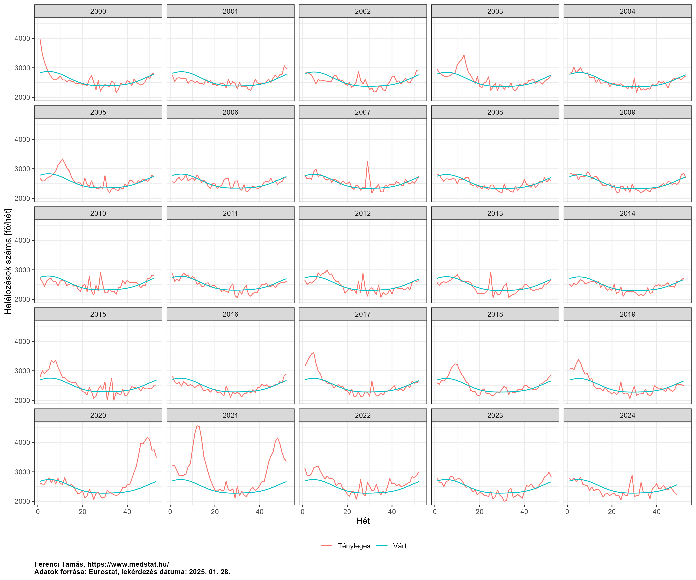<!-- -->

Ez nagyon jól mutatja a módszer működését: azt vizsgáljuk, hogy a
tényleges görbe mikor – és mennyire – ment a várt fölé. A
koronavírus-járvány hatása nagyon durva, további kommentárt nem is
nagyon igényel, de érdemes megnézni, hogy közel nem az egyetlen eltérés:
sok télen látszik egy csúcs (téli többletmortalitás, tipikusan ezt
szokták az influenzának megfeleltetni), például 2016/17-es szezon nagyon
rossz volt, de előfordul ilyen kiugrás nyáron is (például 2007-ben
nagyon látványos, ez egy hőhullám hatása). Nagyon érdekes ezt összevetni
azzal, ahogy a mögötte lévő jelenségekről annak idején a sajtó is
beszámolt (mint a [2007-es
hőhullámról](https://www.met.hu/ismeret-tar/erdekessegek_tanulmanyok/index.php?id=1969&hir=Hohullamok:_ami_ma_szelsoseges,_az_a_jovoben_valoszinuleg_atlagos_lesz)).

### A többlethalálozási mutató előnyei és hátrányai

A többlethalálozási mutatónak két hatalmas előnye van tehát: az egyik,
hogy teljesen érzéketlen a haláloki besorolásra, a másik, hogy immár
tényleg semmilyen szinten nem függ a tesztelési aktivitástól.

Ahogy azonban az eddigi esetekben is történt, ezek az előnyök sem jönnek
ingyen.

Az egyik probléma, hogy a többlethalálozás az összes közül a leglassabb
mutató, hiszen meg kell várni a halálesetek anyakönyvezését, és azok
központi összesítését. Ezért ezek az adatok legjobb esetben is csak a
bekövetkezés után egy hónappal válnak elérhetővé (és persze ne feledjük,
hogy az egy hónappal ezelőtti halálozások meg az *az előtt* egy-másfél
hónappal korábbi fertőződési viszonyokat tükrözik!), de általában pár
hétig még ez után is történnek korrekciók, jellemzően felfelé, a késve
beérkező jelentések miatt. Ezen korrekciók mértéke ráadásul nem is
igazán mondható meg biztosan, függ attól, hogy a rendszer túlterhelődése
mekkora, akár helyileg is. Az Eurostat-hoz [leadott
adatok](https://ec.europa.eu/eurostat/cache/metadata/en/demomwk_esms.htm#accuracy1706014835120)
szerint a magyar jelentés teljeskörűsége 96% a legfrissebb közzétett
adatra nézve és ez 5 hét alatt éri el a 100%-ot. (Mindazonáltal egy
hangyányit gyanús, hogy míg más országok olyan számok adtak le a
hetenkénti teljeskörűségre, mint 93,20%, 95,97%, 97,02%, nálunk ez úgy
néz ki, hogy 96,00%, 97,00%, 98,00%… úgyhogy valószínűleg inkább hasból
közöltünk számokat és nem a tényleges korrekciókat néztük meg
empirikusan, emiatt talán jobb, ha a magyar adatokat inkább irányadónak
vesszük.)

A többlethalálozásnak azonban ezen túl is van két nagyon komoly
problémája. Az egyik, hogy a többlethalálozás – definíció szerint – a
tényleges halálozás és a járvány nélkül *várt* halálozás különbsége. Az
első adatsorral még nincs is probléma, na, de azt honnan mondjuk meg,
hogy hány haláleset lett *volna* például 2020-ban, ha nincs járvány?!
Ahogy szó volt róla, erre valamilyen statisztikai, idősor-előrejelző
módszert kell használni, mely a múltbeli – tehát járvány nélküli
helyzetet tükröző – adatokból készít előrevetítést. Erre vannak
egyszerűbb módszerek: például alapul vehetjük a 2019-es halálozási
adatot (közel van a vizsgált évhez, így a halálozás változásának
esetleges hosszútávú trendje a legkevésbé rontja el, de csak egyetlen
évnyi adat, így bizonytalanabb), vagy vehetjük a 2015-2019 évek átlagát
(a hosszabb periódus miatt kevésbé ingadozó szám, de gond lehet, ha
időközben változtak a halálozási trendek), és akadnak bonyolultabb
módszerek is (egyenest illesztünk a megelőző évek adataira és azt
meghosszabbítjuk), ám végeredményben mindegyik egy *becslés*. Jobb vagy
rosszabb, de mindenképp csak becslés, ebből fakadóan mindig ott lesz a
kérdés, hogy igazából mi sem tudhatjuk, hogy tényleg ennyi halálozás
lett-e volna, ha nincs a járvány.

A másik probléma, hogy a többlethalálozás egy bruttó jellegű mutató,
értve ez alatt azt, hogy egybeméri a járvány direkt hatásaival
(belehalnak emberek) annak indirekt hatásait is. Hogy még rosszabb
legyen a helyzet, ezek az indirekt hatások egyaránt lehetnek pozitívak
és negatívak. Pozitív indirekt hatás, hogy a védelmi intézkedések más
légúti fertőzések ellen is jót tesznek, de kicsit elengedve a
fantáziánkat, az is pozitív indirekt hatás lehet, hogy kevesebb
autóbaleset történik. Negatív indirekt hatás, hogy más betegség ellátása
nehezedik meg, de itt is lehet távlatibb kérdésekre gondolni, például mi
van, ha megnő az öngyilkosságok száma a szociális elszigetelődés miatt,
vagy emelkedik az – egészségügyi állapotot közismerten rontó –
munkanélküliség a gazdaság visszaesése miatt. Ezek feltárása véleményem
szerint rendkívül fontos feladat, és az első empirikus eredmények már
meg is jelentek.

Nézzük meg például, hogy a [KSH
adatai](https://www.ksh.hu/stadat_files/nep/hu/nep0010.html) alapján
hogyan alakult a járvány első évében az autóbalesetben és az
öngyilkosság miatt meghaltak száma Magyarországon:

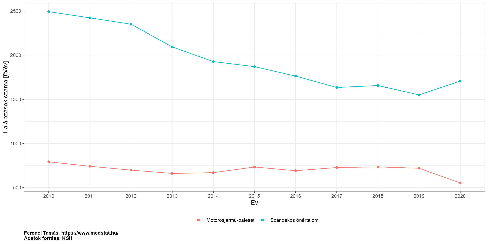<!-- -->

A mintázat nagyon látványos, mindkét fenti jelenség szemléltetésére.
Fontos persze hangsúlyozni, hogy ez egy nagyon durva felbontású
eredmény, azt például végképp nem bizonyítja, hogy ez minden életkorban,
nemnél, szocioökonómiai helyzetben stb. is így van. Ami még fontosabb,
hogy ez csak illusztráció, nem arról van szó, hogy ezek lennének a
legjelentősebb indirekt tényezők (az influenza visszaszorulása például
egész biztos, hogy lényegesebb az egyik irányban, az elmaradó ellátások
pedig a másikban), viszont sokkal biztosabban megragadható adatok és az
alapgondolatot jól mutatják.

E tényezők elkülönítése tehát lehetetlen, vagy szinte lehetetlen a
többlethalálozás alapján! (A “szinte” szó az influenza kérdésköre miatt
van ott, amire később még visszatérünk.)

A fentiből mindkét irányban fakadhat probléma: elképzelhető olyan
helyzet, hogy nem halnak meg sokan a járvány következtében, de a
többlethalálozás magas (komoly negatív indirekt hatások vannak), de akár
fordítva is lehetséges, hogy sokan meghalnak, még sincs lényeges
többlethalálozás (komoly pozitív indirekt hatások vannak). Ez
szükségszerűen korlátozza a többlethalálozás gyakorlati
hasznosíthatóságát.

Van azonban egy nagyon általános, az ilyen konkrét részleteken túlmutató
tanulság, ami remélem érzékelhetővé vált a fentiekből: nincsenek
univerzálisan “jobb” és univerzálisan “rosszabb” mutatók, minden
mutatónak van előnye, van hátránya, ebből fakadóan egyrészt a konkrét
kérdés dönti el, hogy melyik mennyire szerencsés az adott helyzetben,
másrészt az ilyen indikátorokat mindig egészében kell vizsgálni, és az
átfogó kép alapján értékelni.

### A halálozás mint mutató használatának általános problémái

Zárásként még egy dolgot érdemes talán megjegyzeni: függetlenül attól,
hogy pontosan hogyan mérjük le, a halálozásnak, mint a járvány terhének
mutatója, van egy sor hátránya is, általában, pusztán amiatt, hogy a
halálozáson alapul. A probléma többrétű:

- A “járvány terhe” egy többdimenziós fogalom, ami nem szűkíthető le a
  elhunytakra (noha kétségtelen, hogy sok tekintetben ez a legdrámaibb
  teher). Azonban az is teher, ha emberek szenvednek (még ha a végén fel
  is épülnek), más szempontból, de az is teher, ha az egészségügyi
  ellátórendszer kapacitásait igénybe veszik, megint teljesen más
  szempontból, de az is teher, hogy kiesnek a munkából. A halálozás
  mindezekről nem ad számot. Mindazonáltal a halálozás használatát
  mégiscsak védi – túl azon, hogy a legrelevánsabb megjelenése a
  tehernek – az, hogy általában jól korrelált az összes többi
  szemponttal is: ha többen halnak meg, akkor tipikusan többen is
  szenvednek, többen is veszik igénybe az ellátórendszert, többen is
  esnek ki a munkából.
- Ha egyszerűen a halálozásokat számoljuk a lakosság egészében, akkor
  figyelmen kívül hagyjuk az elhunyt minden jellemzőjét: ugyanakkora
  teher egy makkegészséges 30 évest elveszteni, mint egy végstádiumú 85
  éves tumoros beteget? A halálozás szempontjából igen, sokan azonban
  inkább azt érzik, hogy az előző valójában nagyobb teher. Ezt az érzést
  legkézenfekvőbben az elvesztett életévek koncepciója ragadja meg,
  azaz, hogy az alany hány évet élet *volna*, ha nem viszi el a járvány.
  Az így kapott életév-veszteség kifejezi azt, amit a halálozás nem:
  hogy a példánkban szerepelő első alany halála nagyobb teher, hiszen –
  mind az életkora, mind az egészségi állapota miatt – ő jóval többet
  élt volna még, ha nincs a járvány. (Itt természetesen
  *népegészségügyi* teherről beszélünk, nem arról, hogy például a
  családnak mekkora tragédia egy halál, legyen az akár egy 85 éves
  tumoros beteg halála.) Ezek számítása nem könnyű, hiszen egy fiktív
  helyzetet kell vizsgálni – ugyan ki mondja meg, hogy valaki mennyit
  élt *volna*, ha nem kapta *volna* el a fertőzést? Erre természetesen
  csak becslést lehet adni, a jó hír viszont, hogy a becslés adására
  vannak bevált demográfiai, statisztikai módszerek. (Ezeket magyar
  viszonyokra nézve én is [kiszámoltam és
  közöltem](https://link.springer.com/article/10.1007/s10654-021-00774-0).)
  A másik lehetőség, hogy kitűzünk egy – ideálisan magasra rakott –
  rögzített “cél életkort” és [ahhoz
  viszonyítjuk](https://link.springer.com/article/10.1007/s10654-022-00854-9)
  az elvesztett éveket. E kérdés vizsgálatához segítséget jelenthet, ha
  a halálozási adatokat lebontjuk életkorcsoportok szerint. Bizonyos
  értelemben azonban minden ilyen módszer ingoványos talajt jelent, mert
  bármennyire is kézenfekvő, ezek a számítások végeredményben mégis azt
  jelentik, hogy súlyozzuk a különböző halálokat, ami messzire vezető
  morális kérdéseket vet fel.
- Még ha az életév-veszteséget is használjuk, akkor is figyelmen kívül
  marad egy fontos szempont: az életminőség kérdése. (Pontosabb lenne
  úgy fogalmazni, hogy az egészségi állapottal összefüggő életminőség.)
  Ez két, egymással ellentétes irányban hat. Egyfelől a koronavírus
  kapcsán is előfordul, hogy a túlélők maradványtünetekkel gyógyulnak,
  ami rontja az életminőséget, ezért ha életév helyett minőséggel
  korrigált életévet használunk, akkor még a felgyógyulóknál is lehet
  veszteség, nem csak a végül meghalóknál. A másik, ezzel ellentétes
  szempont, hogy az idős, több krónikus betegségben szenvedő
  elhunytaknak, ami a mostani járványnál a többséget jelenti, tipikusan
  már a fertőzés *előtt* sem volt tökéletes az életminőségük, ezért az ő
  esetükben a minőséggel korrigált életév használata kisebb veszteséget
  mutatna ki, mint ha ezt figyelmen kívül hagyjuk.

Ezekre a szempontokra tekintettel kell lenni *bármilyen* halálozáson
alapuló mutató használatakor.

## Módszertani kérdések

A számítás elvégzése néhány alapvető módszertani kérdés megválaszolását
teszi szükségessé, melyeket érdemes külön is megtárgyalni.

### A várt halálozások előrejelzése

Mint láttuk, az egész többlethalálozási mutató kiindulópontja annak
megmondása, hogy járvány nélküli mennyi halálozás lett *volna*, amit
módszertanilag úgy oldunk meg, hogy a korábbi – és emiatt járvány által
nem befolyásolt – adatokból készítünk egy statisztikai előrejelzést.
Éppen ezért fontos alaposan megérteni, hogy milyen lehetséges módszerek
vannak előrejelzések készítésére, ezeknek mik az előnyei és hátrányai.

A továbbiak szemléltetéséhez tekintsünk egy példa országot, melynek a
2015 és 2019 között halálozási rátái a következő szerint alakultak (a
függőleges tengelyen az ezer főre jutó halálozások száma van, az értéket
megadó pont körüli tartomány az ún. 95%-os konfidenciaintervallum, mely
az érték bizonytalanságát jelzi – minél szélesebb az intervallum, annál
kevésbé tudjuk az adott értéket pontosan meghatározni):

``` r
SimData <- data.table(year = as.factor(as.character(2015:2019)),
                      type = "fact", mort = c(134, 132, 131, 130, 129)*1e3,
                      pop = c(9.9, 9.8, 9.8, 9.75, 9.7)*1e6)
SimData <- cbind(SimData, t(sapply(1:nrow(SimData),
                                   function(i) with(binom.test(SimData$mort[i], SimData$pop[i]),
                                                    c(fit = unname(estimate), lwr = conf.int[1],
                                                      upr = conf.int[2])))))
ggplot(SimData, aes(x = year, y = fit*1000, ymin = lwr*1000, ymax = upr*1000, color = type)) +
  geom_point() + geom_errorbar(width = 0.3) + labs(x = "Év", y = "Mortalitás [/1000 fő/év]") +
  guides(color = "none")
```

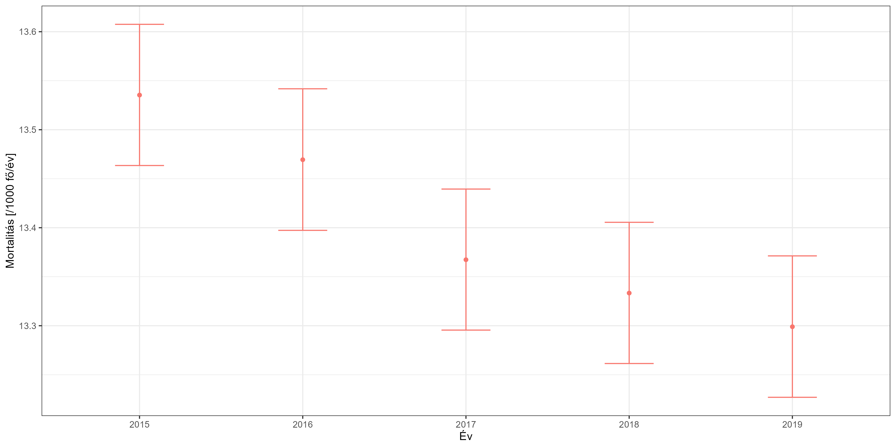<!-- -->

Az egyszerűség kedvéért tételezzük fel, hogy évi adatunk van, és a
járvány pontosan 2020 elején kezdődött. Nézzük meg ezen képzeletbeli
ország példáján a legtipikusabb megoldásokat a 2020-ra vonatkozó
előrejelzés készítésében!

Az első lehetőség, hogy a 2019-re vonatkozó adatokat egy az egyben
átvesszük mint a 2020 becslése:

``` r
SimData <- rbind(SimData, data.table(year = "2019 megis-\nmételve", type = "pred",
                                     SimData[year=="2019", -c("year", "type")]))
ggplot(SimData, aes(x = year, y = fit*1000, ymin = lwr*1000, ymax = upr*1000, color = type)) +
  geom_point() + geom_errorbar(width = 0.3) + labs(x = "Év", y = "Mortalitás [/1000 fő/év]") +
  guides(color = "none")
```

<!-- -->

Ennek a módszernek az előnye, hogy mivel a legközelebbi értéket veszi
át, így nem érinti annyira érzékenyen, ha a mortalitásoknak hosszútávú
trendje van – márpedig általában van. (Bár azért érezhető, hogy még így
sem tökéletes a helyzet, hiszen a példában azt érzi az ember, hogy
valójában még ennél is lejjebb volt a várható, mivel egy folyamatos
csökkenésben vagyunk.) A hátránya, hogy egyetlen év adatait használja,
így nagyobb a bizonytalansága: a mortalitási adatokban lényeges
évről-évre történő véletlen ingadozás van (mikor volt épp egy rosszabb
influenza-szezon, mikor egy jobb stb.); emiatt egy év adata szükségképp
nagyobb bizonytalanságot jelent.

A második tipikus módszer, hogy a néhány – például öt – megelőző év
átlagát veszik várt halálozásnak:

``` r
SimData <- rbind(SimData, data.table(year = "2015-2019\nátlagolva", type = "pred",
                                     mort = sum(SimData[type=="fact"]$mort),
                                     pop = sum(SimData[type=="fact"]$pop),
                                     with(binom.test(sum(SimData[type=="fact"]$mort),
                                                     sum(SimData[type=="fact"]$pop)),
                                          t(c(fit = unname(estimate), lwr = conf.int[1],
                                              upr = conf.int[2])))))
ggplot(SimData, aes(x = year, y = fit*1000, ymin = lwr*1000, ymax = upr*1000, color = type)) +
  geom_point() + geom_errorbar(width = 0.3) + labs(x = "Év", y = "Mortalitás [/1000 fő/év]") +
  guides(color = "none")
```

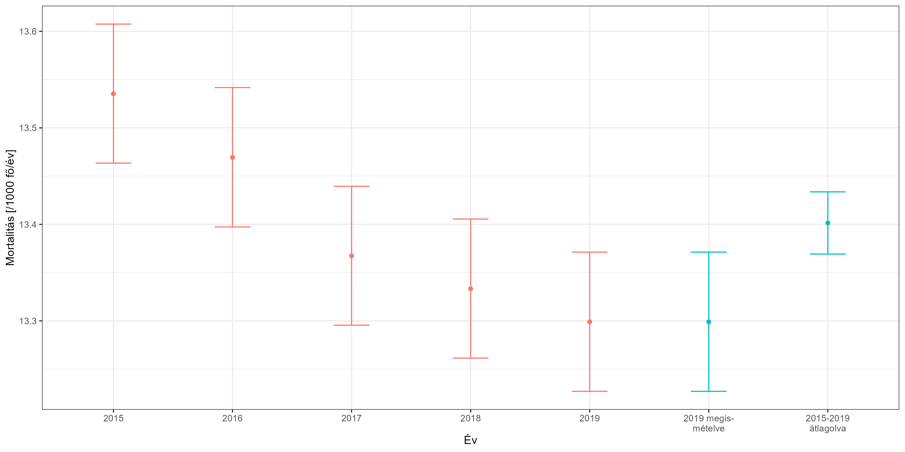<!-- -->

Ez olyan szempontból jobb, hogy az eredmény biztosabb, mivel a több év
átlagolása lecsökkenti a véletlen ingadozásokat. (Jól látszik, hogy a
konfidenciaintervallum is szűkebb, jelezve, hogy pontosabban becsült
értéket kaptunk.) A nagy problémája is látszik azonban az ábrán: ha
hosszú távú trendje van a halálozásoknak, akkor az átlag nagyon
félrevezető lehet; jelen esetben a korábbi nagy értékek miatt torz módon
magas lesz.

Így jutunk el a harmadik megoldási lehetőség ötletéhez: rakjunk egy
vonalzót a megelőző 5 év adatára és hosszabbítsuk meg ezt az egyenest!
Egyszerűen a halálozási rátákkal elvégezve ezt az alábbi eredményhez
jutunk:

``` r
SimData <- rbind(SimData, data.table(year = "2015-2019\nmeghosszabbítva", type = "pred",
                                     mort = NA, pop = NA,
                                     predict(lm(fit ~ as.numeric(as.character(year)),
                                                data = SimData[type=="fact"]),
                                             data.frame(year = 2020), interval = "prediction")))
ggplot(SimData, aes(x = year, y = fit*1000, ymin = lwr*1000, ymax = upr*1000, color = type)) +
  geom_point() + geom_errorbar(width = 0.3) + labs(x = "Év", y = "Mortalitás [/1000 fő/év]") +
  guides(color = "none")
```

<!-- -->

Ez megfelel a “szabad szemre” történő várakozásunknak arra, hogy hol
lenne a következő évi eredmény, viszont cserében a bizonytalansága is a
legnagyobb. (Ez a problémakör közel áll ahhoz, amit a statisztikában úgy
hívnak, hogy torzítás-variancia dilemma: torzítás az, ha
szisztematikusan alá- vagy fölébecsüljük a keresett jellemzőt, variancia
pedig az, hogy mekkora bizonytalansággal becsüljük. A dilemma abban áll,
amire fent is példát látunk, hogy sok esetben a két jellemző csak egymás
kárára javítható: ha lecsökkentjük a varianciát – átlag az egyetlen év
helyett – akkor megnöveljük a torzítást, és fordítva, ha lecsökkentjük a
torzítást – egyetlen év az átlag helyett – akkor megnöveljük a
varianciát.)

E ponton érdemes egy pillanatra megállni, és egy dolgot végiggondolni: a
magyar sajtóban mindhárom fenti módszer alkalmazására lehetett példát
találni a járvány alatt, ám arról annál kevesebb szó esett, hogy ez egy
döntés, és hogy ennek a döntésnek nagyon is lehet hatása a
végeredményre. Nézzük meg még egyszer a fentieket: mivel a várt
halálozást kivonjuk a ténylegesből, így az átlagolós módszert használva
a legkisebb többlethalálozást fogjuk kapni, a meghosszabbítóssal a
legnagyobbat. E kérdések azonban alig merültek fel a sajtóban. Onnan
sokak számára úgy tűnhetett, hogy a többlethalálozás az valamiféle
tökéletesen egyértelműen definiált érték, egy univerzális szám.

De akkor mi a jó választás? A jelen esetben, mivel rengeteg adat áll
rendelkezésre, így a fenti értelmű – mintavételi – bizonytalanság, a
variancia, kevésbé fontos szempont, viszont az kritikus, hogy a
torzítottságot igyekezzünk elkerülni. Emiatt a harmadik megoldás tűnik a
legszerencsésebbnek.

Van azonban egy nyitott kérdés még azzal kapcsolatban is: az utolsó hány
évet használjuk az egyenes illesztéséhez (amit aztán majd
meghosszabbítunk)…? A fenti példában ennek nincs nagy jelentősége, de mi
a helyzet akkor, ha a halálozási rátáink így néznek ki:

``` r
SimData <- data.table(year = factor(2011:2019),
                      mort = c(126, 129, 130, 132, 134, 132, 131.5, 129.7, 129.2)*1e3,
                      pop = 1e7)
SimData <- cbind(SimData, t(sapply(1:nrow(SimData),
                                   function(i) with(binom.test(SimData$mort[i], SimData$pop[i]),
                                                    c(fit = unname(estimate), lwr = conf.int[1],
                                                      upr = conf.int[2])))))
ggplot(SimData, aes(x = year, y = fit*1000, ymin = lwr*1000, ymax = upr*1000)) +
  geom_point() + geom_errorbar(width = 0.3) + labs(x = "Év", y = "Mortalitás [/1000 fő/év]") +
  guides(color = "none")
```

<!-- -->

A probléma jól látható: ha az egész tartományt használjuk (ahogy a
fentiekben tettük!), akkor egy nagyon enyhén emelkedő görbét kapunk,
miközben szemre elég világos, hogy valami megváltozott a példaországban
2015-ben, ezért az új évre – mivel az már a változás utáni érában van –
inkább egy erősen csökkenő görbéből kellene előrejeleznünk… Akkor tehát
ne az összes adatot használjuk, csak az utolsó néhányat? De hogyan
válasszuk meg, hogy hányat? Mi van, ha elrontjuk? Szerencsére van egy
statisztikai módszertan, amivel ez a kérdés elkerülhető, ezt úgy hívják,
hogy
[spline-regresszió](https://tamas-ferenci.github.io/FerenciTamas_SimitasSplineRegresszioAdditivModellek/).
Nagyon röviden összefoglalva, a spline-ok flexibilis görbék, olyan
értelemben, hogy követik az adatokat, bármilyen mintázatot is
mutassanak, így képesek bevenni a fenti ábrán látható “kanyarokat” is,
de úgy, hogy az adatokban lévő alaptrendet próbálják megragadni, a
véletlen, zajszerű ingadozás nélkül. Ez utóbbi azért fontos, mert így,
ha meghosszabbítjuk őket, akkor a meghosszabbítás ezt az alaptrendet
fogja tükrözni – pont, ahogy nekünk kell. Ezzel a fenti dilemmánkat
oldják meg: átadható nekik az összes adat, tehát nem kell –
potenciálisan hibásan – meghatározni, hogy mikortól illesszünk görbét,
de a meghosszabbításhoz mégis csak a valódi alaptrendet fogja használni,
azaz egy ilyen esetben automatikus felismerve, hogy mi az adatsor
végéből látszó trend.

A dolog persze itt sincs ingyen. A kulcskérdés a flexibilitás mértéke:
ha nem túl flexibilis a spline, akkor közelít ahhoz, mintha az egész
adatsorra egyenest húznánk, ha viszont túl flexibilis, akkor az
adatokban lévő zajt is fel fogja venni az alaptrend helyett, és így a
meghosszabbítás is esetleges lesz (azt fogja tükrözni, hogy az utolsó
néhány pont épp kicsit lejjebb vagy feljebb volt-e).

Ennek illusztrálására most már nézzünk meg egy valós példát, Finnország
adatait! Természetesen a járvány előtti adatokat fogjuk ábrázolni (itt
most az egyszerűség kedvéért ez éves felbontást, és 2019, valamint az
előtti adatokat jelent), hiszen a kérdés ezek meghosszabbítása. Az ábrán
a fekete pöttyök jelzik a tényadatokat, a színes vonalak pedig a rájuk
illesztett spline-ok, ahol a szín a flexibilitás mértékét mutatja: minél
nagyobb a szám, annál kevésbé flexibilis a spline. Az ábrán szerepel a
teljes intervallum átlagával történő becslés is:

``` r
diagpargrid <- CJ(tkpy = c(seq(5, 13, 2), 100), geo = unique(RawData$geo), it = c(TRUE, FALSE),
                  ED = names(exclude_dates))
diagpargrid <- diagpargrid[!(it==FALSE&tkpy!=5)]

diagdat <- rbindlist(lapply(1:nrow(diagpargrid), function(i)
  with(compute_expected2(RawData[geo==diagpargrid$geo[i]],
                         exclude = exclude_dates[[diagpargrid$ED[i]]],
                         include.trend = diagpargrid$it[i], 
                         frequency = 52, # csak a trend-nél van jelentősége, de azt helyrerakjuk
                         trend.knots.per.year = 1/diagpargrid$tkpy[i], keep.components = TRUE),
       cbind(counts, ED = diagpargrid$ED[i], trend, trend_log_se, it = diagpargrid$it[i],
             tkpy = diagpargrid$tkpy[i]))))

diagdat$par <- factor(ifelse(diagdat$it==FALSE, "Átlag",
                             ifelse(diagdat$tkpy==100, "Lineáris", diagdat$tkpy)),
                      levels = c("Átlag", "Lineáris", seq(5, 13, 2)))

diagdat$lci <- exp(log(diagdat$trend) - qnorm(0.975)*diagdat$trend_log_se)
diagdat$uci <- exp(log(diagdat$trend) + qnorm(0.975)*diagdat$trend_log_se)

diagdat <- merge(diagdat, params[, .(geo, age, tkpy, it, Ref = TRUE)], all.x = TRUE)

ggplot() +
  geom_line(data = diagdat[geo=="FI"&!par%in%c(11, "Lineáris")&ED=="ExAnte"],
            aes(x = date, y = trend/52, group = par, color = par)) +
  geom_point(data = diagdat[geo=="FI"&year<=2019,
                            .(outcome = sum(outcome)/sum(population)*1000),
                            .(date = lubridate::make_date(year, 07, 01))],
             aes(x = date, y = outcome)) +
  labs(x = "Év", y = "Heti halálozás [fő/ezer fő/hét]", color = "Paraméter")
```

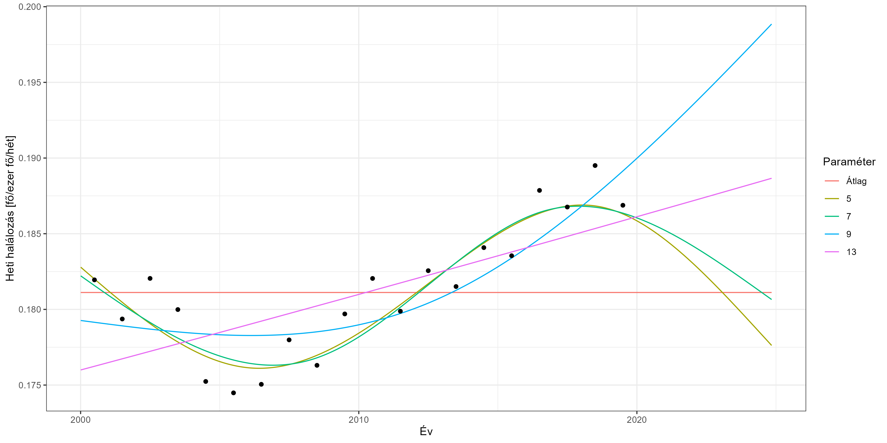<!-- -->

Az ábra szépen illusztrálja az összes fenti megállapítást. Az 5-ös, de
még a 7-es beállítás is túl flexibilis: azért fordulnak el az illesztett
görbék lefelé, mert az utolsó év kicsit alacsonyabb adata is elég ahhoz,
hogy megfordítsa őket (a túl nagy flexibilitás miatt követik az ilyen
zajszerű ingadozásokat is). A 13-as paraméter viszont már túl kevéssé
flexibilis: ez már a valóban változó alaptrendet sem tudja felvenni. Az
átlaggal történő becslés pedig jelen esetben pláne teljesen félrevezető.
A 9-es beállítás azonban tökéletesnek tűnik (és figyeljük meg, hogy nem
kellett megadni, hogy honnan kezdve illesztünk, az összes adatot
átadtuk, és mégis, annak ellenére adott jó extrapolációt, hogy volt egy
trendforduló az adatokban!).

Nincs más hátra, mint minden országra meghatározni az optimális
flexibilitási paramétert – hiszen egyáltalán nem biztos, hogy ugyanaz az
érték lesz jó mindenhol. Én ezt most a fentihez hasonló módon, tehát
kézzel megnézve az illesztéseket hajtottam végre; ennek részleteit egy
külön pontban mutatom be. A későbbi eredmények ezeken a beállításokon
fognak alapulni.

Még egy problémával kell törődni: előfordulhatnak esetek, amikor nem
lehet egyértelműen választani. Magyarország is példa erre:

``` r
ggplot() +
  geom_line(data = diagdat[geo=="HU"&!par%in%c(11, "Lineáris")&ED=="ExAnte"],
            aes(x = date, y = trend/52, group = par, color = par)) +
  geom_point(data = RawData[geo=="HU"&year<=2019,
                            .(outcome = sum(outcome)/sum(population)*1000),
                            .(date = lubridate::make_date(year, 07, 01))],
             aes(x = date, y = outcome)) +
  labs(x = "Év", y = "Heti halálozás [fő/ezer fő/hét]", color = "Paraméter")
```

<!-- -->

Látható, hogy a helyzet nehezen megítélhető: elhisszük, hogy amit a
végén látunk, az egy ténylegesen növekvőbe váltott trend (ez esetben a
9-es, ha nagyon bátrak vagyunk, a 7-es paraméter jöhet szóba), vagy azt
gondoljuk, hogy itt különösebb trend nélküli véletlen szóródással van
dolgunk (ez esetben a legbiztosabb a 13, tehát az egyenes illesztése)…?
Nagyon fontos, hogy ilyen helyzetekben, ahol nem lehet egyértelműen
választani, próbáljunk ki minden szóba jövő lehetőséget! Ezt hívják
érzékenységvizsgálatnak; a későbbiekben külön pontban fogunk vele
foglalkozni.

Egy dolog mindenesetre biztos: nem szabad úgy elfogadni *semmilyen*
paramétert, hogy előbb ne ellenőriztük le, például ilyen grafikus
formában, a helyességét!

Az e kérdés iránt mélyebben érdeklődőeknek figyelmébe ajánlom egy [friss
cikkem](https://bmcmedresmethodol.biomedcentral.com/articles/10.1186/s12874-023-02061-w),
melyben ezt a problémakört jártam körbe részletes vizsgálatokkal.

### A szezonalitás kérdése

Természetesen a valóságban egy sor bonyolító tényezővel kell számolni.
Egyrészt nem éves adataink vannak, hanem haviak, jobb esetben hetiek
(legjobb esetben napiak), ilyenkor el kell számolni az éven belüli
mintázattal. A mortalitásnak ugyanis van egy jellegzetes éven belüli
alakulása, úgy szokták mondani, szezonalitása; az alábbi ábra ezt
szemlélteti a járvány előtti magyar adatokkal (a kék görbe mutatja az
összes adat simítását, a halvány fekete görbék az egyes évek adatait):

``` r
ggplot(RawData[age=="TOTAL"&geo=="HU"&year<=2019], aes(x = week, y = outcome/population*1000*52,
                                                       group = year)) +
  geom_line(alpha = 0.2) +
  geom_line(data = data.frame(week = 1:53,
                              mort = predict(mgcv::gam(outcome ~ s(week, bs = "cc"),
                                                       offset = log(population),
                                                       data = RawData[age=="TOTAL"&geo=="HU"&
                                                                        year<=2019],
                                                       family = quasipoisson),
                                             newdata = data.frame(week = 1:53),
                                             type = "response")*1000*52),
            aes(x = week, y = mort), color = "blue", inherit.aes = FALSE) +
  labs(x = "Hét", y = "Mortalitás [/1000 fő/év]")
```

<!-- -->

Heti vagy havi adatok használatánál tehát ezzel a mintázattal el kell
számolni. (Napi adatok használatánál még a héten belüli mintázattal is.)

A második probléma, hogy a valóságban nem pontosan az évhatárnál van a
járvány kezdete. A gyakorlatban ez általában azt jelenti, hogy a
számítási algoritmusnak meg kell adni, hogy teljesen pontosan mely
adatokat használja fel a várt halálozás becslésére. Semmiféle problémát
nem jelent, ha ez nem az évhatár: ha 2020 márciusig használjuk fel az
adatokat, akkor azokból becsüljük a hosszú távú trendet és a
szezonalitást, nincs jelentősége, hogy ez nem évhatárra esik. (A
becsléshez így minden információt kinyerünk, például még 2020 első két
hónapját is a szezonális mintázat becsléséhez.) Adott esetben még az sem
kötelező, hogy ez a fenti módon nézzen ki, tehát, hogy egy ideig
használjuk az adatokat, utána meg nem, nyugodtan megadhatunk több
tartományt is, amiket használunk a modell – és ebből fakadóan a várt
halálozás – becsléséhez.

### Acosta és Irizarry módszere

Mostani elemzésemben egy olyan módszert fogok használni, mely a fenti
gondolatokon alapszik, azokat valósítja meg, de statisztikai értelemben
még szofisztikáltabb. Az eljárást Rolando J. Acosta (Harvard University)
és Rafael A. Irizarry (Dana-Farber Cancer Institute) 2020-ban
[publikálta](https://journals.lww.com/epidem/abstract/2022/05000/a_flexible_statistical_framework_for_estimating.6.aspx).

Ennek finomabb részleteit egy külön pontban ismertetem, itt most talán
annyi fontos magas szinten, hogy a módszer végeredményben lényegében egy
simítást fog jelenteni: a fenti módon definiált heti többlethalálozások
elég ingadozóak lesznek a tényleges halálozások véletlenszerűsége miatt;
a módszer ezt simítani fogja. Ezt mutatja a következő ábra a magyar
adatokon:

``` r
ggplot(melt(res[age=="TOTAL"&geo=="HU"&sens==FALSE&ED=="ExAnte"&model=="quasipoisson"&
                  date<="2023-07-01", .(date, `Nyers` = y*100,
                                        `Acosta-Irizarry` = increase*100)],
            id.vars = "date"), aes(x = date, y = value, group = variable, color = variable)) +
  geom_line() + labs(x = "Dátum", y = "Százalékos többlet") +
  scale_x_date(date_breaks = "months", labels = scales::label_date_short()) +
  theme(legend.position = "bottom", legend.title = element_blank())
```

<!-- -->

### Ex ante és ex post többlethalálozás

A fentiekből is látható, hogy a többlethalálozás módszere nem
alkalmazható akkor, ha nagyon hosszú időtartamú a járvány. Ekkor ugyanis
nagyon messzire távolodunk a tényadatoktól és lehetetlen lesz értelmes
előrejelzést tenni a várt halálozásra. Ha – persze csak elméleti
példaként… – 10 évig tart egy járvány, akkor a végén már nagyon
megkérdőjelezhető lesz a többlethalálozási eredmény, hiszen a járvány
nélküli adat becsléséhez 10 évvel korábbi adatokat fogunk felhasználni,
ami alapján aligha lehet kijelenteni, hogy mi akkor, 10 év múlva, a várt
érték, annyira odébbmászhattak a járványtól független mortalitási
tényezők. Ilyen hosszú időre egyre kevésbé lehet értelmes megbízhatóság
mellett előrevetítést készíteni.

A dolgon azonban a járvány vége segít: az utána következő – és ebből
fakadóan a járvány hatástól újfent mentes! – adatok *megint*
felhasználhatóak arra, hogy lehorgonyozzuk a várt görbe becslését.
Hiszen a várt görbe a (járványmentes) tényadatok alapján határozható
meg, márpedig az minden statisztikai részlet nélkül is érezhető, hogy ez
sokkal jobban megtehető akkor, ha nem egyik oldalról megyünk egyre
távolabbra, hanem mindkét oldalról “tartjuk” a görbét, mint egy híd.

Amit nagyon fontos látni, hogy ez azt jelenti, hogy ezen adatok
felhasználása azonnal megjavítja *visszamenőleg is* a becsléseket
(hiszen abban a pillanatban, ahogy bejönnek az első, járvány utáni
adatok, a korábbról előrevetített, egyre bizonytalanabb és potenciálisan
egyre vadabbul ingadozó görbét van mihez visszarángatni a másik
oldalról). Ezt természetesen csak utólag, a járvány végén tudjuk
megtenni. Erre tekintettel érdemes megkülönböztetni kétféle
többlethalálozás-becslést: ex ante többlethalálozást, amikor csak a
múltbeli értékeket használjuk, és ex post többlethalálozást, amikor a
későbbi adatokat is használva becslünk egy időszakra. Az előbbi releváns
egy éppen zajló járvány során (értelemszerűen, hiszen akkor csak ezt
tudjuk megtenni), az utóbbi pedig akkor, ha a járvány végeztével,
visszamenőleg értékeljük ki a helyzetet.

Mindezeket illusztrálja a következő ábra, ami újfent a korábban már
látott finn adatokat mutatja a bal oldalon, de a görbéket kiegészítve a
95%-os konfidenciaintervallummal (amik itt is a bizonytalanságot
mutatják: minél szélesebb a besatírozott terület, annál bizonytalanabb
az adott becslés). Ennek köszönhetően az ábrán látszik egy újdonság is,
ami a korábbiról nem derült ki: ahogy haladunk előre az időben, úgy nő
rohamosan a bizonytalanság – a “híd” csak egyik oldalról van
megtámasztva. (Alaposan megnézve az is kiderül, hogy ez annál inkább így
van, minél flexibilisebb a spline – ez azonban teljesen logikus, ha
belegondolunk, a merevebb spline-okat jobban tartják a meglevő adatok, a
flexibilisebbeknek, amik az adatokat jobban követik, nagyobb baj, ha
távolodunk az adatoktól.) De mi a helyzet az ex post becsléssel? Ezt
mutatja az ábra új, jobb oldali része:

``` r
ggplot(diagdat[geo=="FI"&!par%in%c(11, "Lineáris")&ED!="Flu",
               .(date, trend, par, ED = ifelse(ED=="ExAnte", "Ex ante", "Ex post"), lci, uci)],
       aes(x = date, y = trend/52, group = par, color = par, fill = par)) +
  facet_wrap(~ED) + guides(fill = "none") +
  geom_line() + geom_ribbon(aes(ymin = lci/52, ymax = uci/52), alpha = 0.2, color = NA) +
  geom_point(data = RawData[geo=="FI"&(year<=2019),
                            .(outcome = sum(outcome)/sum(population)*1000),
                            .(date = lubridate::make_date(year, 07, 01))],
             aes(x = date, y = outcome), inherit.aes = FALSE) +
  geom_point(data = RawData[geo=="FI"&(year==2023),
                            .(outcome = sum(outcome)/sum(population)*1000, ED = "Ex post"),
                            .(date = lubridate::make_date(year, 07, 01))],
             aes(x = date, y = outcome), inherit.aes = FALSE) +
  labs(x = "Év", y = "Heti halálozás [fő/ezer fő/hét]", color = "Paraméter")
```

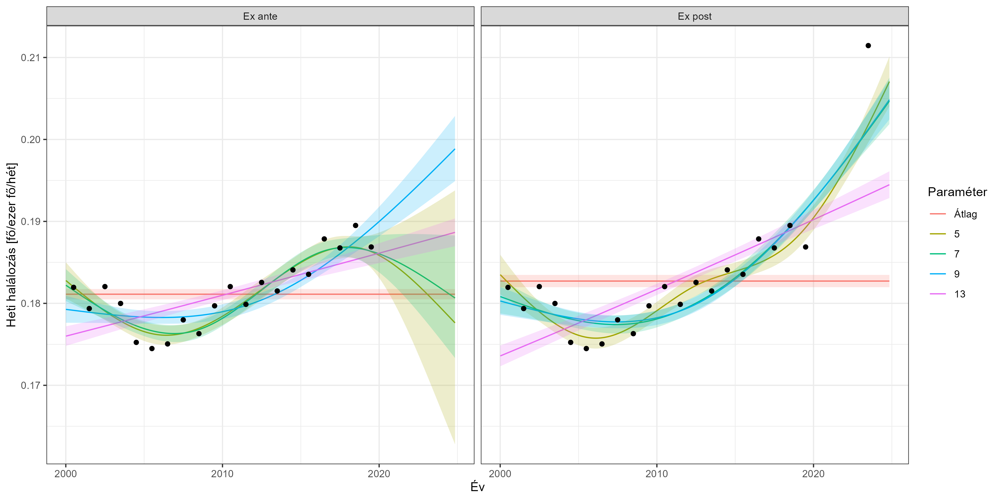<!-- -->

Több dolog nagyon tanulságos ezen az új ábrán. Először is, megváltoztak
a becsült görbék: az új megfigyelés, amit a 2023-as pont mutat, ugyanúgy
“irányítja” a pontokat, mint a korábbiak. Ami azonban talán még
relevánsabb most: összementek a konfidenciaintervallumok! Lecsökkent a
bizonytalanság – mert a hidat már a túloldalról is tartja valami.

(Egyébként jól véggigondolva még egy dolog felmerülhet: az, hogy a
helyes spline megválasztásában is van “ex ante” és “ex post”: lehet,
hogy az utólagos adatok ismeretében más flexibilitású görbe lesz a
legjobb, mint ami menet közben annak tűnt. Ezzel a lehetőséggel most nem
foglalkozom, a várt halálozás számításához használt, tényadatokra
illesztett görbe meghatározásakor az ex ante döntéseket vettem alapul.)

Tekintettel a korábban tárgyaltakra, tehát, hogy a többlethalálozást
számoló algoritmusnak amúgy is át kell adni, hogy mely dátumokat
használja fel a várt görbe becsléséhez és melyeket ne, az ex ante és ex
post becslések könnyen megvalósíthatóak: egyszerűen annyi a dolgunk,
hogy az előbbinél csak a járvány előtti adatokat használtatjuk fel a
becslési eljárással a várt görbe számításához, az utóbbinál a járvány
előttit és a járvány utánit is.

Vegyük észre, hogy mindez igényli annak ismeretét, hogy mikor ért véget
a járvány. Épp a koronavírus mutat rá, hogy ez nem feltétlenül triviális
kérdés: nem csak arról van szó, hogy nem tudhatjuk biztosan, hogy mi ez
a dátum, de könnyen lehet, hogy bizonyos esetekben értelme sincs igazán
arról beszélni, hogy “a” vége a járványnak (mint egyetlen dátum). Ez
különösen igaz amiatt, mert – ne felejtsük el – nem csak a direkt
hatások megszűnése kell ahhoz, hogy a járvány végéről beszélhessünk, az
indirekt hatásoknak (például más betegségek megnehezedett ellátása miatt
halálozások) is teljesen meg kell szűnniük ahhoz, hogy valóban azt
mondhassuk, hogy “a járvány hatástól újfent mentes” adataink vannak!
Elképzelhető, sőt, kimondottan valószínű, hogy az eltűnés egy folyamatos
átmenet, tehát egy fokozatos visszatérés az alapvonalhoz, így
szükségképp minden konkrét dátum egy egyszerűsítés lesz. Én a mostani
vizsgálatban, félig-meddig csak a kerekség kedvéért, 2023. július 1-et
választottam zárási dátumnak. (Ebből rögtön látszik, hogy a fenti ábra
maga is egyszerűsítés, hiszen az egész 2023-as évet ábrázolta, mint
járvány utáni pont.) Természetesen ez csak az ex ante esetben jelenti a
számítások és az adatfelhasználás lezárását, ex post esetben pusztán az
eredmények megjelenítésének a zárása, maga a számítás felhasználja a
2023. július 1. utáni adatokat is – értelemszerűen, hiszen ettől lesz az
ex post számítás ex post.

Visszatérve még egy pillanatra az ábrára: ha ránézünk, az is látszik,
miért lehet komoly hibaforrás a járvány végének a rossz meghatározása
(ami pedig, mint láttuk, sajnos egyáltalán nem elképzelhetetlen). A
2023-as finn adatok nagyon magasak. De vajon ez azért van, mert a finn
adatoknak ez lett volna járvány nélkül is az alaptrendjük, csak kicsit
meredekebben nőttek, mint gondoltuk – nem lehetetlen, tényleg növekedtek
már a járvány előtt is, csak kevésbé meredeken – vagy azért ilyen magas,
mert valójában ebben még igenis benne van a járvány hatása, még nem
tértünk vissza az alaptrendhez, és ezért emelkedett ki annyira…? (És
vigyázat, ahogy volt is róla szó, ide nem csak a direkt hatásokat kell
érteni, hanem az indirekteket is.) Ezért az ex post adatokat is óvatosan
kell kezelni.

Egyetlen megjegyzés még a végére. Mindez természetesen nem azt jelenti,
hogy e dátum után megszűnt a koronavírus. Jelen képünk szerint belesimul
a többi szezonális légúti kórokozóba, ami egy nem szorosan idetartozó,
de szintén érdekes kérdéshez vezet el: a jövőben a “téli többlet”
vélhetően már nem csak az influenzát fogja meghatározó módon jelenteni,
hanem az influenza + koronavírus kombinációt.

### Relatív és abszolút eredmények

A többlethalálozást eddig úgy kezeltük mint a tényleges és a várt
halálozás különbsége, tehát egy – főben mért – abszolút szám. Csakugyan
ez az egyetlen, ami közvetlenül kiszámítható, ám problémája, hogy nem
vethető össze országok között, hiszen a nagyobb országokban nyilván
nagyobb lesz a többlethalálozás, akkor is, ha valójában nem rosszabb a
helyzet. Mit tehetünk?

A természetes ötlet a relatív mutatóra való áttérés, ezen belül is a
legtermészetesebb gondolat az ország lélekszámával való leosztás; számos
más esetben is szinte automatikusan ezt tesszük, ha országok közötti
összehasonlítást szeretnénk végezni. (Például a fertőzött-számok vagy a
halálozási számok esetében is!) Itt azonban nem biztos, hogy ez a
legszerencsésebb választás. A probléma az, hogy a lélekszám érzéketlen
arra, hogy mennyi az alaphalandóság az adott országban. Tekintsünk két,
10 milliós országot, amelyek egyikében évi 100, a másikban évi 150 ezer
ember hal meg (mondjuk mert az utóbbiban több a krónikus beteg, vagy
akár csak azért, mert idősebbek a lakosok). Ez esetben ugyanannyi
abszolút többlethalálozás, relatívvá téve, ugyanolyan eredményre vezet,
noha az ember azt érzi, hogy adott többlethalál jobban számít az első
országnál, mint a másodiknál. Éppen ezért gyakran a többlethalálozások
számát nem a lakosság számára, hanem a várt halálozás-számra osztják rá.
Ez egyfelől ugyan bevisz a dologba egy plusz bizonytalanságot, hiszen
egy becsült, bizonytalansággal terhelt értékkel osztunk, de cserében van
egy előnye: mivel a várt érték már *eleve* tükrözi az ország
alaphalandóságát, és így minden azt befolyásoló tényezőt (kezdve a
korfával, de nyugodtan felsorolhatjuk a krónikus betegségeket, a
környezeti tényezőket, szociális viszonyokat, egészségügyi
ellátórendszert stb.), így a hányadossal kapott relatív érték nagyon jól
összehasonlítható lesz országok között, még akkor is, ha ezek a tényezők
eltérnek (mint ahogy nagyon is el fognak térni minden valós esetben). Az
persze egy – nagyon is fontos – külön kérdés lehet, hogy célunk-e
egyáltalán az ilyen tényezők hatásától való megszabadulás; erre a
problémára még visszatérünk a későbbiekben.

## Eredmények

### A hazai többlethalálozási adatok, és európai viszonyításuk

Ebben a pontban közlöm a fent felvázolt eljárással kapott eredményeket.
Minden technikai részlet (beleértve az adatforrást, az adatok
előkészítését, valamint az összes, számítást végző kódot, melyek együtt
– a nyílt tudomány jegyében – teljesen reprodukálhatóvá teszik munkámat)
a függelékben olvasható.

Az eredmények megadásához nem év alapú mutatókat használok (bár néha ezt
is szokták, de valójában természetesen semmilyen kitüntetett járványügyi
jelentősége nincs a december 31-nek, hogy akkor vágjuk el az adatokat),
hanem egyszerűen folytonosan kezeljük az időt. Másrészt, relatív mutató
gyanánt a lélekszámmal osztott változatot használom, így ugyanis egy
olyan mutatót kapunk, ami analóg a regisztrált halálozások közlésével,
hiszen azt is halál / millió főben szokták megadni (de később kitérek a
másik lehetőségre, a várt halálozásra történő ráosztásra is).

Minden adatközlést 2023. július 1-én zárunk (természetesen, ahogy már
volt róla szó, az ex post számításokhoz fontosak a későbbi adatok is,
tehát a “zárás” itt az adatmegjelenítés végét jelenti).

Mit tudunk mondani egy adott időpontban aktuális helyzetről? E kérdés
megválaszolásához jobban passzolnak az ex ante adatok: ezt tudhattuk a
járvány közben! Ezt mutatják a heti adatok (piros görbe Magyarország, a
szürke görbék a többi európai országot jelölik):

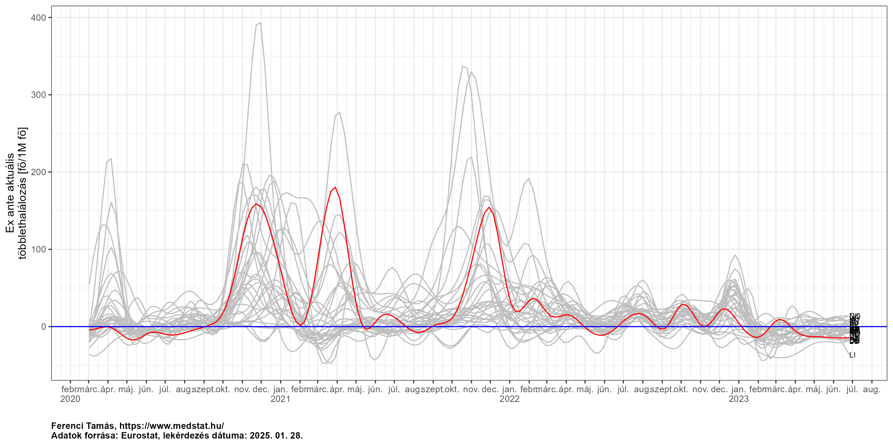<!-- -->

Jól látszik, hogy az első hullám teljesen kimutathatatlan volt
(legalábbis többlethalálozás tekintetében) Magyarországon, addig a
második már súlyosan érintett minket, a harmadikban pedig gyakorlatilag
egész Európában a legrosszabbak között volt az aktuális járványügyi
helyzetünk. Ezután egy évvel még egy hullám jelentkezett, mely az
előzőekkel teljesen összevethető nagyságú volt.

Érdemes lehet országonként külön-külön is ábrázolni, hogy jobban látható
legyen, az egyes országok hogyan teljesítettek a járvány kezelésében,
mik a jó és a rossz példák:

<!-- -->

A járvány egészének értékeléséhez nézzük egyrészt a kumulált, másrészt
az ex post adatokat (piros görbe Magyarország, a szürke görbék a többi
európai országot jelölik):

<!-- -->

Érdekes lehet jobban látható módon is kiemelni az utolsó időpontbeli
adatokat, tehát a fenti ábra jobb szélét, a záráskor, 2023. júliusában
érvényes “vég” eredményt:

<!-- -->

Látható, hogy Magyarország a legkedvezőtlenebb harmad elején-közepén
van. Hogy egy számszerű érték is szerepeljen: a kumulált
többlethalálozásunk a járvány alatt ex post számításban 48900 fő volt.

Látványos lehet ugyanezeket az adatokat térképen is ábrázolni. Itt ugyan
az értékeket nehezebb leolvasni, illetve összehasonlítani, hiszen egy
színskála rosszabbul ítélhető meg mint egy oszlop magassága, viszont
cserében térbeli információt is ad, ami meg sok szempontból jobban
érzékelhető, egyetlen pillantással is (jobban társítani tudjuk az
országokhoz az egyéb jellemzőiket, látszanak a térbeli csoportosulások
stb.):

<!-- -->

Az Eurostat [adatokat
szolgáltat](https://ec.europa.eu/eurostat/databrowser/view/demo_r_mwk3_t/)
ún. NUTS3 szintű, országon belüli területi egységekről is, ez
Magyarországon a megyéknek felel meg. Ilyen módon az összes fenti
vizsgálatot elvégezhetjük a magyar megyékre is vonatkozóan, egész
egyszerűen ugyanazt az elemzést kell csak lefuttatnuk – egymástól
függetlenül – minden megyére.

Hogy ennek mennyi értelme van? Magyar viszonylatban sajnos egy
szempontból egész biztosan van: a magyar rendszer, elképesztő módon, nem
ad meg területi halálozási adatokat, még megyei szinten sem. Így, ha
bármilyen halálozási eredményre van szükségünk területi lebontásban,
egész egyszerűen a többlethalálozás lesz az egyetlen eszközünk, teljesen
mindegy, hogy mennyire jó vagy rossz. Ettől függetlenül azért érdemes
feltenni a kérdést, hogy mennyire jó: ha ismernénk a jelentett
halálozást megyei szinten, volna értelme mégis nézni a többlethalálozást
ez esetben is? Gondoljunk a többlethalálozás két alapvető előnyére:
teljesen független a haláloki besorolástól és teljesen független a
tesztelési aktivitástól. Az előbbi igen valószínűtlen, hogy országon
belül eltérjen, de az utóbbiban nagyon is lehetnek különbségek az ország
különböző megyéi között, így még ez esetben is érdekes lehet a
többlethalálozás (persze annak a hátrányai is ugyanúgy érvényesülnek egy
ilyen, országon belüli elemzés során is).

Az aktuális helyzet alakulása megyei szinten (a piros vonal ezen az
ábrán az országos értéket jelenti):

<!-- -->

Az utolsó állapotról itt is készíthetünk oszlopdiagramot, természetesen
ehhez is a kumulált adatokat használjuk, ex post számításban:

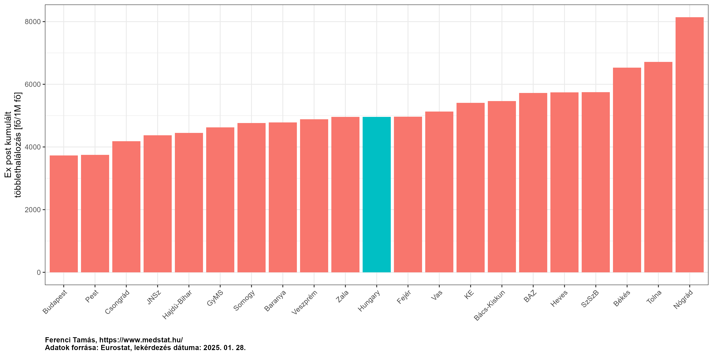<!-- -->

Itt is kézenfekvő ötlet térképet rajzolni:

<!-- -->

Finomabb felbontású, legalább járási adatok híján nehéz igazán fajsúlyos
megállapításokat tenni (megyei szinten még a városok és a falusias
területek is össze vannak vegyítve), ez alól Budapest az egyetlen
kivétel, és pozitív irányban: míg a nagyobb népsűrűség általában
kimondottan elősegíti a járványok terjedését, addig Magyarországon belül
Budapest pont, hogy a jobban teljesítő megyék közé került. Persze
vigyázat: ezek most nem a fertőződésre, hanem a halálozásra vonatkozó
adatok, így a megítélést még az is nehezíti, hogy a halálozási arányok
eltérhetnek (hiszen az függ a társbetegségek gyakoriságától, az életkori
eloszlástól, és így tovább, amik eltérhetnek megyék között).

### Érzékenységvizsgálat

A korábbiakban is hangsúlyosan szerepelt, hogy a végeredmény függhet
attól, hogy milyen módszerrel jelezzük előre a várt halálozást. Ahogy
láttuk, bizonyos esetekben nem egyértelmű, hogy mi a jó, várt adatokra
illesztett görbe, például milyen flexibilitású spline-t kell használni,
mert több is megfelelőnek tűnik a múltbeli adatok alapján. A módszernek
magának is lehetnek paraméterei, az Acosta-Irizarry eljárásnak például
meg kell adni, hogy milyen modellt használjon (kvázi-Poisson, vagy
korrelált hibatagú) – most mindegy is, hogy ezek pontosan mit
jelentenek, a lényeg, hogy beállítható paraméterek.

Ilyen esetekben, ha nem vagyunk teljesen biztosak abban, hogy mi a jó
választás, mindig érdemes inkább az összes lehetséges, szóba jövő
paraméter mellett lefuttatni a számítást és kiszámolni a végeredményt;
ezt szokták érzékenységvizsgálatnak nevezni. Érzékenységvizsgálat az is,
ha az ex post becslésnél különböző záródátumokkal próbálkozunk (láttuk,
hogy ez miért lehet fontos alanya érzékenységvizsgálatnak: egyszerre
igaz rá, hogy nem biztos, hogy pontosan meghatározható, és, hogy a
megválasztásának lehet komoly jelentősége a végeredményre nézve), sőt,
akár még az is érzékenységvizsgálat, ha kiszámítjuk a többlethalálozást
egy teljesen más módszerrel.

Egyrészt azért fontos ez, mert így nem érheti szó a ház elejét, hogy
miért pont azt a paramétert választottuk, amit (esetleg valami hátsó
szándékunk volt, hogy egy bizonyos eredmény jöjjön ki?); az olvasó akár
saját maga is kiválaszthatja a neki szimpatikus paraméterek melletti
eredményt. Másrészt, ha szerencsénk van, akkor azt fogjuk látni, hogy a
végeredmények nem nagyon különbözőek az egyes paraméter-választások
mellett – ilyenkor mondhatjuk, hogy az eredmény robusztus erre nézve,
ami megerősíti a bizodalmunkat a kapott számokban. Ha nincs is ilyen
szerencsénk, az érzékenységvizsgálat akkor is hasznos, mert mutatja,
hogy milyen tartományt fednek le az eredmények a paraméterválasztás
függvényében. (Megváltozhat a végkonklúzió is a paraméter-választástól
függően, ami nagyon erősen óvatosságra int, vagy csak a konkrét számok
lesznek mások, de azért kvalitatíve ugyanazok maradnak a
megállapításaink?) Szokták ezt a megközelítést néha a ‘vibration of
effects’ névvel is
[illetni](https://www.sciencedirect.com/science/article/pii/S0895435615002772).

Vegyük Magyarország példáját! Amint láttuk, itt bizonytalanok voltunk
már abban is, hogy melyik a jó spline, a 9-es flexibilitású, vagy a
teljesen lineáris. Emellett ott van az a bizonytalanság is, hogy a két
említett modell közül melyiket használjuk az Acosta-Irizarry eljárásban.
Minden lehetséges kombinációt tekintve ez összesen 4 eshetőség; az
alábbi ábra mutatja az ex ante aktuális halálozást ezen paraméterek
függvényében:

``` r
ggplot(res[geo=="HU"&age=="TOTAL"&ED=="ExAnte"&date<="2023-07-01",
           .(date, excess, population, tkpy = ifelse(tkpy==100, "Lineáris", "Spline (9)"),
             model = ifelse(model=="correlated", "Korrelált", "Kvázi-Poisson"))],
       aes(x = date, y = excess/population*1e6, color = paste0(tkpy, ", ", model, " modell"))) +
  geom_line() + geom_hline(yintercept = 0, colour = "blue") +
  labs(x = "", y = "Ex ante aktuális\ntöbblethalálozás [fő/1M fő]", caption = captionlab) +
  scale_x_date(date_breaks = "months", labels = scales::label_date_short()) +
  theme(plot.caption = element_text(face = "bold", hjust = 0), legend.position = "bottom",
        legend.title = element_blank())
```

<!-- -->

Az ábrából két fontos következtetést is levonhatunk. Egyrészt a használt
modell típusának gyakorlatilag semmilyen jelentősége nincsen. Másrészt,
a használt spline-nak van ugyan némi jelentősége, de ennek sem sok, a
kritikus időpontokban (a járvány igazi zajlása alatt) pedig
gyakorlatilag semmi. Összességében megállapíthatjuk tehát, hogy az
eredmények – e paraméterekre nézve legalábbis – robusztusak, nem
érzékenyek érdemben arra, hogy hogyan parametrizáljuk az eljárásunkat!

Nézzük most meg mindezt az összes ország esetében; használjuk példaként
a másik nézőpontot, ex post elemzést a kumulált számokkal. Mivel az
érzékenységvizsgálatnál egy országhoz több érték is tartozik, érdemes
egy új típusú ábrát használni:

``` r
ggplot(res[nuts_level==0&age=="TOTAL"&ED=="ExPost"&date=="2023-06-26",
           .(geo, sens = ifelse(sens, "Érzékenység-vizsgáló", "Elsődleges"),
             model = ifelse(model=="correlated", "Korrelált", "Kvázi-Poisson"),
             y = cumexcess/meanpopulation*1e6)],
       aes(x = y, y = forcats::fct_reorder(geo, y, .desc = TRUE), color = sens,
           shape = model)) +
  geom_point() + geom_vline(xintercept = 0, color = "blue") +
  labs(x = "", y = "Ex post kumulált\ntöbblethalálozás [fő/1M fő]", color = "Spline",
       shape = "Modell", caption = captionlab) +
  theme(plot.caption = element_text(face = "bold", hjust = 0))
```

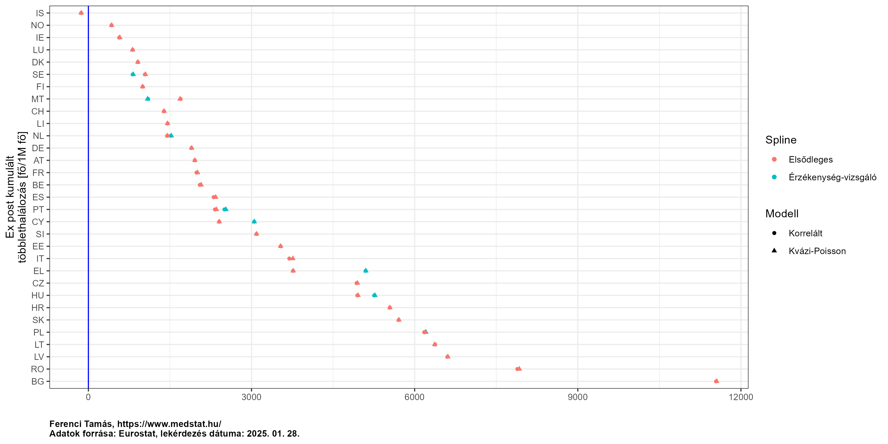<!-- -->

Ez az ábra nagyon fontos, mert mutatja, hogy bár a konkrét számok nem
egyértelműek, az országok közötti sorrend nagyban állandó, függetlenül a
használt paraméterektől! (De azért nem tökéletesen, ezt is érdemes
tanulmányozni: például Görögország esetében az érzékenység-vizsgálatként
választott spline elég lényegesen eltérő eredményt ad, mint az
elsődlegesként választott spline.)

Ettől függetlenül tudni kell, hogy a többlethalálozási eredmények nem
kőbevésettek. Most ugyan a fenti szerencsés helyzetet tapasztaltuk, de
erre semmiféle előzetes garancia nincsen, így egyrészt minden alkalommal
vizsgálni, másrészt szükség esetén érzékeltetni kell ezt az
eredményközlésben. Ez utóbbinak két formája van, az egyik, hogy túl nagy
pontossággal nem érdemes megadni az eredményeket (ez még most is igaz:
semmi értelme főre pontosan közölni az eredményt, bőven elég 100-ra
kerekíteni), másrészt ha kell, nem egy eredményt, hanem például egy
tartományt kell megadni, és jelezni a bizonytalanságot.

### Összevetés a jelentett halálozással

Érdekes kérdés, hogy vajon a többlethalálozás adatsora hogyan viszonyul
a jelentett halálozáshoz (már most hangsúlyozva, hogy semmiféle olyan
elvárás nincs – még elméletileg sem! – hogy a kettőnek egyeznie
kellene). Mindazonáltal a mintázat, és pláne a nagyobb eltérések
figyelemfelhívóak lehetnek.

Megnézhetjük Magyarország példáján a kétféle adatsort (az ex ante
számolt aktuális halálozást használva):

``` r
ggplot(melt(res[geo=="HU"&age=="TOTAL"&sens==FALSE&ED=="ExAnte"&model=="quasipoisson"&
                  date<="2023-07-01",
                .(date, `Többlethalálozás` = excess/population*1e6,
                  `Regisztrált koronavírus-halálozás` = new_deaths/population*1e6)],
            id.vars = "date"), aes(x = date, y = value, group = variable, color = variable)) +
  geom_line() + labs(x = "", y = "Halálozás [fő/1M fő]", caption = captionlab) +
  scale_x_date(date_breaks = "months", labels = scales::label_date_short()) +
  theme(plot.caption = element_text(face = "bold", hjust = 0), legend.position = "bottom",
        legend.title = element_blank())
```

<!-- -->

Érdekes, hogy a két görbének mind a csúcsa, mind az időbeli felfutása
eltér egymástól, ráadásul az eltérés nem is egységes a különböző
hullámokban. Ennek pontosabb vizsgálata fontos kérdés lenne, itt most
csak néhány – vélhetően – fontos szerepet játszó szempontra hívnám fel a
figyelmet:

- A többlethalálozás két előnye közül a haláloki besorolás nem
  valószínű, hogy egy országon belül lényegesen változott volna időben,
  de a tesztelési intenzitás már megváltozhat időben.
- A járvány és annak kezelésének indirekt hatásai szintén nem biztos,
  hogy időben állandóak.
- A múltbeli adatokból becsült várt halálozási adatoknál szintén
  változhat időben a becslés jósága. Ennek legkézenfekvőbb oka az
  influenza-szezon (mely a legvalószínűbb magyarázat például arra, hogy
  február elején hogyan lehet, hogy nulla a többlethalálozás, miközben
  nagyon is van regisztrált koronavírusos halálozás). Erre a kérdésre
  még egy külön pontban, jóval részletesebben visszatérek később.
- Végezetül fontos hangsúlyozni (sajnos a magyar adatközlés ezt nem
  teszi túl egyértelművé, így sokan félreértik), hogy a regisztrált
  magyar halálozásoknál a közlés dátuma a halál *jelentésének* a dátuma,
  nem a *bekövetkezésének* a dátuma. Márpedig a kettő között akár
  tetemes különbség is lehet, pláne, ha épp a sok halálozás miatt
  elmarad az adminisztráció és torlódnak az adatok. Fontos lenne a
  kérdés számszerű vizsgálata is, tehát, hogy mikor mekkora különbség
  volt a kettő között és hogy nézne ki a halálozások görbéje a
  bekövetkezésük dátuma alapján megrajzolva; sajnos a magyar adatközlés
  ezt nem teszi lehetővé, ugyanis semmilyen adatot nem közöl nyilvánosan
  a bekövetkezés dátumáról. Megjegyzem, hogy ugyanez a kérdés a
  többlethalálozásnál is felmerülhetne, de szerencsére az [Eurostat
  adatainál](https://ec.europa.eu/eurostat/cache/metadata/en/demomwk_esms.htm#coher_compar1706014835120)
  mindegyik általunk használt ország esetében – így Magyarországnál is!
  – egységesen a bekövetkezés dátuma szerint szerepelnek a halálozások.

Érdekes összevetni a kétféle mutatót nem csak Magyarországra, hanem az
összes vizsgált országra. Az áttekinthetőség kedvéért használjuk a
kumulált – és ex post számolt – adatot a záráskori időpontra (a fekete
vonal az egyenlőség vonala, ahol a többlethalálozás egyezne a jelentett
halálozással):

``` r
ggplot(res[nuts_level==0&age=="TOTAL"&sens==FALSE&ED=="ExPost"&model=="quasipoisson"&
             date=="2023-06-26"],
       aes(x = cumexcess/population*1e6, y = cumnewdeaths/population*1e6, label = geo)) +
  geom_point(aes(col = geo=="HU")) + geom_abline() + geom_text(hjust = "left", nudge_x = 30) +
  scale_color_manual(values=c("FALSE" = "gray", "TRUE" = "red")) + guides(color = "none") +
  labs(x = "Összesített többlethalálozás [fő/1M fő]",
       y = "Összesített jelentett halálozás [fő/M fő]", caption = captionlab) +
  theme(plot.caption = element_text(face = "bold", hjust = 0), legend.position = "bottom",
        legend.title = element_blank())
```

<!-- -->

Látszik, hogy az országok többségében a többlethalálozás nagyon közeli a
jelentetthez, minimális szóródással ide vagy oda (Magyarországon
történetesen szinte tökéletesen egyezik a kettő). Az országok egy kisebb
részében viszont nagyobb eltérés is van, ám ezeknél a kirívó eseteknél
az irány szinte mindig az, hogy a többlethalálozás nagyobb mint a
jelentett halálozás! Különösen szembeötlő Bulgária esete; ez még az
említett limitációkkal együtt is erősen annak a lehetőségét veti fel,
hogy a koronavírusos halálozásokat masszívan aluljelentették.

Zárásként nézzük meg Magyarország esetén a kumulált, ex post értékek
időbeli alakulását is (most kivételesen, mivel egyetlen országról van
szó, abszolút skálán):

``` r
p <- ggplot(melt(res[geo=="HU"&age=="TOTAL"&sens==FALSE&ED=="ExPost"&model=="quasipoisson"&
                       date<="2023-07-01", 
                     .(date, `Többlethalálozás` = cumexcess,
                       `Regisztrált koronavírus-halálozás` = cumnewdeaths)],
                 id.vars = "date"), aes(x = date, y = value, group = variable, color = variable,
                                        label = round(value, -2))) + geom_line() +
  labs(x = "", y = "Halálozás [fő]", caption = captionlab) +
  scale_x_date(date_breaks = "months", labels = scales::label_date_short()) +
  theme(plot.caption = element_text(face = "bold", hjust = 0), legend.position = "bottom",
        legend.title = element_blank())
p
```

<!-- -->

A korábban már felvázolt “lassú” adatszolgáltatási folyamatnak, tehát a
HVB-k alapján történő, az Egészségügyi Világszervezet protokollját
követő besorolásnak az [eredményei
megvannak](https://www.ksh.hu/stadat_files/nep/hu/nep0010.html), éves
felbontásban: a 2020 évi összesített adat szerint 8981 halálesetet, a
2021-es szerint 24838-at, a 2022-es szerint 7685-öt soroltak a mostani
koronavírus miatt bekövetkezettnek. Érdemes – pontokkal – ezeket is
megjelölni az ábrán:

``` r
p + geom_point(data = data.frame(x = c(as.Date("2020-12-31"), as.Date("2021-12-31"),
                                       as.Date("2022-12-31")),
                                 y = c(8981, 8981 + 24838, 8981 + 24838 + 7685)),
               inherit.aes = FALSE, aes(x = x, y = y,
                                        fill = "HVB-k szerinti koronavírus-halálozás"))
```

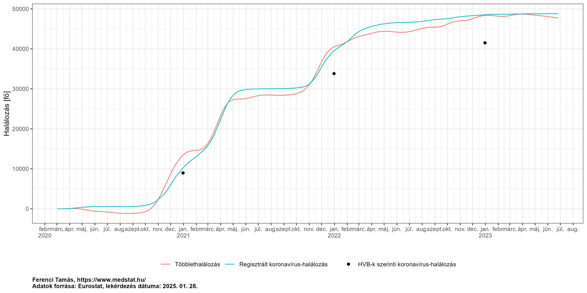<!-- -->

Mint látszik, érdemi különbség 2020-ban nincs, 2021-ben és 2022-ben
pedig egy kisebb eltérés alakult ki: a napi gyorsjelentett halálozások
száma némileg a halottvizsgálati szám fölé kerül, ám a különbség nem
jelentős (2022-ig összesítve a jelentett halálozás 48495 fő, a
halottvizsgálati érték 41504 fő, tehát a különbség 16.8%). Ez fontos
abból a szempontból, hogy cáfolja azt a vélekedést, miszerint a gyors
regisztrálás “boldog-boldogtalant” koronavírusos halottnak sorol,
szemben a precíz besorolással. Sajnos, mint volt is róla szó, a precíz,
HVB szerinti adatokat mindig csak a következő évben tudjuk meg (és nem
is az elején).

Megjegyzendő, hogy – bármennyire is kézenfekvőnek tűnik, és csakugyan
fontos is lenne – megyei szinten a kétféle adat nem vethető össze, mivel
Magyarországon nincs és nem is volt nyilvános adatközlés a halálozások
területi eloszlásáról, még megyei szinten sem. A fertőzöttekről ugyan
volt nyilvános adat (más kérdés, hogy olyan módon, hogy a számokat egy
képfájlra (!) írták fel…), de annak összevetése még kérdésesebb, hiszen
– mint már volt róla korábban is szó – ott közrejátszik a halálozási
arány is, ami miatt ez a kapcsolat nagyon áttételes.

## Záró gondolatok

A többlethalálozási adatok felhasználása kettős: járvány alatt fontos
információforrást jelentenek az aktuális helyzet nyomonkövetésére,
járvány után pedig a történtek kiértékelésére (természetesen mindkét
esetben a felvázolt korlátok figyelembevételével). Az előbbi esetben
tipikusan a trendeket nézzük, hogy romlik-e vagy javul a helyzet,
mennyire – ez magyarul azt jelenti, hogy országon *belül* hasonlítunk
össze (ugyanazon ország különböző időpontbeli adatait hasonlítjuk
egymáshoz). A második helyzetben viszont gyakoribb, hogy országok
*között* hasonlítunk össze – hol lett nagyobb a többlethalálozás, és hol
lett kisebb? Ez utóbbi célja általában a tulajdonítás, az attribúció:
annak feltárása, hogy milyen tényezők vezettek a jobb vagy éppen
rosszabb eredményhez, annak megmagyarázása, hogy ahol jobb lett az
eredmény ott miért lett jobb és ahol rosszabb lett, ott miért lett
rosszabb. Azt feltételezzük ugyanis, hogy ahol jobb lett az eredmény,
ott valamit jól csináltak, vagy valamilyen körülmény szerencsésebb volt,
így egy ilyen vizsgálat segít feltárni, hogy milyen körülmény volt
szerencsésebb, vagy mit csináltak jól, ami a kisebb halálozáshoz
vezetett. Ennek megértése elsőrangú kérdés, hiszen segíthet a tanulságok
levonásában, a tanulásban, és ami talán még fontosabb: ezek révén abban,
hogy a jövőben jobb eredményt érjünk el egy járvány kezelésében.

Bár ez a kérdés már nem a többlethalálozás számításához kapcsolódik,
szeretnék róla pár gondolatot leírni. Az első és legfontosabb, hogy ez a
feladat, bár vitathatatlanul nagyon fontos, rendkívül nehéz is. A
probléma az, hogy az országok milliónyi jellemzőben térnek el egymástól:
ha meg is állapítjuk, hogy hol lett nagyobb a többlethalálozás, honnan
tudjuk, hogy a milliónyi eltérés közül melyik az, ami ennek a hátterében
van…? A probléma, hogy ezek az eltérések tipikusan egymással is
összefüggnek. Mondjuk azt találjuk, hogy ahol több ápoló jut ezer
lakosra, ott kisebb a többlethalálozás. Akkor tehát az ápolók száma
csökkenti a halálozást? Kézenfekvő a gondolat, de mi van, ha ott, ahol
több ápoló jut ezer lakosra, egyúttal kisebb a dohányzók aránya is?
Akkor lehet, hogy az ápolóknak igazából nincs is semmi szerepe és a
dohányzáson múlik a dolog? De mi van, ha ezekben az országokban a
cukorbetegek aránya is kisebb? Akkor lehet, hogy egyiknek sincs
valójában szerepe, és a dolog a cukorbetegségen múlik? Mi van, ha ezek
mindegyike számít, valamilyen arányban…?

Ezt a problémát hívják magyarul is általánosan használt angol szóval
confounding-nak. (Angolul nagyon találó kifejezés: szó szerint
“egybemosódást” jelent, és valóban arról van szó, hogy a különböző
tényezők hatása egybemosódik, a több nővér egybemosódik a kevesebb
cukorbeteggel.) A probléma általánosságából adódóan számos más területen
fellép, orvostudománytól a közgazdaságig
([videó-előadás](https://www.youtube.com/watch?v=dYt6vqqdtYQ), [írott
jegyzet](https://tamas-ferenci.github.io/FerenciTamas_AzOrvosiMegismeresModszertanaEsAzOrvosiKutatasokKritikusErtekelese/az-empirikus-megismer%C3%A9s-alapgondolata-%C3%A9s-a-confounding.html)).

A gond itt súlyos, hiszen a sor az ilyen potenciális magyarázó
változókra tényleg nagyon hosszan folytatható, miközben EU és EFTA
országból mindössze 31 áll rendelkezésünkre! (Lejjebb mehetünk
területileg, megyei szintre, és akkor több egységünk lesz, de ezt tudjuk
a magyarázó változókkal is követni? Ismerjük megyénként is a
cukorbetegek arányát? És az ezer lakosra jutó ápolók számát? Egyáltalán,
értelmezhető ez megyei szinten…? Úgyhogy ilyenkor már nem csak
adatelérhetőségi, de definíciós problémák is felmerülhetnek.)

A másik gondolat, amit megemlítenék, az a befolyásolhatóság kérdése. A
tulajdonítás sokszor azért fontos, hogy megmondjuk: min múlt a dolog.
(Jó esetben a tanulást, és nem az ujjal mutogatást szolgálva ezzel!)
Ilyen szempontból azonban nagyon eltérhetnek az egyes tényezők, amik
kihatnak a járvány miatt halálozásra. Lehetnek olyanok, amik egyáltalán
nem befolyásolhatóak reálisan (például a korfa), lehetnek olyanok, amik
befolyásolhatóak ugyan, de nem gyorsan (például az elhízottak aránya –
ezt ugyan befolyásolhatják állami népegészségügyi programok, de nem
másnapra), és lehetnek olyanok, amik gyorsan befolyásolhatóak (példásul
korlátozó intézkedések bevezetése vagy feloldása, ami sokszor tényleg
megtehető másnapra). A felelősség típusú attribúciónál e kérdés
vizsgálata is alapvető.

Egy dolgot világosan látni kell az olyan típusú elemzések kapcsán,
amelyek különböző országokat hasonlítanak össze: amikor összehasonlítási
alapot választunk, akkor kérdést is választunk, amire válaszolunk.
Hasonlítsuk magunkat az összes európai országhoz, beleértve
Nyugat-Európát? Vagy inkább csak a V4 országaihoz arra hivatkozva, hogy
nekik hasonló a történeti hátterük mint nekünk? Azt kell megérteni, hogy
egyik megközelítés sem “jó” vagy “rossz”, egyszerűen más kérdésre
válaszolnak: ha a V4-eket vesszük, mondván, hogy például az
alkoholfogyasztók vagy dohányzók aránya nagyobb mint Nyugat-Európában,
hozzánk hasonlóan, a posztszocialista múlt miatt, akkor egyszerűen
kivesszük az alkoholfogyasztást és dohányzást a vizsgálatból. Ami lehet
kimondottan szerencsés, ha azt mondjuk, hogy ezek hatásával szándékosan
nem akarunk törődni (például mert azt mondjuk, hogy nem jellemzi a
járványkezelés jóságát, márpedig mi azt akarjuk mérni – ez egy teljesen
legitim álláspont, valóban nem jelent rosszabb járványkezelést, ha
valahol *csak* azért nagyobb a halálozás, mert több a dohányzó), de
másik oldalról, így lehetetlenné tesszük, hogy észrevegyük, hogy ezekben
a tényezőkben javítani kellene, ha a következő járványt jobban akarjuk
átvészelni. Ezt csak akkor tudjuk kideríteni, ha a nyugati országokhoz
is mérjük magunkat.

Egy [másik
esszémben](https://github.com/tamas-ferenci/GondolatokAJarvanyElleniVedekezesErtekeleserolEsAJarvanyHatasanakVizsgalatarol)
részletesen kifejtem a fenti kérdések módszertani nehézségeit és
megoldási lehetőségeit.

Végezetül még egyetlen megjegyzés zárásként. A legkitűnőbb elemzés sem
ér sokat, ha a közvélemény nem bízik meg annak megállapításaiban.
Sokszor
[elmondtam](https://github.com/tamas-ferenci/GondolatokAJarvanyugyiAdatokKozleserol),
itt is megismétlem, hogy e bizalom egyik alapja és rendkívül fontos
sarokköve a transzparencia, amely téren az ilyen elemzések is példát
tudnak mutatni, ha a közvélemény számára is megismerhető, reprodukálható
módon közlik őket, tartalmukat közérthetően elmagyarázzák, és őszinte,
nyílt – például: a limitációkra is kiterjedő – kommunikáció kapcsolódik
hozzájuk.

Látható talán mindezekből, hogy a többlethalálozás számítása sok
elemzéshez valójában csak az első lépés, a kiindulópont. De ez nem azt
jelenti, hogy emiatt kisebb a súlya, ellenkezőleg: nem várható jó
elemzés akkor, ha már a kiindulópont is hibás. Mint a fentiek is
mutatják, az utána jövő kérdések – amik már túlmutatnak e dolgozat
keretein – szintén nem könnyűek, és nem állítom, hogy adhatóak rájuk
egyszerű válaszok, de azt biztosan állítom, hogy az ezeken való
gondolkodás előbbre viszi az országot.

## Függelék

### A kétféle relatív mutató viszonya

A lélekszámra vetített ábrákat láthattuk az eredményeket bemutató
részben. Most nézzük meg kicsit közelebbről a kétféle relatívvá tétel
egymáshoz való viszonyát!

Emlékeztetőül, az aktuális többlethalálozás lélekszámra vetített relatív
mutatóként, ex ante módon számolva:

``` r
ggplot(res[nuts_level==0&age=="TOTAL"&sens==FALSE&ED=="ExAnte"&model=="quasipoisson"&
             date<="2023-07-01"],
       aes(x = date, y = excess/population*1e6, group = geo, label = geo)) +
  geom_line(aes(color = geo=="HU",
                group = forcats::fct_reorder(geo, geo=="HU", .fun = first))) +
  geom_hline(yintercept = 0, colour = "blue") +
  scale_color_manual(values = c("FALSE" = "gray", "TRUE" = "red")) + guides(color = "none") +
  labs(x = "", y = "Ex ante aktuális\ntöbblethalálozás [fő/1M fő]", caption = captionlab) +
  scale_x_date(date_breaks = "months", labels = scales::label_date_short()) +
  directlabels::geom_dl(method = list("last.points", cex = 0.6)) +
  theme(plot.caption = element_text(face = "bold", hjust = 0), legend.position = "bottom",
        legend.title = element_blank())
```

<!-- -->

Ugyanez akkor, ha a várt halálozásra vetítünk:

``` r
ggplot(res[nuts_level==0&age=="TOTAL"&sens==FALSE&ED=="ExAnte"&model=="quasipoisson"&
             date<="2023-07-01"], aes(x = date, y = increase*100, group = geo, label = geo)) +
  geom_line(aes(color = geo=="HU",
                group = forcats::fct_reorder(geo, geo=="HU", .fun = first))) +
  scale_color_manual(values=c("FALSE" = "gray", "TRUE" = "red")) + guides(color = "none") +
  labs(x = "", y = "Aktuális többlethalálozás [%]", caption = captionlab) +
  geom_hline(yintercept = 0, colour = "blue") +
  scale_x_date(date_breaks = "months", labels = scales::label_date_short()) +
  directlabels::geom_dl(method = list("last.points", cex = 0.6)) +
  theme(plot.caption = element_text(face = "bold", hjust = 0), legend.position = "bottom",
        legend.title = element_blank())
```

<!-- -->

Látszik, hogy a kétféle relatív mutató között nincs nagy különbség.
Kicsit direktebben is összevethetjük őket, ha országonként külön-külön
ábrázoljuk, egymással szemben:

``` r
ggplot(res[age=="TOTAL"&nuts_level==0], aes(x = increase*100, y = excess/population*1e6)) +
  geom_line() +
  labs(x = "Aktuális többlethalálozás [%]", y = "Aktuális többlethalálozás [fő/1M fő]",
       caption = captionlab) +
  facet_wrap(~geo) + geom_abline(intercept = 0, slope =  2, alpha = 0.3) +
  theme(plot.caption = element_text(face = "bold", hjust = 0), legend.position = "bottom",
        legend.title = element_blank())
```

<!-- -->

Az ábra az origón átmenő, 2 meredekségű egyenest tünteti fel a
viszonyítást segítendő. (Miért pont erre illeszkednek jól? E szerint a
100% többlet – azaz épp a halálozás – 200 fő/M főnek felel meg. De
vigyázat, ez heti adat, így az éves az $52 \cdot 200 = 10 400$, ami ezer
főre vetítve 10,4, és csakugyan ennyi nagyjából az európai országok
nyers halálozási rátája.) Ez egyúttal arra a korábban is tárgyalt
jelenségre is rámutat, hogy mi a lélekszámra vetítés jellegzetessége:
függ a nyers halandóságtól. Ilyen szempontból a várt halálozásra való
vetítés jobb, de mint láthatjuk, a különbség európai viszonyokon belül
nem nagy. A várt értékre való vetítés hátránya, azon a már említett
szemponton túl, hogy egy eleve becsült értékkel oszt, egyrészt az, hogy
nem vethető közvetlenül össze a jelentett halálozással (hiszen más a
mértékegységük is), másrészt pedig az, hogy nem nyilvánvaló a kumulálása
(de azért megoldható, lásd következő pont).

Folytassuk most az összesített többlethalálozással, ex post módon
számolva. Emlékeztetőül a népességszámra vetített ábra:

``` r
ggplot(res[nuts_level==0&age=="TOTAL"&sens==FALSE&ED=="ExPost"&model=="quasipoisson"&
             date<="2023-07-01"],
       aes(x = date, y = cumexcess/meanpopulation*1e6, group = geo, label = geo)) +
  geom_line(aes(color = geo=="HU",
                group = forcats::fct_reorder(geo, geo=="HU", .fun = first))) +
  geom_hline(yintercept = 0, colour = "blue") +
  scale_color_manual(values=c("FALSE" = "gray", "TRUE" = "red")) + guides(color = "none") +
  labs(x = "", y = "Ex post kumulált\ntöbblethalálozás [fő/1M fő]", caption = captionlab) +
  scale_x_date(date_breaks = "months", labels = scales::label_date_short()) +
  directlabels::geom_dl(method = list("last.points", cex = 0.6)) +
  theme(plot.caption = element_text(face = "bold", hjust = 0),
        legend.position = "bottom", legend.title = element_blank())
```

<!-- -->

Kérdés, hogy mi a helyzet a várt értékre vetített mutatóval. A probléma
a kumulálás, hiszen a százalékok természetesen nem adhatóak egyszerűen
össze. Ha kicsit nyakatekertebb is, de van megoldás, külön kumuláljuk a
többletet és a várt értéket, majd ezeket osztjuk el egymással:

``` r
ggplot(res[nuts_level==0&age=="TOTAL"&sens==FALSE&ED=="ExPost"&model=="quasipoisson"&
             date<="2023-07-01"],
       aes(x = date, y = cumexcess/cumexpected*100, group = geo, label = geo)) +
  geom_line(aes(color = geo=="HU",
                group = forcats::fct_reorder(geo, geo=="HU", .fun = first))) +
  geom_hline(yintercept = 0, colour = "blue") +
  scale_color_manual(values = c("FALSE" = "gray", "TRUE" = "red")) + guides(color = "none") +
  labs(x = "", y = "Összesített többlethalálozás [%]", caption = captionlab) +
  scale_x_date(date_breaks = "months", labels = scales::label_date_short()) +
  directlabels::geom_dl(method = list("last.points", cex = 0.6)) +
  theme(plot.caption = element_text(face = "bold", hjust = 0),
        legend.position = "bottom", legend.title = element_blank())
```

<!-- -->

A kép természetesen itt is hasonló, de azért érdemes megnézni a
különbségeket, mert szépen illusztrálják az elméleti mondanivalót. Hogy
jobban lássunk, vessük össze közvetlenebbül a kétféle értéket az egyes
országokra:

``` r
ggplot(res[nuts_level==0&age=="TOTAL"&sens==FALSE&ED=="ExPost"&model=="quasipoisson"&
             date=="2023-06-26"],
       aes(x = cumexcess/meanpopulation*1e6, y = cumexcess/cumexpected*100, label = geo)) +
  geom_point(aes(col = geo=="HU")) + geom_hline(yintercept = 0, colour = "blue") +
  geom_vline(xintercept = 0, colour = "blue") + geom_text(hjust = "left", nudge_x = 30) +
  scale_color_manual(values = c("FALSE" = "gray", "TRUE" = "red")) + guides(color = "none") +
  labs(x = "Összesített többlethalálozás [fő/1M fő]", y = "Összesített többlethalálozás [%]",
       caption = captionlab) +
  theme(plot.caption = element_text(face = "bold", hjust = 0),
        legend.position = "bottom", legend.title = element_blank())
```

<!-- -->

Ami az említett különbségeket illeti, vegyük példának Szlovákiát és
Lettországot. Szlovákia szűk háromszor nagyobb ország lélekszámban (5,5
és 1,9 millió fő) és szűk háromszor annyi az abszolút többlethalálozása
is (31600 és 12100). Ezért kerültek szinte pontosan egymás fölé: a
lélekszámra vetített többlethalálozásaik nagyon pontosan egyeznek. Igen
ám, de Lettországban sokkal nagyobb a várt halandóság! A járvány
időszaka alatt kumuláltan 91200 fő, míg Szlovákiában 178000 fő (ne
felejtsük el, hogy Szlovákia majdnem háromszor akkora lélekszámmal bír).
Ez az alapján sem meglepő, hogy Lettországban egyszerűen nagyobb a nyers
halandóság, például a koronavírus-járványt megelőző 5 évben 14.7/1000
fő/év, míg Szlovákiában csak 9.8/1000 fő/év. Azaz hiába halnak meg
ugyanannyian lakosságarányosan, Szlovákiában úgy egyébként jóval
kevesebb halálozás történik, így ugyanaz a – lakosságarányos – többlet
ilyen értelemben durvább helyzetet jelez. Ezt tükrözi, hogy a függőleges
tengelyen Szlovákia jóval feljebb került.

Egyszóval, ahogy volt is róla szó, a két mutató más szempontból mutatja
meg ugyanazt a jelenséget. Mindazonáltal az is látszik az ábrából, hogy
az alaptrend azért hasonló mindkét mutatóval (ezen belül is:
Magyarország pozíciója gyakorlatilag ugyanaz, bármelyik metrikát
használjuk is).

### A direkt hatás elkülönítése: egy kísérlet az influenza-járvány kezelésére

Láthattuk, hogy a többlethalálozási mutató legnagyobb baja, hogy
igazából *nem* a járvány direkt hatását méri. Szintén megbeszéltük, hogy
– a lassúságon túl – két nagy baja van: hogy függ a várt érték
előrejelzésétől, és hogy beleméri az eredménybe a járvány és kezelésének
indirekt hatásait is (mind a pozitívakat, mind a negatívakat).
Mindezeket összegezve úgy fogalmazhatnánk, hogy többlethalálozás =
direkt hatás + indirekt hatások + előrejelzés tévedése a járványtól
független halandóságról. A probléma épp az, hogy nekünk az elsőre lenne
szükségünk, de csak az összeget látjuk. Így nézve egy meglehetősen
kézenfekvő ötlet, hogy próbáljuk a másik két tényezőt számszerűsíteni,
mert ha azokat sikerülne meghatározni, akkor egyszerűen kivonva őket a
többlethalálozásból megkapjuk a keresett direkt hatást!

Jelen pont erre fog egy példát mutatni: a cél az lesz, hogy az
influenza-járvány hatását próbáljuk meg figyelembe venni, és ezzel
korrigálni a kapott becslést; más tényezővel nem foglalkozunk.
Előrebocsátom, hogy a terület egy aknamező, így ez hangsúlyozottan csak
kiegészítő elemzés. Első ránézésre meglepő lehet ez az állítás: miért
problémás ha valamivel korrigálunk? Persze, rendben, van még egy sor
másik tényező is, de így legalább eggyel beljebb vagyunk! – mondhatja
valaki. A probléma azonban épp ez: ha egyszer belekezdünk abba, hogy
elkezdünk korrigálgatni bizonyos tényezőkre, akkor nagyon ingoványos
talajra kerülünk: miért pont azokra korrigálunk? A többire miért nem?
Hol húzzuk meg a határt, hogy mire próbálunk korrigálni és mire nem?
Igen, lehet mondani, hogy így egy dologtól megtisztítottuk, míg az
eredeti attól az egytől sincs tisztítva, de az eredetinek legalább
világos, egyértelmű, pontosan definiált a tartalma, míg az új mutatónak
már nem. Még ha a számítása nem is egyértelmű, de maga a fogalom, hogy
többlethalálozás, egyezményes, világos, hogy mit tartalmaz. A “részben
tisztított” mutató már egyáltalán nem egyértelmű, hogy mit jelent,
hogyan hasonlítható össze nemzetközileg stb.

Az, hogy mennyire erősek az ellenérvek a fentiekkel szemben, függ attól
is, hogy mennyire határozottan különíthető el az egyéb
mortalitás-befolyásoló ok, amit le akarunk választani a
többlethalálozásból. Egy elég meglepő, de valós kérdés: kivonjuk-e
Azerbajdzsán és Örményország többlethalálozásából a 2020 végi
hegyi-karabahi háború áldozatainak a számát…? Ez talán még a legjobban
védhető helyzet, hiszen ez teljesen egyértelműen az “előrejelzés
tévedése a járványtól független halandóságról” kategóriában van, mivel
ez nyilván nem volt előrejelezhető a múltbeli halálozási adatokból,
semmilyen módszerrel, másrészt elég jól meghatározható számú halálozást
jelentett. (Vegyük észre, hogy ezek növelik a koronavírusos halálozást,
ha a többlethalálozást használjuk!) De még így is óvatos lennék, még
ezzel is, épp a fenti okok miatt.

Hangsúlyozva tehát még egyszer az ezzel kapcsolatos fenntartásokat, egy
konkrét példát nézzünk meg: az influenza-járvány kezelését. Azért ezt,
mert magyar viszonyok között talán ez jelenti a legmarkánsabb olyan
forrását a mortalitásnak, ami évről-évre lényegesen változik, és
ráadásul indirekt hatásként is megjelenhet (a védekező intézkedések
minden légúti kórokozó ellen jót tesznek). A jelentősége azonnal látható
is, ha az ember ránéz az aktuális többlethalálozást és a regisztrált
halálozást egyszerre feltüntető ábrára: hogyan lehet, hogy 2021. február
elején szó szerint nulla volt a többlethalálozás, miközben regisztrált
halálozás volt, nem is kevés…? Bizonyosan természetesen nem lehet
válaszolni, pont a többlethalálozás fenti nehézségei miatt, de nagyon
erős lehet a gyanúnk, hogy az influenza a magyarázat: 2020/21-ben az
influenza-szezon praktikusan elmaradt, csakhogy ez a várt halálozási
görbében benne volt, amely görbét levontuk – magyarán levontunk valamit,
amit nem kellett volna, így az eredmény persze, hogy kisebb lett. Úgy is
fogalmazhatnánk, hogy a koronavírus lecserélte az influenzát: igen,
nulla volt többlethalálozás, de a helyes megfogalmazás, hogy *annak
ellenére* is *csak* nulla volt a többlethalálozás, hogy kiesett az
influenza!

Hogyan tudnánk ezt valahogy kezelni, korrigálni? Az egyik lehetőség,
hogy megnézzük a múltbeli influenza-járványok halálozásaira vonatkozó
adatokat és azt egész egyszerűen hozzáadjuk a mostani
többlethalálozáshoz (mondván, hogy ennyit vontunk le szükségtelenül).
Eljárhatunk azonban jóval elegánsabban is. Mint már volt róla szó, a
várt halálozást előrejelző modellnek meg kell adni, hogy melyik adatok
vannak kizárva a modell becsléséből, így megtehetjük, hogy ezeket a
kizárt dátumokat kibővítjük: szintén kivesszük az influenza-szezonokat,
azaz a stratégia az, hogy ilyen módon megbecslünk egy “influenza
nélküli” alapvonalat, és ezt vonjuk ki, mint várt halálozást! Ezzel
lényegében automatikusan korrigálunk az influenza-járványra.

A dolog azonban ennél egy kicsit bonyolultabb: azt sem tehetjük meg,
hogy az összes influenza-szezont kivesszük, hiszen akkor meg nem lesz
miből megbecsülni ezen hetekre a szezonális mintázatot. A megoldást az
jelentheti, ha *kézzel* megnézzük a múltbeli adatokat, és ahol más
forrásból tudjuk, hogy nem, vagy nagyon enyhe influenza-szezon volt, azt
*mégis* visszatesszük, hogy a modell ebből meg tudja ezekre a hetekre is
becsülni a szezonális mintát. (Valójában ez nem teljesen igaz. Mivel
Acosta és Irizarry eljárása egy meghatározott formájú függvényt illeszt
a szezonális mintázatra, így akkor is működni fog, ha egy adott
időintervallumra egyáltalán semelyik évben nincs megfigyelésünk, mert ha
az év többi szakaszából meg tudja ezen függvényforma paramétereit
becsülni, akkor az kiad valamilyen lefutást erre a kihagyott
intervallumra is. Mindazonáltal biztosabb a becslés, ha mindenhol és
minél több adatunk van.)

Az egyszerűség kedvéért mondjuk, hogy Magyarországon a
január-február-március az influenza-szezon, ezt a három hónapot zárjuk
ki minden olyan 2020 előtti évben, amikor vizuálisan érdemi többlet –
azaz tényleges influenza-szezon – látszódott. Hogy látható legyen ennek
a hatása, érdemes megnézni, hogy mi a várt halálozás becsült görbéje a
két módon:

``` r
ggplot(resFull[geo=="HU"&age=="TOTAL"&sens==FALSE&ED%in%c("ExPost", "Flu")&
                 model=="quasipoisson",
               .(date, expected,
                 ED = ifelse(ED=="ExPost", "Eredeti", "Influenza-szezonok kizárásával"))],
       aes(x = date, y = expected, color = ED)) + geom_line() +
  labs(x = "Év", y = "Várt heti halálozás [fő/hét]", color = "") +
  theme(legend.position = "bottom")
```

<!-- -->

Szépen látszik, hogy az influenza-szezonok nélkül becsültetett modell
kevésbé fut fel magas értékekre, hiszen nem kell ráilleszkednie az
akkori magasabb halálozásokra, de az is nagyon érdekes, hogy az
alaptrend is más lett. (Igen, elvileg ez is előfordulhat: lehet, hogy az
influenza-szezonok nélkül számolva más alaptrendet látunk.)

És itt már látszik az ötlet működése: ha ehhez az – alacsonyabban lévő –
értékhez viszonyítunk, akkor nem fogja lecsökkenteni a többlethalálozást
az, hogy a viszonyítási alapérték tartalmazza az – abban az évben be sem
következett – influenza-szezont. Nézzük az eredményeket:

``` r
ggplot(res[geo=="HU"&age=="TOTAL"&sens==FALSE&ED%in%c("ExPost", "Flu")&model=="quasipoisson"&
             date<="2023-07-01",
           .(date, cumexcess, ED = ifelse(ED=="ExPost", "Eredeti",
                                          "Influenza-szezonok kizárásával"))],
       aes(x = date, y = cumexcess, group = ED, color = ED, label = round(cumexcess, -2))) +
  geom_line() +
  directlabels::geom_dl(data = res[geo=="HU"&age=="TOTAL"&sens==FALSE&ED%in%c("ExPost", "Flu")&
                                     model=="quasipoisson"&date=="2023-06-26",
                                   .(date, cumexcess,
                                     ED = ifelse(ED=="ExPost", "Eredeti",
                                                 "Influenza-szezonok kizárásával"))],
                        method = list("last.points", cex = 0.6)) +
  labs(x = "", y = "Halálozás [fő]", caption = captionlab) +
  scale_x_date(date_breaks = "months", labels = scales::label_date_short()) +
  theme(plot.caption = element_text(face = "bold", hjust = 0), legend.position = "bottom",
        legend.title = element_blank())
```

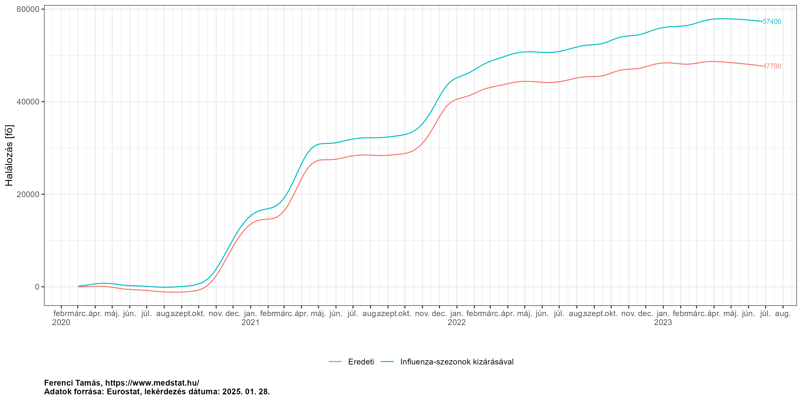<!-- -->

Látszik, hogy így számolva a többlethalálozás, ahogy vártuk is,
megemelkedik – első ránézésre ráadásul elég nagy mértékben, 13 ezer
fővel. De ha jobban meggondoljuk ez teljesen reális: a vizsgálat
időszakban ugyanis *három* influenza-szezon is kiesett, márpedig egy
szezon halálozása [magyar
adatok](https://akjournals.com/view/journals/650/161/23/article-p962.xml)
szerint jobb esetben 1-2, rosszabb esetben akár 5-6 ezer fő is lehet,
így a három szezon alatti 13 ezer fő pont azt mutatja, hogy ezzel a
számítási eljárással nagyon szépen jött az influenza-szezonok – más
forrásból ismert – halálozása! Megjegyzendő, hogy ebből is látszik, hogy
újabb limitációja az előbbi számításnak: az, hogy feltételezi, hogy
ebben a három szezonban tényleg, komplettül elmaradt a szezonális
influenza.

### Acosta és Irizarry módszerének technikai részletei

Acosta és Irizarry módszerében nagyon röviden összefoglalva a következő
történik. Az alapgondolat, hogy kell a halálozások tényleges száma a $t$
időpontban, jelölje ezt $Y_t$, és a várt halálozás ugyanebben az
időpontban, jelölje ezt $\mu_t$. Azonban ahelyett, hogy egyszerűen
kivonnák a kettőt egymásból, és $Y_t - \mu_t$ módon határoznák meg a
többletet, inkább a következő valószínűségi modellt veszik alapul:
$Y_t \mid \varepsilon_t \sim \text{Poi}\left(\mu_t\left[1+f\left(t\right)\right]\varepsilon_t\right)$;
ebben tehát a többlet százalékos formában jelenik meg, ez lesz az
$f\left(t\right)$. Természetesen ebből is kiszámolható az abszolút
többlet, $f\left(t\right) \cdot \mu_t$ formában. Hogy ez miért jó?
Azért, mert így $f\left(t\right)$ simítható (ezt meg is teszik,
spline-nal), ez azért fontos, mert a nyersen számolt többlet a véletlen
hatások miatt elég zajos lehet. Erre mutat példát a magyar adatokon
következő ábra, mely a nyersen számolt, és az $f\left(t\right)$-ből
abszolútra visszaszámolt többletet mutatja:

``` r
ggplot(melt(res[age=="TOTAL"&geo=="HU"&sens==FALSE&ED=="ExAnte"&model=="quasipoisson"&
                  date<="2023-07-01", .(date, `Nyers` = y*100,
                                        `Acosta-Irizarry` = increase*100)],
            id.vars = "date"), aes(x = date, y = value, group = variable, color = variable)) +
  geom_line() + labs(x = "Dátum", y = "Százalékos többlet") +
  scale_x_date(date_breaks = "months", labels = scales::label_date_short()) +
  theme(legend.position = "bottom", legend.title = element_blank())
```

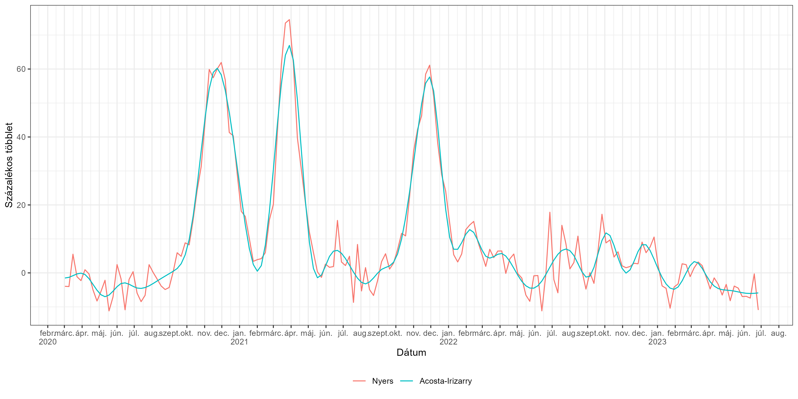<!-- -->

Ezen felül megengedhető, hogy szakadás legyen benne (ha egy jól
meghatározott esemény-időpont van, ahol a mortalitás-eltérés kezdődik).
Ezt a becslési eljáráson túl az $\varepsilon_t$-vel éri el: ez nem
feltétlenül fehérzaj, lehet autokorrelált, az adatok
autokorreláltságának elszámolására (a napi adat erősen az, a heti nem
feltétlenül).

A várt értéket a módszer az általam is részletesen bemutatott módon
$\mu_t = N_t \exp\left[\alpha\left(t\right)+s\left(t\right)+w\left(t\right)\right]$
formában számolja, ahol $\alpha\left(t\right)$ a hosszú távú – lassan
változó – trend, spline-nal megragadva (a flexibilitást az szabályozza,
hogy hány évente rak be knot-ot), $s\left(t\right)$ az éven belüli
mintázat (szezonalitás) meghatározott számú – alapbeállításban 2 –
harmonikus taggal megragadva, $w\left(t\right)$ pedig a hét napja hatás
(ha napi adatunk van).

Visszatérve a modellre, $N_t$ a háttérpopuláció, és a becslés nem
autokorrelált esetben szokásos GLM-mel történtik. A modell felállítása
logikus, hiszen a halálozások száma darabszám jellegű adat, erre
csakugyan a Poisson a legszokványosabb választás. (A Poisson az
overdiszperzió kezelésére kvázi-Poisson eloszlásra cserélhető; ez
egyébként az alapértelmezés is.) Látható, hogy $f\left(t\right)$ a
keresett többlet (szorzóként lép be, hiszen log-link mellett
multiplikatív az egész modell). Explicite nem ráta van benne, de
lényegében igen, hiszen offszetként felhasználjuk a háttérpopuláció
lélekszámát. Autokorrelált esetben a becslés bonyolultabb, egy
többlépéses eljárást használnak, amit a cikk részletesen bemutat.

A modellt most összesített adatokon futtatom (tehát nem pedig rétegzett,
például életkor és nem szerint rétegzett adatokon). Szemben azzal, amit
az ember első ránézésre gondolna, hogy ti. az életkori és nemi
összetételek eltérése miatt ez hiba lehet, ez valójában nagy bajt nem
okoz, különösen, ha a várthoz viszonyított relatív eltéréseket
használjuk, ahogy arról már volt is szó. Mégis lehet valamennyi értelme
a rétegzésnek, de egy kevésbé fontos ok miatt: ha a hosszú távú trend,
vagy szezonalitás eltér az egyes rétegek között.

## Technikai részletek

Ebben a szakaszban közlöm az elemzést végző teljes kódot, a nyílt – és
reprodukálható – tudomány filozófiájának megfelelően. Én általában is
ennek vagyok a híve, de a jelen esetben, egy népegészségügyileg kritikus
helyzetben, azt gondolom, hogy ez kiemelten fontos. Három ok miatt
vagyok a híve ennek a filozófiának: az első, hogy ez a fajta
transzparencia növeli a bizalmat a kutatási eredmények iránt, hiszen
azok így többé már nem felkent papoktól érkező kinyilatkoztatások, a
második, hogy biztosabbá teszi az eredményeket, mert így, ha elrontottam
valamit, azt az egész világ látni fogja, és így sokkal valószínűbb, hogy
kiderül és hamar kiderül (igen, rosszul fogom magam érezni, ha kiderül,
hogy hibáztam, de még sokkal rosszabbul érezném magam, ha *nem* derül
ki, és mindenki elhiszi a rossz eredményeket), végezetül a harmadik,
hogy ezzel is szeretném segíteni a többi kutatót és az érdeklődő
laikusokat hasonló számítások elvégézésében, mivel itt látnak egy
lehetséges példát.

A számítások aktualizálásának dátuma: 2024-09-18. A többlethalálozást
számító csomag (`excessmort`) verziószáma 0.7.0.

Elsőként betöltjük a szükséges könyvtárakat, elvégzünk pár egyéb
előkészületet:

``` r
library(data.table)
library(excessmort)
library(ggplot2)
source("helper.R")
theme_set(theme_bw())
captionlab <- paste0("Ferenci Tamás, https://github.com/tamas-ferenci/ExcessMortEUR/\n",
                     "Adatok forrása: Eurostat, lekérdezés dátuma: ",
                     format(Sys.Date(), "%Y. %m. %d."))
```

A mortalitási adatokat az Eurostat-tól kérjük le (a `demo_r_mwk_ts`
[adatbázist](https://ec.europa.eu/eurostat/databrowser/view/demo_r_mwk_ts/default/table?lang=en)
használva az országos, és a `demo_r_mwk3_ts`
[adatbázist](https://ec.europa.eu/eurostat/databrowser/view/demo_r_mwk3_ts/default/table)
használva a regionális adatokhoz), az `eurostat` csomag használatával,
majd leszűrjük az adattáblákat és kikódoljuk a szükséges változókat:

``` r
RawData <- as.data.table(eurostat::get_eurostat("demo_r_mwk_ts", use.data.table = TRUE))
RawData <- RawData[sex=="T"]
RawData <- RawData[geo%in%eurostat::eu_countries$code|geo%in%eurostat::efta_countries$code]
RawData <- RawData[geo!="UK"]
RawDataHunNUTS <- as.data.table(eurostat::get_eurostat("demo_r_mwk3_ts", use.data.table = TRUE))
RawDataHunNUTS <- RawDataHunNUTS[sex=="T"&substring(geo, 1, 2)=="HU"&nchar(geo)==5]
RawDataHunNUTS[ , values := round(values*sum(values)/sum(values[geo!="HUXXX"])), .(TIME_PERIOD)]
RawDataHunNUTS <- RawDataHunNUTS[geo!="HUXXX"]
RawData <- rbind(RawData, RawDataHunNUTS)
# RawDataHunAge <- as.data.table(eurostat::get_eurostat("demo_r_mwk_05", time_format = "raw"))
# RawDataHunAge <- RawDataHunAge[sex=="T"&geo=="HU"&age!="TOTAL"]
# RawDataHunAge$age <- ifelse(RawDataHunAge$age=="Y_GE90", "Y85-89", RawDataHunAge$age)
# RawDataHunAge <- RawDataHunAge[, .(values = sum(values)) , .(age, sex, unit, geo, time)]
# RawDataHunAge[age=="Y85-89"]$age <- "Y_GE85"
# RawDataHunAge[ , values := round(values*sum(values)/sum(values[age!="UNK"])), .(time)]
# RawDataHunAge <- RawDataHunAge[age!="UNK"]
# RawData <- rbind(RawData, RawDataHunAge)
# RawData <- RawData[!is.na(RawData$values)]
RawData$year <- lubridate::isoyear(RawData$TIME_PERIOD)
RawData$week <- lubridate::isoweek(RawData$TIME_PERIOD)
RawData <- RawData[, .(geo, age = "TOTAL", year, week, date = TIME_PERIOD, outcome = values)]
```

Az egyes országokra rendelkezésre álló adatok hossza, mérve azzal, hogy
hány hétnyi adatunk van 2020 előttről:

``` r
knitr::kable(RawData[year<2020, .N, .(geo)][order(N)])
```

| geo   |    N |
|:------|-----:|
| CY    |  261 |
| EL    |  261 |
| RO    |  261 |
| IE    |  313 |
| FR    |  365 |
| IT    |  469 |
| MT    |  469 |
| DK    |  678 |
| CZ    |  782 |
| AT    | 1043 |
| BE    | 1043 |
| BG    | 1043 |
| CH    | 1043 |
| DE    | 1043 |
| EE    | 1043 |
| ES    | 1043 |
| FI    | 1043 |
| HR    | 1043 |
| HU    | 1043 |
| HU110 | 1043 |
| HU120 | 1043 |
| HU211 | 1043 |
| HU212 | 1043 |
| HU213 | 1043 |
| HU221 | 1043 |
| HU222 | 1043 |
| HU223 | 1043 |
| HU231 | 1043 |
| HU232 | 1043 |
| HU233 | 1043 |
| HU311 | 1043 |
| HU312 | 1043 |
| HU313 | 1043 |
| HU321 | 1043 |
| HU322 | 1043 |
| HU323 | 1043 |
| HU331 | 1043 |
| HU332 | 1043 |
| HU333 | 1043 |
| IS    | 1043 |
| LI    | 1043 |
| LT    | 1043 |
| LU    | 1043 |
| LV    | 1043 |
| NL    | 1043 |
| NO    | 1043 |
| PL    | 1043 |
| PT    | 1043 |
| SE    | 1043 |
| SI    | 1043 |
| SK    | 1043 |

Látszik, hogy valamennyi ország esetében van legalább 250 hétnyi, azaz
kb. 5 évnyi adat van a járvány előttről, ami lehetővé teszi az
elfogadható megbízhatóságú becslést. Ez alapján valamennyi EU és EFTA
ország adatait fel fogjuk használni az elemzésben; ennek deklarálása
azért is fontos, hogy látszódjon, az országok körét nem önkényesen
választottuk meg.

Az Egyesült Királyság csak a járvány elején volt EU ország, a végén már
nem, így az Eurostat-nál szereplő adatsora is megszakad. Ez még más
adatforrásból (mint az [STMF](https://www.mortality.org/Data/STMF))
megmenthető lenne, de egy másik módszertani probléma miatt nem fogom ezt
megtenni: az Egyesült Királyság, eltérően az összes többi országtól, nem
a halál bekövetkezésének dátuma, hanem a regisztrálásának dátuma szerint
jelenti az adatokat. (A saját statisztikáik szerint a kettő között
szerencsére általában csak pár nap eltérés van, ez tehát látszólag nem
jelentene problémát, csak van egy bökkenő, az, hogy ez nem egyenletes:
ahol ünnepnap van, pláne ha több is – például év végén – ott a
regisztrálás lelassul, így az ilyen heteknél kevesebb eset lesz, a
rákövetkezőben pedig több. Ez persze statisztikai úton valamennyire
javítható lenne, de most ebbe nem mentem bele, hiszen a javítás
szükségképp közelítő lesz, és mindössze egyetlen országról van szó.)

A kapott adatok heti felbontásúak (az Eurostat ugyan konkrét napot ad
meg, de ez mindig a hét első napja); itt jegyzendő meg, hogy a hét
definíciója az ISO 8601 szabvány szerinti. Ebben nincs tört-hét egy
évhez, az évek vagy 52, vagy 53 – teljes – hétből állnak (tehát nem 365
vagy 366 naposak, hanem 364, vagy 371 naposak). A dolognak nincs nagy
jelentősége, egyedül az fontos, hogy egységesek legyünk, tehát, hogy
mindenhol ezt a definíciót használjuk.

Megjegyzendő, hogy előfordulhatnak ún. “héthez nem rendelt” halálozások,
tehát, amikor bizonyos haláleseteknek nem ismert a hete (de az éve
igen). Ezeket az Eurostat [külön
táblákban](https://ec.europa.eu/eurostat/cache/metadata/en/demomwk_esms.htm#coher_compar1706014835120)
közli. El lehetne gondolkozni, hogy ezeket kezeljük-e valahogy (és ha
igen, hogyan), én most azért nem tettem, mert a dolognak nincs nagy
jelentősége: Magyarországon utoljára 2001-ben volt ilyen, a többi ország
közül pedig csak két helyen fordult egyáltalán elő, Lettországban, de
ott is utoljára 2012-ben, így az egyetlen releváns ország Svédország,
ahol minden évben volt ilyen eset, még 2023-ban is, viszont itt sem sok
(2023-ban 3228 ilyen halálozás volt, a legnagyobb szám 3605, miközben
Svédországban évi 90 ezer körüli halálozás történik). Mindesetre a svéd
adatok ennek fenntartásával értékelendőek, tehát, hogy ennyi haláleset
hiányzik a táblákból.

A másik probléma, hogy a területileg (megyeileg) bontott magyar adatok
esetén előfordulnak “megyéhez nem rendelt” halálozások, tehát, amikor a
haláleset megyéje nem ismert. Ezeket – jobb híján – egyenletesen
osztottam szét minden hétre külön-külön, azaz a megyéhez nem rendelt
eseteket töröltem, majd minden megye adatát ugyanannyival felszoroztam
úgy, hogy az összeg változatlan maradjon. Az egyetlen szépséghiba, hogy
az így kapott számok nem feltétlenül egészek, ami később problémát
jelenthet, mert a statisztikai modellek egész számot fognak várni a
halálozások számaként. Ezért ezeket kerekítettem, de így meg az összeg
változhatott meg (függően attól, hogy a kerekítés pont hogy jött ki), de
ezt már végképp elhanyagolható problémának vettem.

A megmaradt, és a későbbi elemzésben felhasznált országok listája, a
rövidítéseikkel együtt, amik az ábrákon a helytakarékosság végett
szerepelni fognak:

``` r
knitr::kable(unique(res[nchar(geo)==2, .(`Kód` = geo, `Angol név` = geoname)])[order(`Kód`)])
```

| Kód | Angol név     |
|:----|:--------------|
| AT  | Austria       |
| BE  | Belgium       |
| BG  | Bulgaria      |
| CH  | Switzerland   |
| CY  | Cyprus        |
| CZ  | Czechia       |
| DE  | Germany       |
| DK  | Denmark       |
| EE  | Estonia       |
| EL  | Greece        |
| ES  | Spain         |
| FI  | Finland       |
| FR  | France        |
| HR  | Croatia       |
| HU  | Hungary       |
| IE  | Ireland       |
| IS  | Iceland       |
| IT  | Italy         |
| LI  | Liechtenstein |
| LT  | Lithuania     |
| LU  | Luxembourg    |
| LV  | Latvia        |
| MT  | Malta         |
| NL  | Netherlands   |
| NO  | Norway        |
| PL  | Poland        |
| PT  | Portugal      |
| RO  | Romania       |
| SE  | Sweden        |
| SI  | Slovenia      |
| SK  | Slovakia      |

A háttérpopuláció létszám adatait szintén az Eurostat-tól kérjük le
(`demo_pjan` adatbázis); szintén összes nemre és életkorra együtt:

``` r
PopData <- as.data.table(eurostat::get_eurostat("demo_pjangroup", use.data.table = TRUE))
PopData <- PopData[!age%in%c("UNK", "Y_GE75", "Y_GE80")]
PopDataHunNUTS <- as.data.table(eurostat::get_eurostat("demo_r_pjanaggr3",
                                                       use.data.table = TRUE))
PopDataHunNUTS <- PopDataHunNUTS[substring(geo, 1, 2)=="HU"&nchar(geo)==5&geo!="HUXXX"]
PopDataHunNUTS <- PopDataHunNUTS[age=="TOTAL"]
PopData <- rbind(PopData, PopDataHunNUTS)
PopData <- PopData[sex=="T"]
# PopDataHunAge <- as.data.table(eurostat::get_eurostat("demo_pjan"))
# PopDataHunAge <- PopDataHunAge[sex=="T"&geo=="HU"&!age%in%c("TOTAL", "UNK")]
# PopDataHunAge$age <- ifelse(PopDataHunAge$age=="Y_LT1", 0,
#                             ifelse(PopDataHunAge$age=="Y_OPEN", 100,
#                                    substring(PopDataHunAge$age, 2)))
# PopDataHunAge$age <- as.numeric(PopDataHunAge$age)
# PopDataHunAge[age>=90]$age <- 90
# PopDataHunAge <- PopDataHunAge[, .(values=sum(values)), .(unit, age, sex, geo, time)]
# PopDataHunAge$age <- as.character(cut(PopDataHunAge$age, breaks = c(seq(0, 90, 5), Inf), 
#                                       labels = c("Y_LT5", paste0("Y", seq(5, 85, 5), "-",
#                                                                  seq(10, 90, 5)-1), "Y_GE90"),
#                                       right = FALSE))
# PopData <- rbind(PopData, PopDataHunAge)
PopData$numdate <- as.numeric(PopData$TIME_PERIOD-as.Date("1960-01-01"))
# PopData$geo <- as.factor(PopData$geo)
```

(Itt is lehetnek hiányzó adatok, de ez végképp nem okoz érdemi
problémát. Magyar adat egyáltalán nem hiányzik, még megyei szinten sem,
a többi ország közül pedig utoljára 2011-ben fordul elő adathiány, az is
egyetlen országnál, és minimális számban.)

Ez a tábla minden év január 1-re vonatkozóan tartalmazza a
lélekszámokat, ebből úgy kapjuk meg az egyes hetek adatait, hogy egy
spline illesztünk rá, és abból kérjük le a megfelelő napokat. Ehhez az
`mgcv` csomagot használjuk; a dátumot pedig numerikussá kell
alakítanunk, hogy át tudjuk adni magyarázó változóként. Ha ezzel a
számítással végezve megvannak a heti lélekszám-adataink, azt
összekapcsoljuk a halálozási táblával:

``` r
RawData <- merge(RawData,
                 PopData[geo%in%unique(RawData$geo),
                         .(date = unique(RawData$date),
                           population = as.numeric(predict(
                             mgcv::gam(values ~ s(numdate)),
                             data.frame(numdate = as.numeric(unique(RawData$date)-
                                                               as.Date("1960-01-01")))))),
                         .(geo, age)], by = c("geo", "age", "date"))
```

A többlethalálozás becsléséhez elsőként beállítjuk a tényadatokra
illesztett görbe paramétereit, melyeket a várt halálozás
előrevetítéséhez használunk:

``` r
params <- fread("params.csv")
params$sens <- duplicated(params$geo)
params[it==FALSE]$tkpy <- 5
```

Ahogy már volt róla szó, ezeket egyszerűen “ránézésre”, azaz a
tényadatokra való illeszkedés alapján határoztam meg (minden esetben ex
ante módon). Ezt mutatja a következő ábra, amelyen az egyes színek a
lehetséges illesztéseket jelzik (különböző flexibilitású spline-ok,
lineáris továbbvetítés, átlaggal közelítés), a vastag vonal pedig az
elfogadott, és becsléshez felhasznált verzió, ennek jogossága tehát ezen
ábra alapján szemrevételezéssel ellenőrizhető:

``` r
ggplot() +
  geom_line(data = diagdat[ED=="ExAnte"&!tkpy%in%c(11, 13)],
            aes(x = date, y = trend/52, group = par, color = par, linewidth = !is.na(Ref))) +
  scale_linewidth_manual(values = c(1, 2)) +
  geom_point(data = RawData[year<=2019,
                            .(outcome = sum(outcome)/sum(population)*1000),
                            .(geo, date = lubridate::make_date(year, 07, 01))],
             aes(x = date, y = outcome)) + facet_wrap(~geo, scales = "free", ncol = 4) +
  labs(x = "Év", y = "Heti halálozás [fő/ezer fő/hét]", color = "Paraméter") +
  guides(linewidth = "none")
```

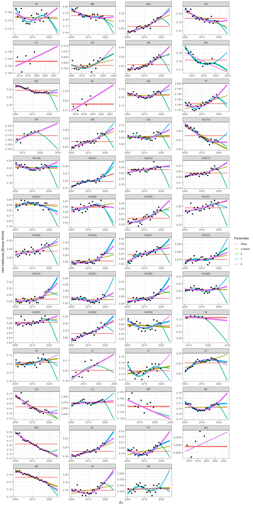<!-- -->

Ahol több vastag görbe is van, ott nem volt egyértelmű a választás, ez
esetben a számítást – érzékenységvizsgálat gyanánt – minden esetre
lefuttatjuk.

Következő lépésben beállítjuk a kizárt időszakokat: ex ante becsléshez a
járvány kezdete után minden hetet, ex post becsléshez csak a járvány
időszakát. Ezen túl a további, érzékenységvizsgáló paramétereket is
beállítjuk, majd az `excessmort` csomaggal elvégeztetjük a számításokat.
Kiszedjük a tényleges és a várt halálozást, a nyersen számolt és
modellel simított többletet, a többlet abszolút értékét, illetve ez
utóbbihoz standard hibát is számolunk (ezt kénytelenek vagyunk kézzel
megtenni), bár a mostani számításban nem lesz rá szükségünk. Mivel a
számítás ennyi kombináció mellett már meglehetősen időigényes, így
párhuzamosítva végezzük:

``` r
exclude_dates <- list(ExAnte = seq(as.Date("2020-03-01"), max(RawData$date), by = "day"),
                      ExPost = seq(as.Date("2020-03-01"), as.Date("2023-07-01"), by = "day"),
                      Flu = c(do.call(c, sapply(c(2003, 2005, 2012, 2013, 2015,
                                                  2017, 2018, 2019),
                                                function(i) seq(as.Date(paste0(i, "-01-01")),
                                                                as.Date(paste0(i, "-03-31")),
                                                                by = "day"))),
                              seq(as.Date("2020-03-01"), max(RawData$date), by = "day")))
pargrid <- as.data.table(merge(as.data.frame(params),
                               CJ(ED = names(exclude_dates),
                                  model = c("quasipoisson", "poisson", "correlated"))))
pargrid <- pargrid[substring(geo, 1, 2)=="HU"|ED!="Flu"]

cl <- parallel::makeCluster(parallel::detectCores()-1)
parallel::clusterExport(cl, c("RawData", "pargrid", "exclude_dates"), envir = environment())

res <- parallel::parLapply(cl, 1:nrow(pargrid), function(i) {
  geodat <- RawData[RawData$geo==pargrid$geo[i]&RawData$age==pargrid$age[i],]
  with(excessmort::excess_model(geodat, start = min(geodat$date), end = max(geodat$date),
                                model = pargrid$model[i],
                                exclude = exclude_dates[[pargrid$ED[i]]],
                                control.dates = seq(
                                  min(geodat$date),
                                  min(min(geodat$date) + 4999,
                                      min(exclude_dates[[pargrid$ED[i]]]) - 1), by = "day"),
                                frequency = nrow(geodat)/(as.numeric(diff(
                                  range(geodat$date)))/365.25),
                                trend.knots.per.year =
                                  if(pargrid$it[i]) 1/pargrid$tkpy[i] else 1,
                                include.trend = pargrid$it[i]),
       data.table::data.table(pargrid[i], date = date, observed = observed,
                              expected = expected, y = (observed - expected)/expected,
                              increase = fitted,  excess = expected * fitted,
                              se = sapply(1:length(date), function(i) {
                                mu <- matrix(expected[i], nr = 1)
                                x <- matrix(x[i,], nr = 1)
                                sqrt(mu %*% x %*% betacov %*% t(x) %*% t(mu))
                              })))
})

parallel::stopCluster(cl)

res <- rbindlist(res)

# res <- readRDS("resFull.rds")

resFull <- res
```

Ezután egyesítjük a többlethalálozási adatbázist a korábbi adatokkal, és
leszűrjük a járvány időszakára:

``` r
res <- merge(res, RawData, by = c("geo", "age", "date"))
res <- res[order(geo, age, date, tkpy, it, sens, ED, model)]
res <- res[date>=as.Date("2020-03-01")]
```

Kiszámoljuk a – járvány eleje óta – kumulált többletet és kumulált várt
értéket, illetve a populációból egy (kumulált) átlagot:

``` r
res[, cumexcess := cumsum(excess), .(geo, age, tkpy, it, sens, ED, model)]
res[, meanpopulation := dplyr::cummean(population), .(geo, age, tkpy, it, sens, ED, model)]
res[, cumexpected := cumsum(expected), .(geo, age, tkpy, it, sens, ED, model)]
```

A `geo`-t átalakítjuk faktorrá, és beállítjuk, hogy Magyarország az
utolsó legyen, hogy az ábrázolásnál az kerüljön a legtetejére:

``` r
res$nuts_level <- nchar(res$geo)-2
res$geo <- forcats::fct_relevel(as.factor(res$geo), "HU", after = Inf)
```

A térkép-adatokkal is összekapcsoljuk az eredményeket a későbbi térképes
ábrázolás érdekében, illetve kibővítjük azokat az országok és megyék
elnevezéseivel, hogy ne csak kódjaink legyenek:

``` r
geodata <- eurostat::get_eurostat_geospatial(output_class = "sf", resolution = "01",
                                             year = "2021")
geodata <- merge(geodata, res[sens==FALSE&ED=="ExPost"&model=="quasipoisson"&
                                date=="2023-06-26",
                              .(y = cumexcess/meanpopulation*1e6, geo, age, tkpy, it, sens,
                                ED, model, nuts_level)], by = "geo")
res <- merge(res,
             data.table(geo = c(unique(RawData[nchar(geo)==2]$geo),
                                c("HU110", "HU120", "HU211", "HU212", "HU213", "HU221", "HU222",
                                  "HU223", "HU231", "HU232", "HU233", "HU311", "HU312", "HU313",
                                  "HU321", "HU322", "HU323", "HU331", "HU332", "HU333")),
                        geoname = c(countrycode::countrycode(unique(RawData[nchar(geo)==2]$geo),
                                                             "eurostat", "country.name"),
                                    c("Budapest", "Pest", "Fejér", "KE", "Veszprém", "GyMS",
                                      "Vas", "Zala", "Baranya", "Somogy", "Tolna", "BAZ",
                                      "Heves", "Nógrád", "Hajdú-Bihar", "JNSz", "SzSzB",
                                      "Bács-Kiskun", "Békés", "Csongrád"))))
```

Következő lépésben kikódoljuk a 3 betűs ISO-országkódot a 2 betűs
Eurostat kódból, hogy később az jelentett halálozási (WHO) adatbázissal
lehessen egyesíteni:

``` r
res$iso_code <- countrycode::countrycode(ifelse(res$nuts_level==3, NA_character_, res$geo),
                                         "eurostat", "iso2c")
```

A jelentett halálozással való egybevetés céljából letöltjük a WHO
[adatbázisát](https://data.who.int/dashboards/covid19/data), mely
tartalmazza a jelentett halálozás adatait, majd kiszámoljuk ott is az
évet és a hetet:

``` r
EpiData <- fread("https://covid19.who.int/WHO-COVID-19-global-data.csv")
EpiData$year <- lubridate::isoyear(EpiData$Date_reported)
EpiData$week <- lubridate::isoweek(EpiData$Date_reported)
EpiData$New_deaths[is.na(EpiData$New_deaths)] <- 0
EpiData <- EpiData[,.(new_deaths = sum(New_deaths)) , .(iso_code = Country_code, year, week)]
```

Ezt egyesítjük az előbbi táblával, és a jelentett halálozásokat itt is
felkumuláljuk:

``` r
res <- merge(res, EpiData, by = c("iso_code", "year", "week"))
res[, cumnewdeaths := cumsum(new_deaths), .(geo, age, tkpy, it, sens, ED, model)]
```

Végezetül pedig, most hogy minden adatfeldolgozás végére értünk, az
eredményeket kimentjük, hogy más is kényelmesen fel tudja használni:

``` r
fwrite(res, "ExcessMortEUR_data.csv", sep = ";", dec = ",", row.names = FALSE)
fwrite(resFull, "ExcessMortEUR_full_data.csv", sep = ";", dec = ",", row.names = FALSE)
saveRDS(res, "res.rds")
saveRDS(resFull, "resFull.rds")
```

## Továbbfejlesztési ötletek

- [ ] Életkori és nemi lebontás. (Hátha mások a mortalitási trendek! +
  elvesztett életév aspektus).
- [ ] Életkorra és nemre standardizálás (van bármi értelme?).
- [x] A jelentés teljességének a vizsgálata (mennyire nőnek még az
  utolsó adatok, és meddig?). Válasz: Eurostat metadata 13.1-es pont.
- [ ] Területi adatok használata.
- [x] Egyszeri hatások kiküszöbölése (influenza!) kiegészítő
  elemzésként.
- [ ] A spline simítási paraméterének automatizált kiválasztása.
- [ ] A korrelált modellnél a kontrolldátumok optimális megválasztása.
- [ ] A járvány végének (“fokozatos visszatérés az alapvonalhoz”) jobb
  kezelése.
- [ ] Spline megválasztásánál vizsgálni az ex ante vs. ex post
  szempontot.
- [ ] A spline diagnosztikai ábráján a tört évek jobb kezelése
  (szezonalitás szerinti szétosztás).

## Irodalmi hivatkozások

- Ariel Karlinsky, Dmitry Kobak. “The World Mortality Dataset: Tracking
  excess mortality across countries during the COVID-19 pandemic.”
  Elife. 2021 Jun 30;10:e69336. DOI: 10.7554/eLife.69336.
  [Link](https://elifesciences.org/articles/69336).
- Nazrul Islam, et al. “Excess deaths associated with Covid-19 pandemic
  in 2020: age and sex disaggregated time series analysis in 29 high
  income countries.” BMJ. 2021 May 19;373:n1137. DOI: 10.1136/bmj.n1137.
  [Link](https://www.bmj.com/content/373/bmj.n1137).
- Vasilis Kontis, et al. “Magnitude, demographics and dynamics of the
  effect of the first wave of the COVID-19 pandemic on all-cause
  mortality in 21 industrialized countries.” Nat Med. 2020
  Dec;26(12):1919-1928. DOI: 10.1038/s41591-020-1112-0.
  [Link](https://www.nature.com/articles/s41591-020-1112-0).
- Janine Aron, John Muellbauer. “A pandemic primer on excess mortality
  statistics and their comparability across countries.” Our World in
  Data. 2020 June 29. Preprint.
  [Link](https://ourworldindata.org/covid-excess-mortality).
- Tóth G. Csaba. “Többlethalandóság a koronavírus-járvány miatt
  Magyarországon 2020-ban.” Korfa. 2021 March;21(2):1-4.
  [Link](https://demografia.hu/kiadvanyokonline/index.php/korfa/article/view/2812/2700).
- Rolando J Acosta, Rafael A Irizarry. “A Flexible Statistical Framework
  for Estimating Excess Mortality.” Epidemiology. 2022 May
  1;33(3):346-353. DOI: 10.1097/EDE.0000000000001445.
  [Link](https://journals.lww.com/epidem/Abstract/2022/05000/A_Flexible_Statistical_Framework_for_Estimating.6.aspx).
- Tamás Ferenci. “Comparing methods to predict baseline mortality for
  excess mortality calculations.” BMC Med Res Methodol. 2023 Oct
  18;23(1):239. DOI: 10.1186/s12874-023-02061-w.
  [Link](https://bmcmedresmethodol.biomedcentral.com/articles/10.1186/s12874-023-02061-w).
