Többlethalálozási adatok európai összevetésben
================
Ferenci Tamás

-   [A többlethalálozási mutatóról
    általában](#a-többlethalálozási-mutatóról-általában)
    -   [A halálozási statisztikák használatának általános
        motivációja](#a-halálozási-statisztikák-használatának-általános-motivációja)
    -   [A haláloki statisztikák
        problémái](#a-haláloki-statisztikák-problémái)
    -   [A magyar haláloki statisztikák adatszolgáltatási
        folyamata](#a-magyar-haláloki-statisztikák-adatszolgáltatási-folyamata)
    -   [A többlethalálozási mutató definíciója és
        logikája](#a-többlethalálozási-mutató-definíciója-és-logikája)
    -   [A többlethalálozási mutató előnyei és
        hátrányai](#a-többlethalálozási-mutató-előnyei-és-hátrányai)
    -   [A halálozás mint mutató használatának általános
        problémái](#a-halálozás-mint-mutató-használatának-általános-problémái)
-   [Eredmények: A hazai többlethalálozási adatok, és európai
    viszonyításuk](#eredmények-a-hazai-többlethalálozási-adatok-és-európai-viszonyításuk)
-   [Záró gondolatok](#záró-gondolatok)
-   [Módszertani kérdések](#módszertani-kérdések)
    -   [A várt halálozások
        előrejelzése](#a-várt-halálozások-előrejelzése)
    -   [Acosta és Irizarry módszerének technikai
        részletei](#acosta-és-irizarry-módszerének-technikai-részletei)
    -   [Relatív és abszolút
        eredmények](#relatív-és-abszolút-eredmények)
-   [A számítások részletei, kiegészítő
    elemzések](#a-számítások-részletei-kiegészítő-elemzések)
    -   [Adatok előkészítése](#adatok-előkészítése)
    -   [A többlethalálozás becslése](#a-többlethalálozás-becslése)
    -   [Az eredmények ábrázolása, a kétféle relatív mutató
        viszonya](#az-eredmények-ábrázolása-a-kétféle-relatív-mutató-viszonya)
    -   [Összevetés a jelentett
        halálozással](#összevetés-a-jelentett-halálozással)
    -   [Összevetés a jelentett halálozással – magyar megyei
        adatok](#összevetés-a-jelentett-halálozással--magyar-megyei-adatok)
    -   [Érzékenységvizsgálat](#érzékenységvizsgálat)
    -   [A direkt hatás elkülönítése: egy kísérlet az influenza-járvány
        kezelésére](#a-direkt-hatás-elkülönítése-egy-kísérlet-az-influenza-járvány-kezelésére)
-   [Továbbfejlesztési ötletek](#továbbfejlesztési-ötletek)
-   [Irodalmi hivatkozások](#irodalmi-hivatkozások)

<!-- # ```{r het99statisztika, echo = FALSE} -->
<!-- # knitr::kable(dcast(RawData[,.(outcome[week==99]/sum(outcome)*100),.(geo, year)], -->
<!-- #                   year ~ geo, value.var = "V1"), digits = 2) -->
<!-- # ``` -->
<!-- #  -->
<!-- # ```{r hetszetosztas, echo = FALSE} -->
<!-- # RawData[ , outcome := round(outcome*sum(outcome)/sum(outcome[week!=99])), .(geo, year)] -->
<!-- # RawData <- RawData[week!=99] -->
<!-- # ``` -->

## A többlethalálozási mutatóról általában

Jelen írásomban megpróbálom a többlethalálozási mutató hátterét és
tágabb kontextusát bemutatni a mostani koronavírus-járvány példáján,
megvilágítva a kérdés tudományos hátterét, nehézségeit. Úgy vélem, hogy
ezek a kérdések nem lehetnek a tudósok meg politikusok belügyei, a
számok áradatában való tájékozódáshoz mindenkinek meg kell adni a
lehetőséget, hogy megismerje a járványügyi, módszertani hátteret, mert
csak így lehet értékelni, kritikusan értékelni és értelmezni az elhangzó
adatokat.

### A halálozási statisztikák használatának általános motivációja

Egy járvány helyzetének legdirektebb mutatója az új fertőzöttek napi
száma. Ez méri közvetlenül a fertőzöttségi helyzetet, és az összes
mérőszám közül a legkisebb késleltetésű, 24 órán belül ismertté válik.
Egy megjegyzés azért tartozik ehhez: valójában még ennek is van egy-két
hét késleltetése a *tényleges* fertőződési viszonyok változásához
képest. Ha ugyanis valaki megfertőződik, akkor először el kell telnie a
lappangási időnek a tünetek jelentkezéséhez, ez tipikusan néhány naptól
két hétig terjed jelen esetben; legyen egy hét a kerekség kedvéért. De
itt még nincs vége: a tünetek jelentkezése után sokan még várnak, mire
orvost hívnak, utána az orvosnak meg kell rendelnie a tesztelést, meg
kell történnie a minta levételének, utána ismét várni kell, mire
megszületik az eredmény; ezek időtartama függ attól, hogy az
egészségügyi rendszer kapacitása és terheltsége milyen, egy-két nap
legjobb esetben is, rosszabb esetben sajnos akár egy hét is lehet, ha
nem több, láttunk erre példát Magyarországon. Ennél sokkal közelebb nem
tudunk jutni, hiszen nem lehet minden lakost minden nap letesztelni (és
igazából a teszt sem válik azonnal pozitívvá), a legjobb amit lehet
tenni, ha a fertőzés igazolásakor nem csak ennek dátumát írjuk fel,
hanem megkérdezzük a beteget a tünetek jelentkezésének dátumáról is, így
legalább a késleltetés második forrása levágható, ha csak utólag is;
sajnos Magyarországon ezt az információt nem gyűjti a népegészségügy. Ez
az egy-két hét késleltetés is fontos, hiszen azt jelenti, hogy amit most
látunk a fertőzött-számban, az igazából az egy-két héttel *ezelőtti*
fertőzési viszonyokat tükrözi. Ami fordítva elmondva azt is jelenti,
hogy bármilyen intézkedés, ami ezt megváltoztatja, csak egy-két hét
múlva fog érvényre jutni! Hiába is vezetünk be például egy korlátozást,
ami az új fertőzések számát azonnal lecsökkenti, a *regisztrált*
fertőzöttek száma még egy-két hétig nőni fog. (De ez végülis teljesen
logikus: aki már elkapta a kórt, csak még nem jelentkeztek a tünetei,
azon nem fog segíteni az, hogy milyen intézkedést hoztunk, csak még idő
kell mire ő is megjelenik a kimutatásban.)

A fertőzött-számnak minden előnye mellett van egy hatalmas problémája:
függ a tesztelési aktivitástól. Ez kevésbé gond egy olyan betegségnél
mint mondjuk a kanyaró, ahol szinte minden betegnek tünetei vannak, és
ezek a tünetek szinte minden esetben elég látványosak és egyértelműek,
de nagyon nagy baj a jelen helyzetben, ahol a fertőzöttek egy jelentős
részének csak nagyon enyhe, aspecifikus, más betegséggel is könnyen
összetéveszthető tünetei vannak, vagy egyáltalán nincsenek tünetei. Az
előbbieket elsősorban, az utóbbiakat kizárólag teszttel lehet
megtalálni, de innen kezdve az, hogy hány ilyet találunk meg, függeni
fog attól, hogy milyen intenzíven tesztelünk: ahol/amikor sokat
tesztelnek, ott/akkor több ilyet is megtalálnak, ahol/amikor kisebb a
tesztelési aktivitás, ott/akkor kevesebbet fognak. Ennek egy praktikus
következménye, hogy a fertőzött-számok országok közötti összevetése
életveszélyes, hiszen tesztelési aktivitásban hatalmas különbségek
lehetnek: egyáltalán nem biztos, hogy ahol több fertőzött van, ott
rosszabb a helyzet, sőt, simán lehet, hogy pont fordítva, ott
rendesebben tesztelnek, és így jobban tudják kezelni a járványt. Sajnos
a helyzet ennél is rosszabb: valójában nem csak az országok közötti, de
egy ország különböző időpontjai között összevetés is problémás lehet,
azaz egyáltalán nem biztos, hogy ha most több fertőzöttet regisztrálunk
mint múlt hónapban, akkor most rosszabb a helyzet. Mikor? Természetesen
abban az esetben, ha menet közben megváltozik a tesztelési intenzitás!
Lehet, hogy több fertőzöttet regisztrálunk, de közben a helyzet nem
romlott, csak elkezdtünk rendesebben tesztelni (és ez esetben az
kimondottan egy jó hír, hogy több fertőzött lett!), de sajnos
elképzelhető a fordított eset is, hogy a regisztrált fertőzöttek száma
stagnál, de közben a helyzet romlik (mert beleütköztünk a tesztelési
kapacitások felső korlátjába). Lényegében annyi mondható, hogy a
fertőzött-szám jó mutató akkor, *ha* a tesztelési intenzitás időben
állandó. Lehet, hogy az abszolút számok ekkor is hibásak, mondjuk csak a
fertőzöttek ötödét regisztráljuk, de ha ez az arány állandó, akkor
legalább a relatív viszonyok jók lesznek: ha most több van mint egy
hónapja, akkor most rosszabb a helyzet.

Kitérő megjegyzésként érdemes itt beszúrni, hogy ezért érdekes mutató a
tesztpozitivitás, tehát, hogy az elvégzett tesztek mekkora hányada
pozitív: azt mutatja, hogy a tesztelési program mennyire tud lépést
tartani a járvány terjedésével. Ha kellően alacsony (a nemzetközi
ajánlás 5%-os maximumot tűz ki), akkor a tesztelési intenzitás
megfelelő, de ha nagyobb, akkor nem elégséges a tesztelés. Fontos tehát
hangsúlyozni, hogy a tesztpozitivitás ezt, tehát a tesztelési program
elégségességét méri, *nem* a járvány helyzetét. De az elégségesség
mérésére tényleg logikus tartalmú mutató, hiszen azt mondja: ha el is
szabadul a járvány, ez akkor is behúzható az 5%-os küszöb alá. Hogyan?
Ha kellően sokat tesztelünk! (Néhányan olyat is szoktak tenni, hogy ez
alapján próbálják „korrigálni” a fertőzöttek számát. Ez nagyon
ingoványos talaj, hiszen a valódi kép ennél bonyolultabb: a helyzet függ
a tesztelési mintázattól is, tehát, hogy kiket, milyen kockázatú
alanyokat tesztelünk. Nagyon nem mindegy, hogy gyanús tüneteket mutató
alanyokat tesztelünk, kontaktus-személyeket tesztelünk, egy cég a
munkavállalóit a „biztonság kedvéért” teszteli stb.) Természetesen
fontos az elvégzett tesztek számán túl azok típusának – PCR,
antigén-gyorsteszt – ismerete is, sajnos Magyarország erre vonatkozóan
nem közöl nyilvánosan adatot. Magyarországon szintén nincs nyilvános
adat a tesztkapacitásról, tehát, hogy heti hány tesztet tudunk
maximálisan elvégezni.

Tekintve a fertőzött-szám nagy problémáját, eléggé kézenfekvően adja
magát a következő mutató: a fertőzésben történő halálozások napi száma.
Hiszen az függ a tesztelési aktivitástól, hogy észrevesszük-e valakiről,
hogy fertőzött, de azt azért csak észrevesszük, hogy valaki él-e,
teszteléstől függetlenül is…! Sajnos ez az okfejtés hibás: azt fejlett
világban tényleg tudjuk, hogy valaki meghalt, csak most itt nem erre van
szükség, hanem arra, hogy a fertőzés*ben* halt-e meg! Ennek ismerete
viszont igenis függhet a tesztelési aktivitástól. Rosszabb esetben egy
gyanús tüneteket mutató elhunytat sem tesztelnek, még poszt mortem sem,
de teljesen jóhiszemű módon is előállhat ilyen: „hát igen, a nagymamának
gyenge volt a szíve, erre sajnos fel kellett készülni” – és senki nem
végez tesztet, és soha ki nem derül, hogy azért a dolog nem volt
teljesen véletlen, mert a háttérben volt egy infekció is. Az ilyen
esetek előfordulása azonban igenis függ a tesztelési aktivitástól. Éppen
ezért igaz rá minden, amit erről korábban mondtunk: eltérhet, akár
drasztikusan is, országok között, de sajnos még egy országon belül is
könnyen megváltozhat időben.

Tehát bár ez a mutató sem teljesen független a tesztelés intenzitisától,
de azért tény, hogy jóval kevésbé függ tőle, mint a regisztrált
fertőzöttek száma, hiszen a végül elhalálozó fertőzöttek általában
súlyosabb állapotban vannak, így valószínűbb, hogy tesztelik őket. Ilyen
értelemben tehát racionális e mutató használata is.

Milyen hátrányai vannak a halott-számnak? Az egyik, hogy ez egy jóval
lassabb indikátor: a fertőzött-számnál felsorolt összes késleltetés
megjelenik természetesen itt is, és még pluszban hozzájön a halálig
eltelő idő, ez szintén több hét. Összességében véve a halálozás-számnak
már simán lehet hónapon felül a késleltetése; és érvényes minden, amit
erről korábban mondtunk: aki most hal meg, az 4 héttel, 5 héttel, lehet,
hogy 6 héttel korábban kapta el a fertőzést, a halála az *akkori*
fertőzési viszonyokat tükrözi! Avagy, még másképp megfogalmazva: ha
bármit teszünk, annak a hatása halálozásokban 4-6 hét *múlva* fog csak
jelentkezni. Mindezeket tökéletesen szemléleti a 2020 őszi cseh helyzet:


Ez egy jól vizsgálható szituáció, mert a csehek egyetlen időpontban,
koncentráltan hoztak egy komoly szigorítást október közepén, ezt jelzi a
függőleges fekete vonal. Ettől még mind a fertőzöttek száma, mind a
halálozások száma vidáman nőtt tovább, mígnem a beszélt egy-két hét
múlva a fertőzött-szám növekedése megállt (a felső tengelyen láthatóak
az intézkedés bevezetése után eltelt napok száma). Igen ám, de a
halottak száma még *ekkor is* teljesen változatlanul nőtt tovább, még jó
egy-két hétig! Ez a járványkezelés tehetetlensége, és mellesleg egy
nagyon fontos tanulsággal bír: a járványkezelésben nagyon veszélyes
taktika, hogy megvárjuk, amíg elromlik a helyzet, és majd akkor lépünk,
hiszen így fertőzöttek tekintetében még egy-két hétig, halálozásokban
még akár több mint egy hónapig az eredeti trend szerint fogunk
továbbhaladni! Amiből nagyon nagy baj is lehet, ha az egy gyorsan
növekvő trend…

A halálozási adatok második problémája, hogy valójában nem csak a
járvány terjedését méri, hiszen szerepet játszik benne két további
dolog: az, hogy a megfertőzödött alanyoknak mi az általános állapota
(életkora, társbetegségei stb.), a másik, hogy milyen a gyógyítás
hatásfoka. A probléma hasonló, mint a fertőzöttek számánál és a
tesztelési intenzitásnál: elképzelhető, hogy a halottak száma lemegy, de
valójában nem javult a helyzet, csak mondjuk sikerült új ápolókat
munkába állítani, csökkentve az ellátórendszer túlterheltségét, vagy épp
fordítva, megnő a halálozás, pedig nem a fertőződési helyzet vált
rosszabbá, csak épp bevezettek egy új, hatásos gyógyszert. Mint ebből is
látható, ez a probléma, tehát a gyógyítás hatásfokán változása sajnos
még egy ország különböző időpontbeli adatainak összehasonlításakor is
probléma lehet. A másik kérdés, a betegek állapota is megváltozhat
egyetlen országon belül – például fiatalabbak körére terjed át a járvány
– de egyértelműen megnehezíti az országok közötti összehasonlítást:
eltérő lehet társbetegséggel bírók aránya, a kockázati tényezők
jelenléte (dohányzás, alkohol-fogyasztás stb.), eltérő lehet a korfa.
Mindazonáltal hasonló országokat összehasonlítva ennek jelentősége
csökkenthető; a másik megoldási lehetőség, hogy rétegzett adatokat
gyűjtünk. (Tehát nem összességében hasonlítjuk össze két ország
halálozásait, hanem a cukorbetegekét hasonlítjuk a cukorbetegekével és a
nem cukorbetegekét a nem cukorbetegekével – ezzel kiküszöböljük az abból
fakadó problémákat, ha a két országban eltérő a cukorbetegek aránya.) A
gyakorlatban azonban ilyen adatok ritkán elérhetőek, talán egyedül az
életkor kivételével, szerencsére ez jól összefügg a krónikus
betegségekkel is. A korspecifikus adatok használata egy országon belül
is fontos lehet, ha hosszabb távú trendeket szeretnénk vizsgálni.

Van azonban egy harmadik probléma, ami a mi mostani szempontunkból
különösen fontos lesz: az, hogy ez a mutató támaszkodik a haláloki
besorolásra. Hiszen a fertőzésben elhunytakról van szó, ehhez pedig
valahogy definiálni kell, hogy kit tekintünk fertőzésben elhunyt
személynek. A probléma az, hogy a haláloki besorolások általában is
nagyon problémásak tudnak lenni. Érdemes ezt a kérdést részletesebben is
megbeszélni, mert ez az, ami közvetlenül el fog vezetni a
többlethalálozási mutató gondolatához.

### A haláloki statisztikák problémái

Elöljáróban fontos rögzíteni, hogy *minden* haláloki besoroláson alapuló
statisztika közös problémája, hogy ezt a besorolást szinte soha nem
lehet jól elvégezni. A probléma oka, hogy kivételes esetektől eltekintve
– egészséges fiatalt elgázol egy autó – egy embernek általában nem *egy*
haláloka van. Ez a mostani járványtól függetlenül is igaz, de ez is jó
példát szolgáltat rá: elveszítünk egy tumoros, cukorbeteg
koronavírus-fertőzöttet; ő akkor most mibe halt bele? A rákba? A
cukorbetegségbe? A fertőzésbe?

Ritkák a vegytiszta esetek, mégpedig mindkét irányban ritkák: hogy egy
makkegészséges alanyt elvisz a fertőzés vagy hogy egy fertőzött fejére
rádől egy kémény az utcán. Ezek a tiszta esetek, amikor 100% vagy 0% a
fertőzés hozzájárulása a halálozáshoz, de a valódi történetek többsége
nem ilyen, hanem szürke zóna, mint azt az előző bekezdés példája is
mutatja.

Ráadásul nem arról van szó, hogy ez bonyolult probléma, hanem arról,
hogy ez *megoldhatatlan* probléma. Valamennyi ok *hozzájárult* a
halálához, tehát, ha szigorúan vesszük, valami olyasmit kellene mondani,
hogy 48 százalékban a tumorba halt bele, 33 százalékban a
cukorbetegségbe és 19 százalékban a fertőzésbe. (Természetesen ezek a
számok teljesen hasraütésszerűek.) Hiába is lenne *elvileg* ez a helyes,
az orvosi realitásnak megfelelő kép, ilyet nem csinálunk (annyiban
érthető módon is, hogy ember legyen a talpán, aki ezeket a százalékokat
megmondja): mindenkit egy halálokkal számolunk el. Csakhogy innentől ezt
nem lehet jól megtenni, illetve erős definíciós bizonytalanság lesz
abban, hogy hogyan tesszük meg. Mint látható, ez nem egy kiküszöbölhető
probléma: nem arról van szó, hogy jövőre majd okosabbak leszünk, vagy
fejlődik az orvostudomány, és akkor majd ezt jobban tudjuk csinálni.
Mindaddig, amíg a halált egyetlen okhoz rendeljük, ez egy megoldhatatlan
probléma.

Itt tehát nagyon komoly definíciós kérdések vannak, ebből fakadóan pedig
sajnos nagy tere van az országok közötti adatszolgáltatási eltéréseknek
(vagy akár egy országon belül is megváltozhat időben).

### A magyar haláloki statisztikák adatszolgáltatási folyamata

Hazánkban két alapvető adatszolgáltatási folyamat révén nyerhetünk
információt a mostani koronavírus-járvány halálozási adatairól.

Az egyik az az eljárás, amely bármely haláleset bekövetkezésekor
megtörténik: törvényben pontosan meghatározott rend szerint a
halottvizsgálatot végző orvos kitölt egy Halottvizsgálati Bizonyítványt
(röviden HVB, orvosi köznyelvben elterjedt nevén a „hatpéldányos”),
melyben rögzíti a halálozással kapcsolatos fontos tényeket,
standardizált formátumban. (Apróbb kivételek vannak, például magzati
halálozás esetén, bizonyos folyamatok elektronizáltak, de ez most
számunkra nem lényeges.) A HVB egyik példánya ezt követően a KSH
megfelelő szervéhez kerül, ahol az Egészségügyi Világszervezet
ajánlásának megfelelő, részletekbe menően szabályozott algoritmus
szerint elvégzik a haláloki besorolást. Ez aprólékos munka, például, ha
nem egyértelmű a kitöltés, akkor a KSH validálja az adatokat a
területileg illetékes kormányhivatallal együttműködve. Természetesen az
eredmény nem mutathat pontosabb képet annál, ahogy a HVB-t kitöltötték,
illetve fontos hangsúlyozni, hogy akármilyen aprólékosan is dolgoznak,
az előző részben ismertetett limitációt nem lehet feloldani, hiszen az
elvileg lehetetlen.

Ez a folyamat nagyon lassú, heteket vesz igénybe, így egy éppen zajló
járvány esetén, ahol napi sűrűséggel van szükség adatra, nem
használható. Szükség van tehát egy gyorsabb besorolásra is; ez az,
aminek az adatait mindannyian halljuk a napi kommunikációban.

Sajnálatos módon Magyarországon a mai napig nincsen nyilvánosan, írásban
rögzítve, hogy milyen eljárásrend határozza meg, hogy ezen besorolás
szerint ki minősül koronavírusos halottnak. Tovább rontja a helyzetet,
hogy elhangzott ezzel kapcsolatban egy nyilvánvaló nyelvbotlás,
miszerint „valamennyi olyan elhunytat, akinél a betegség időtartama
alatt, vagy előtte bármikor \[!\] pozitív személynek regisztráltak,
tehát készült nála laboratóriumi vizsgálat, ami pozitivitást mutatott,
mindenkit beszámolunk az elhunytak közé”. Ez természetesen – szerencsére
– nem igaz, hiszen ha szó szerint vennénk, akkor valakit, aki tavaly
áprilisban megbetegedett majd meggyógyult, majd ma elüti egy autó, azt
elvileg koronavírusos halottként kellene elszámolni. (Most olyan
apróságokról nem beszélve, hogy így a koronavírus halálozási aránya,
tehát, hogy a fertőzöttek mekkora hányada hal bele a betegségbe,
garantáltan 100 százalék lenne…) Erről természetesen nincs szó, a
gyakorlatban senki sem fog törődni azzal, hogy mondjuk egy autóbaleset
áldozatának egy évvel korábban volt egy pozitív tesztje, de az nagyon
fontos lenne, hogy közzé legyen téve, hogy elvileg milyen szempontok
döntenek abban a kérdésben, hogy kit lehet koronavírusos elhunytnak
minősíteni. Az európai járványügyi szervezet, az ECDC például [azt az
ajánlást](https://www.ecdc.europa.eu/en/covid-19/surveillance/surveillance-definitions)
fogalmazza meg, hogy nem koronavírus a halálok akkor, ha (1) van
egyértelmű, alternatív, a koronavírustól független mechanizmussal ható
halálok (pl. trauma autóbalesetben), vagy ha (2) a diagnózis és a halál
között teljes gyógyulás következett be. Több ország nem ez követi, hanem
egyszerűen bevezetett egy [időbeli küszöböt
is](https://assets.publishing.service.gov.uk/government/uploads/system/uploads/attachment_data/file/916035/RA_Technical_Summary_-_PHE_Data_Series_COVID_19_Deaths_20200812.pdf),
tipikusan a diagnózistól számított 28 napot, ameddig koronavírusos
halálozásnak mutat ki egy halálesetet, minden további vizsgálat nélkül.
Persze, ez sem tökéletes (valakit elüthet az autó a tizedik napon, vagy
fordítva, feladhatja a fertőzéssel való küzdelmet a negyvenediken), de
ez legalább egy definiált, reprodukálható algoritmus.

Senkit nem szeretnék kérdőre vonni egy szerencsétlen nyelvbotlás miatt,
de az már probléma, hogy ennek a nyelvbotlásnak a korrekciója, és a
valódi eljárásrend közlésével való helyesbítése a mai napig nem történt
meg.

Jellemző, hogy végül úgy juthatott a közvélemény bármilyen
információhoz, hogy egy parlamenti képviselő levelére válaszul megírta a
tisztifőorvos, hogy a fent is említett ECDC/WHO protokollt követjük (még
ezt az információt sem a népegészségügy hozta nyilvánosságra, hanem a
kérdéses parlamenti képviselő töltötte fel a Facebook-oldalára, a magyar
helyzet abszurditását mutatja, hogy e pillanatban ez a
Facebook-bejegyzés az egyetlen hivatalos információforrás a magyar
eljárásrendről…). A teljesen kaotikus kommunikációra jellemző, hogy
mindeközben viszont a hivatalos kormánysajtótájékoztatón az hangzott el,
hogy még az autóbalesetben elhunyt fertőzötteket is beszámítjuk a
halottak közé, noha ez ellentétben van az ECDC/WHO protokollal, sőt, a
tisztifőorvos levele kifejezetten felhozza példaként, hogy mi az, amit
*nem* számolunk be a halálozások közé…

### A többlethalálozási mutató definíciója és logikája

Látható tehát, hogy mi a két nagy problémája a halálozási adatoknak,
amit jó lenne kezelni: a haláloki besorolástól meg kellene szabadulni,
és a tesztelési intenzitástól megmaradt függést is jó lenne
kiküszöbölni. Az elsőn elgondolkozva juthatunk el a többlethalálozás
mint mutató gondolatához: egyszerűen felejtsük el a halálokot, és csak
azt nézzük, hogy valaki meghalt-e, tehát a halottakat számoljuk,
függetlenül attól, hogy mibe haltak bele! Ez egy csapásra megoldja a
haláloki besorolás problémáját (hiszen arra nem is lesz szükség), és a
tesztelési aktivitástól való függést is komplettül felszámolja (hiszen
most már *tényleg* csak az számít, hogy valaki meghalt-e, azt pedig a
fejlett világban tudni fogjuk biztosan). Igen ám, de a problémát még
egyáltalán nem oldottuk meg: lehet, hogy van egy (össz)halálozási
számunk, de honnan tudjuk, hogy ezen halálozásokból mennyi tudható be a
járványnak?

Az alapötlet a következő: a múltbeli halálozási adatok alapján, amikor
még nem volt járvány, készítünk egy előrejelzést az aktuális időszak
halálozási számára, ezt szokás várt halálozásnak nevezni, és azt
mondjuk, hogy ez tükrözi, hogy mi lett *volna* ha nem lett *volna*
járvány. (Hiszen olyan adatokat felhasználva készült, amikor még nem is
volt.) Ha fogjuk a tényleges halálozás-számot, és abból kivonjuk ezt a
várt értéket, akkor megkapjuk a járvány hatását!

### A többlethalálozási mutató előnyei és hátrányai

A többlethalálozási mutatónak két hatalmas előnye van tehát: az egyik,
hogy teljesen érzéketlen a haláloki besorolásra, a másik, hogy immár
tényleg semmilyen szinten nem függ a tesztelési aktivitástól.

Ahogy azonban az eddigi esetekben is történt, ezek az előnyök sem jönnek
ingyen.

Az egyik probléma, hogy a többlethalálozás az összes közül a leglassabb
mutató, hiszen meg kell várni a halálesetek anyakönyvezését, és azok
központi összesítését. Ezért ezek az adatok legjobb esetben is csak a
bekövetkezés után egy hónappal válnak elérhetővé (és persze ne feledjük,
hogy az egy hónappal ezelőtti halálozások meg az *az előtt* egy-másfél
hónappal korábbi fertőződési viszonyokat tükrözik!), de általában pár
hétig még ez után is történnek korrekciók, jellemzően felfelé, a késve
beérkező jelentések miatt. Ezen korrekciók mértéke ráadásul nem is
igazán mondható meg biztosan, függ attól, hogy a rendszer túlterhelődése
mekkora, akár helyileg is. Az Eurostat-hoz [leadott
adatok](https://ec.europa.eu/eurostat/cache/metadata/en/demomwk_esms.htm#accuracy1612863315336)
szerint a magyar jelentés teljeskörűsége 96% a legfrissebb közzétett
adatra nézve és ez 5 hét alatt éri el a 100%-ot. (Mindazonáltal egy
hangyányit gyanús, hogy míg más országok olyan számok adtak le a
hetenkénti teljeskörűségre mint 93,20%, 95,97%, 97,02%, nálunk ez úgy
néz ki, hogy 96,00%, 97,00%, 98,00%… úgyhogy valószínűleg inkább hasból
közöltünk számokat és nem a tényleges korrekciókat néztük meg
empirikusan, emiatt talán jobb, ha a magyar adatokat inkább irányadónak
vesszük.)

A többlethalálozásnak azonban ezen túl is van két nagyon komoly
problémája. Az egyik, hogy a többlethalálozás – definíció szerint – a
tényleges halálozás és a járvány nélkül *várt* halálozás különbsége. Az
első adatsorral még nincs is probléma, na, de azt honnan mondjuk meg,
hogy hány haláleset lett *volna* például 2020-ban, ha nincs járvány?!
Erre vannak egyszerűbb módszerek: például alapul vehetjük a 2019-es
halálozási adatot (közel van a vizsgált évhez, így a halálozás
változásának esetleges hosszútávú trendje a legkevésbé rontja el, de
csak egyetlen évnyi adat, így bizonytalanabb), vagy vehetjük a 2015-2019
évek átlagát (a hosszabb periódus miatt biztosabb számok, de gond lehet,
ha időközben változtak a halálozási trendek), és akadnak bonyolultabb
módszerek is (görbét rakunk a megelőző évekre és azt meghosszabbítjuk),
ám végeredményben mindegyik egy *becslés*. Ebből fakadóan mindig ott
lesz a kérdés, hogy igazából mi sem tudhatjuk, hogy tényleg ennyi
halálozás lett-e volna, ha nincs a járvány.

A másik probléma sokkal jelentősebb: a többlethalálozás egy bruttó
jellegű mutató, ami egybeméri a járvány direkt hatásaival (belehalnak
emberek) annak indirekt hatásait is. Hogy még rosszabb legyen a helyzet,
ezek az indirekt hatások egyaránt lehetnek pozitívak és negatívak.
Pozitív indirekt hatás, hogy a védelmi intézkedések más légúti
fertőzések ellen is jót tesznek, de kicsit elengedve a fantáziánkat, az
is pozitív indirekt hatás lehet, hogy kevesebb autóbaleset történik.
Negatív indirekt hatás, hogy más betegség ellátása nehezedik meg, de itt
is lehet távlatibb kérdésekre gondolni, például mi van, ha megnő az
öngyilkosságok száma a szociális elszigetelődés miatt, vagy emelkedik az
– egészségügyi állapotot közismerten rontó – munkanélküliség a gazdaság
visszaesése miatt. Ezek feltárása véleményem szerint rendkívül fontos
feladat, és az első empirikus eredmények már meg is jelentek.

Nézzük meg például, hogy a [KSH
adatai](https://www.ksh.hu/stadat_files/nep/hu/nep0010.html) alapján
hogyan alakult az elmúlt 10 évben az autóbalesetben és az öngyilkosság
miatt meghaltak száma Magyarországon:

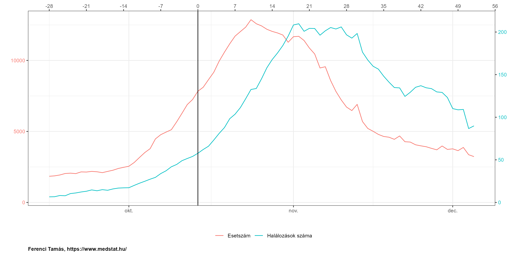<!-- -->

A mintázat nagyon látványos, mindkét fenti jelenség szemléltetésére.
Fontos persze hangsúlyozni, hogy ez egy nagyon durva felbontású
eredmény, azt például végképp nem bizonyítja, hogy ez minden életkorban,
nemnél, szocioökonómiai helyzetben stb. is így van. Ami még fontosabb,
hogy ez csak illusztráció, nem arról van szó, hogy ezek lennének a
legjelentősebb indirekt tényezők (az influenza visszaszorulása például
egész biztos, hogy lényegesebb az egyik irányban, az elmaradó ellátások
pedig a másikban), viszont sokkal biztosabban megragadható adatok és az
alapgondolatot jól mutatják.

E tényezők elkülönítése tehát lehetetlen, vagy szinte lehetetlen a
többlethalálozás alapján! (A „szinte” szó az influenza kérdésköre miatt
van ott, amire később még visszatérünk.)

Sajnos mindkét irányban előfordulhat probléma: elképzelhető olyan
helyzet, hogy nem halnak meg sokan a járvány következtében, de a
többlethalálozás magas (komoly negatív indirekt hatások vannak), illetve
az is, hogy sokan meghalnak, még sincs lényeges többlethalálozás (komoly
pozitív indirekt hatások vannak). Ez szükségszerűen korlátozza a
többlethalálozás gyakorlati hasznosíthatóságát.

Remélem, a fentiekből is érzékelhető, hogy nincsenek univerzálisan
„jobb” és „rosszabb” mutatók, az ilyen indikátorokat mindig egészében
kell vizsgálni, és az átfogó kép alapján értékelni.

### A halálozás mint mutató használatának általános problémái

Függetlenül attól, hogy pontosan hogyan mérjük le, a halálozásnak, mint
a járvány terhének mutatója, van egy sor hátránya is, általában, pusztán
amiatt, hogy a halálozáson alapul. A probléma többrétű:

-   A „járvány terhe” egy többdimenziós fogalom, ami nem szűkíthető le a
    elhunytakra (noha kétségtelen, hogy sok tekintetben ez a legdrámaibb
    teher). Azonban az is teher, ha emberek szenvednek (még ha a végén
    fel is épülnek), más szempontból de az is teher, ha az egészségügyi
    ellátórendszer kapacitásait igénybe veszik, megint más szempontból,
    de az is teher, hogy kiesnek a munkából. A halálozás mindezekről nem
    ad számot. Mindazonáltal a halálozás használatát mégiscsak védi –
    túl azon, hogy a legrelevánsabb megjelenése a tehernek – az, hogy
    általában jól korrelált az összes többi szemponttal is: ha többen
    halnak meg, akkor tipikusan többen is szenvednek, többen is veszik
    igénybe az ellátórendszert, többen is esnek ki a munkából.
-   Ha egyszerűen a halálozásokat számoljuk a lakosság egészében, akkor
    figyelmen kívül hagyjuk az elhunyt minden jellemzőjét: ugyanakkora
    teher egy makkegészséges 30 évest elveszteni, mint egy egyébként is
    végstádiumú 85 éves tumoros beteget? A halálozás szempontjából igen,
    sokan azonban inkább azt érzik, hogy az előző valójában nagyobb
    teher. Ezt legkézenfekvőbben az elvesztett életévek koncepciója
    ragadja meg, azaz, hogy az alany hány évet élet *volna*, ha nem
    viszi el a járvány. Az így kapott életév-veszteség kifejezi azt,
    amit a halálozás nem: hogy a példánkban szerepelő első alany halála
    nagyobb teher, hiszen – mind az életkora, mind az egészségi állapota
    miatt – ő jóval többet élt volna még ha nincs a járvány.
    (Természetesen itt *népegészségügyi* teherről beszélünk, nem arról,
    hogy például a családnak mekkora tragédia egy halál, legyen az akár
    egy 85 éves tumoros beteg halála.) Ezek számítása nem könnyű, hiszen
    egy fiktív helyzetet kell vizsgálni – ugyan ki mondja meg, hogy
    valaki mennyit élt *volna*, ha nem kapta *volna* el a fertőzést?
    Erre természetesen csak becslést lehet adni, a jó hír viszont, hogy
    a becslés adására vannak bevált demográfiai, statisztikai módszerek.
    (Ezeket magyar viszonyokra nézve én is [kiszámoltam és
    közöltem](https://link.springer.com/article/10.1007/s10654-021-00774-0).)
    A másik lehetőség, hogy kitűzünk egy – ideálisan magasra rakott –
    rögzített „cél életkort” és [ahhoz
    viszonyítjuk](https://link.springer.com/article/10.1007/s10654-022-00854-9)
    az elvesztett éveket. E kérdés vizsgálatához segítséget jelenthet,
    ha a halálozási adatokat lebontjuk életkorcsoportok szerint.
    Bizonyos értelemben azonban minden ilyen módszer ingoványos talajt
    jelent, mert bármennyire is kézenfekvő, ezek a számítások
    végeredményben mégis azt jelentik, hogy súlyozzuk a különböző
    halálokat, ami messzire vezető morális kérdéseket vet fel.
-   Még ha az életév-veszteséget is használjuk, akkor is figyelmen kívül
    marad egy fontos szempont: az életminőség kérdése. (Talán pontosabb
    lenne úgy fogalmazni, hogy az egészségi állapottal összefüggő
    életminőség.) Ez két, egymással ellentétes irányban hat. Egyfelől
    ennél a mostani betegségnél sajnos előfordul, hogy a túlélők
    maradványtünetekkel gyógyulnak, ami rontja az életminőséget, ezért
    ha életév helyett minőséggel korrigált életévet használunk, akkor
    még a felgyógyulóknál is van veszteség, nem csak a végül
    meghalóknál. A másik, ezzel ellentétes szempont, hogy az idős, több
    krónikus betegségben szenvedő elhunytaknak, ami a mostani járványnál
    a többséget jelenti, tipikusan már a fertőzés *előtt* sem volt
    tökéletes az életminőségük, ezért az ő esetükben a minőséggel
    korrigált életév használata kisebb veszteséget mutatna ki, mint ha
    ezt figyelmen kívül hagyjuk.

Ezekre a szempontokra tekintettel kell lenni *bármilyen* halálozáson
alapuló mutató használatakor.

## Eredmények: A hazai többlethalálozási adatok, és európai viszonyításuk

Próbáljuk meg áttekinthetővé tenni a többlethalálozási mutatókat!
Először is, ne év alapú mutatókat nézzük (semmilyen kitüntetett
járványügyi jelentősége nincs a december 31-nek, hogy akkor vágjuk el az
adatokat), hanem egyszerűen folytonosan kezeljük az időt. Másrészt,
érdemesebb relatív mutató gyanánt a lélekszámmal osztani, így ugyanis
egy olyan mutatót kapunk, ami analóg a regisztrált halálozások
közlésével, hiszen azt is halál / millió főben szokták megadni. Ha a
többletet is millió lakosra osztjuk rá, akkor a kettő egymással is jól
összehasonlítható lesz.

Én az Eurostat
[adatai](https://ec.europa.eu/eurostat/databrowser/view/demo_r_mwk_ts/)
alapján kiszámítottam a többlethalálozást, mégpedig heti alapon,
egységesen az országokra, és valamennyi európai országra. Az elemzéshez
és ábrázoláshoz használt programot – a „nyílt tudomány” jegyében –
teljes egészében [nyilvánosságra
hozom](https://github.com/tamas-ferenci/ExcessMortEUR#eredmények-a-hazai-többlethalálozási-adatok-és-európai-viszonyításuk),
így bárki reprodukálhatja, ellenőrizheti és továbbfejlesztheti a
számításaimat, illetve itt elolvashatóak a módszertani részletek is.

A többlethalálozás számítása az egyik legkorszerűbb eljárással, [Acosta
és Irizzary
módszerével](https://www.medrxiv.org/content/10.1101/2020.06.06.20120857v3)
történt, mely kifinomult statisztikai eljárással igyekszik jól
meghatározni a múltbeli adatokból a viszonyítási alapot. Kihagytam
azokat az országokat amelyek nem tagjai az EU-nak vagy EFTA-nak.

Mit tudunk mondani egy adott időpontban aktuális helyzetről? Ezt
mutatják a heti adatok (piros görbe Magyarország, a szürke görbék a
többi európai országot jelölik):

<!-- -->

Jól látszik, hogy az első hullám teljesen kimutathatatlan volt
(legalábbis többlethalálozás tekintetében) Magyarországon, addig a
második már súlyosan érintett minket, a harmadikban pedig gyakorlatilag
egész Európában a legrosszabbak között volt az aktuális járványügyi
helyzetünk.

Érdemes lehet országonként külön-külön is ábrázolni, hogy jobban látható
legyen, az egyes országok hogyan teljesítettek a járvány kezelésében,
mik a jó és a rossz példák:

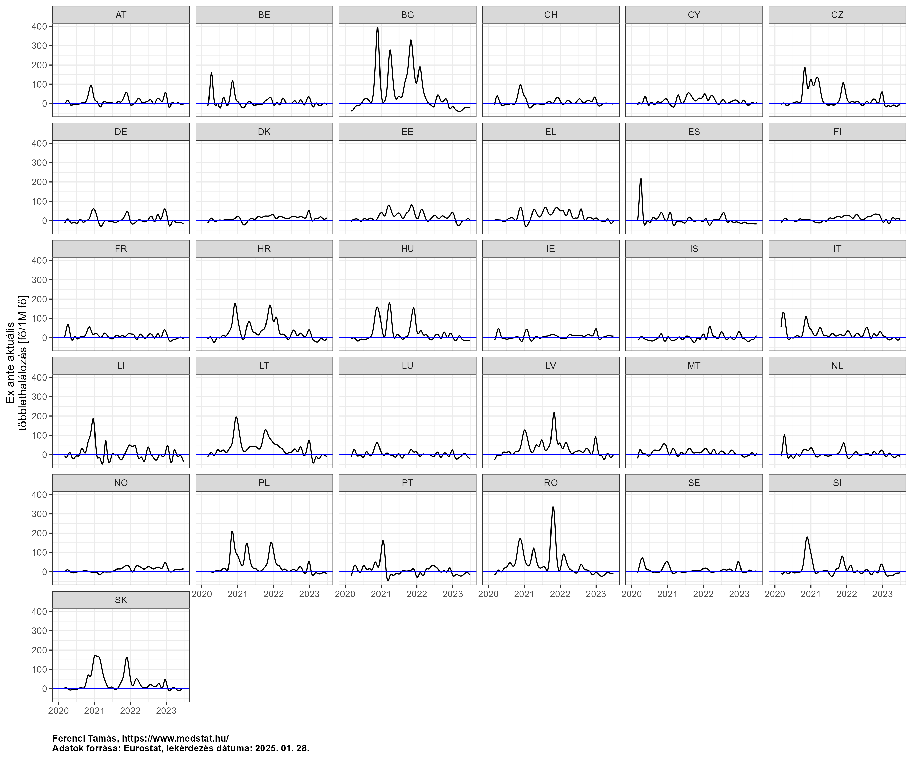<!-- -->

A járvány egészének értékeléséhez nézzük az összesített adatokat (piros
görbe Magyarország, a szürke görbék a többi európai országot jelölik):

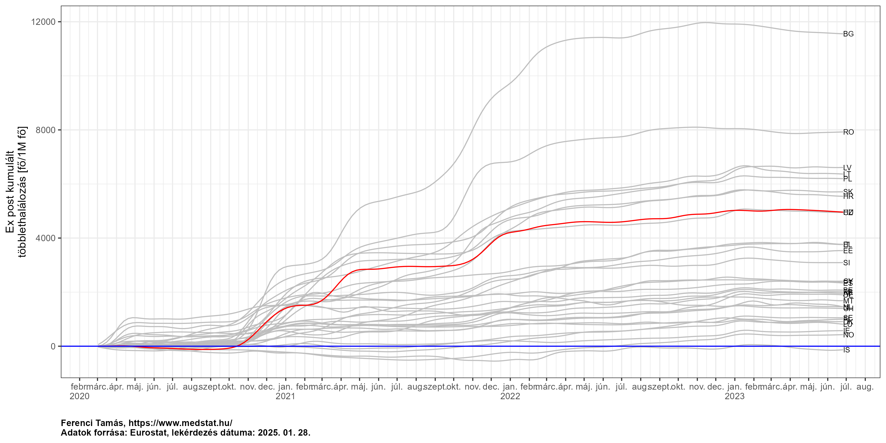<!-- -->

Látható, hogy a legfrissebb adatok szerint – persze ne felejtsük, ez egy
hónappal ezelőtti állapotot jelent! – Magyarország a legkedvezőtlenebb
harmad elején-közepén van.

Érdekes lehet jobban látható módon is kiemelni az utolsó időpontbeli
adatokat, tehát a fenti ábra jobb szélét (minden ország az utolsó
elérhető adatával szerepel):

<!-- -->

Látványos lehet ugyanezeket az adatokat térképen is ábrázolni. Itt ugyan
az értékeket nehezebb leolvasni, illetve összehasonlítani, hiszen egy
színskála rosszabbul ítélhető meg mint egy oszlop magassága, viszont
cserében térbeli információt is ad, ami meg sok szempontból jobban
érzékelhető, egyetlen pillantással is (jobban társítani tudjuk az
országokhoz az egyéb jellemzőiket, látszanak a térbeli csoportosulások
stb.):

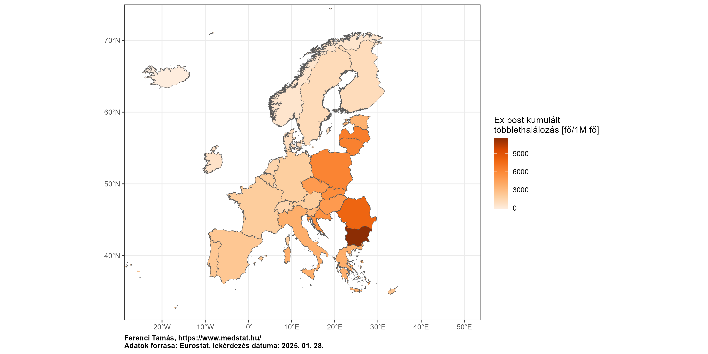<!-- -->

Az Eurostat [adatokat
szolgáltat](https://ec.europa.eu/eurostat/databrowser/view/demo_r_mwk3_t/)
ún. NUTS3 szintű, országon belüli területi egységekről is, ez
Magyarországon a megyéknek felel meg. Ilyen módon az összes fenti
vizsgálatot elvégezhetjük a magyar megyékre is vonatkozóan, egész
egyszerűen ugyanazt az elemzést kell csak lefuttatnuk – egymástól
függetlenül – minden megyére.

Hogy ennek mennyi értelme van? Magyar viszonylatban sajnos egy
szempontból egész biztosan van: a magyar rendszer, elképesztő módon, nem
ad meg területi halálozási adatokat, még megyei szinten sem (nemhogy
járási lebontásban). Így, ha bármilyen halálozási eredményre van
szükségünk területi lebontásban, egész egyszerűen a többlethalálozás
lesz az egyetlen eszközünk, teljesen mindegy, hogy mennyire jó vagy
rossz. Ettől függetlenül azért érdemes feltenni a kérdést, hogy mennyire
jó: ha ismernénk a jelentett halálozást megyei szinten, volna értelme
mégis nézni a többlethalálozást ez esetben is? Gondoljunk a
többlethalálozás két alapvető előnyére: teljesen független a haláloki
besorolástól és teljesen független a tesztelési aktivitástól. Az előbbi
igen valószínűtlen, hogy országon belül eltérjen, de az utóbbiban nagyon
is lehetnek különbségek az ország különböző megyéi között, így még ez
esetben is érdekes lehet a többlethalálozás (persze annak a hátrányai is
ugyanúgy érvényesülnek egy ilyen, országon belüli elemzés során is).

Az aktuális helyzet alakulása megyei szinten (a piros vonal ezen az
ábrán az országos értéket jelenti):

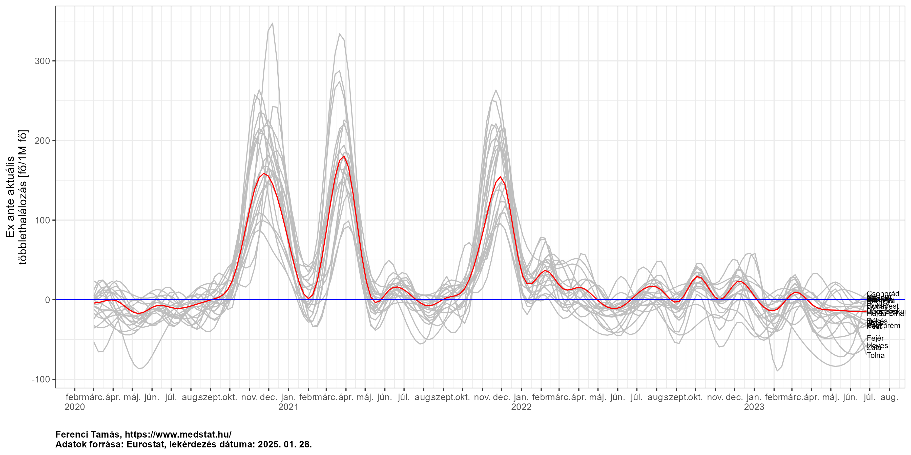<!-- -->

Itt is igaz, hogy bár ez összkép szempontjából tanulságos, ha egyesével
akarjuk vizsgálni a területi egységeket, akkor jobb őket külön
ábrázolni:

<!-- -->

Az előzőekhez hasonlóan érdekes lehet a kumulált helyzet, illetve ez
azért is segít, mert a korábbi ábráról nehéz megítélni, hogy
összességében mi egy megye helyzete, hiszen kevésbé látszik, hogy
mennyire ugyanazok bizonyultak rossz helyzetűnek a különböző
időpontokban:

<!-- -->

Az utolsó állapotról itt is készíthetünk oszlopdiagramot:

<!-- -->

Itt is kézenfekvő ötlet térképet rajzolni:

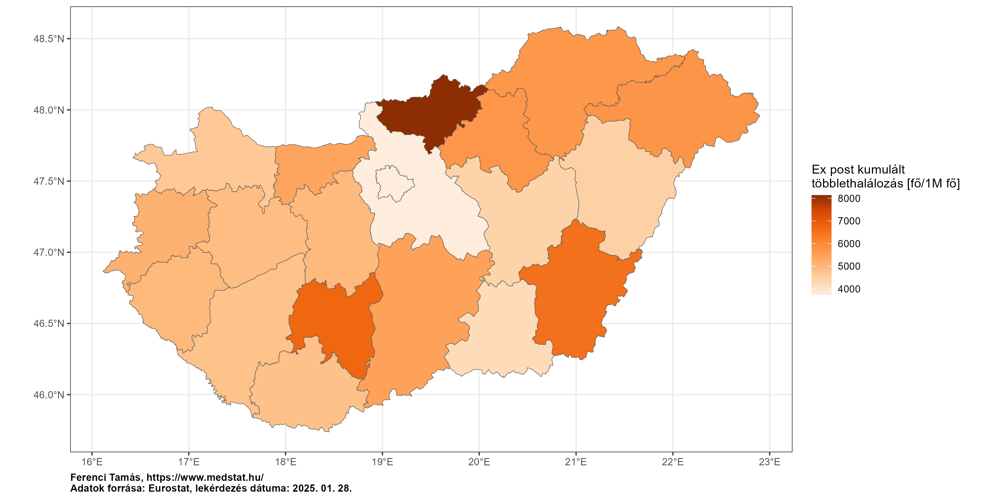<!-- -->

Finomabb felbontású, legalább járási adatok híján nehéz igazán fajsúlyos
megállapításokat tenni (megyei szinten még a városok és a falusias
területek is össze vannak vegyítve), ez alól Budapest az egyetlen
kivétel, és pozitív irányban: míg a nagyobb népsűrűség általában
kimondottan elősegíti a járványok terjedését, addig Magyarországon belül
Budapest pont, hogy a jobban teljesítő megyék közé került. Persze
vigyázat: ezek most nem a fertőződésre, hanem a halálozásra vonatkozó
adatok, így a megítélést még az is nehezíti, hogy a halálozási arányok
eltérhetnek (hiszen az függ a társbetegségek gyakoriságától, az életkori
eloszlástól, és így tovább, amik eltérhetnek megyék között).

## Záró gondolatok

Teljes mértékben egyetértek azzal, hogy most nem személyi felelőst kell
keresni, ujjal mutogatni, hogy ki mit rontott el, ám messzemenőkig nem
értek egyet azzal, hogy a kérdést elintézzük olyan mondatokkal, mint
hogy ez az időszak „a gyászról és a megfeszített küzdelemről” szól. Nem,
itt nem lehet befejezni egy elemzést, ugyanis *épp* a gyászolóknak és
megfeszítve küzdőknek tartozunk azzal, hogy feltárjuk a hibák okait,
*pont azért*, hogy a jövőben minél kevesebben gyászoljanak, és legyenek
kénytelenek megfeszítve küzdeni.

Azzal tehetünk a magyar emberek egészségéért, ha feltesszük azt a
kérdést: mi az oka ezeknek az adatoknak? Csak akkor tudunk ugyanis tenni
a javításukért, ha értjük, hogy miért alakultak így. Miért halnak meg
ilyen sokan nálunk európai összevetésben? Azért, mert sokan
megfertőződtek (de ők már ugyanolyan valószínűséggel haltak meg, mint
más országokban) vagy azért, mert bár ugyanannyian fertőződtek meg, de a
magyar fertőzöttek nagyobb valószínűséggel haltak meg? Esetleg mindkettő
egyszerre, és ha igen, milyen arányban? Ha az előbbire gyanakszunk,
akkor az járványvédelmi intézkedéseket (a szigorúságukat és az
időbeliségüket is), azok betartásának fegyelmét kell vizsgálni, a
tesztelési és kontaktuskövetési stratégiát, a járványügyi szervek
hatákonyságát és szervezettségét kell vizsgálni. De itt számíthatnak
olyan tényezők is, mint a népsűrűség, a városi lakosság aránya, a
lakásviszonyok és a lakások zsúfoltsága, vagy akár olyan szempontok is,
mint hogy az adott országban mik a kulturális szokások a
távolságtartásra. Ha az utóbbit elemezzük, akkor kétfelé ágaznak a
lehetőségek. Vagy az emberek olyan jellemzőjében van eltérés, ami
befolyásolja a kórlefolyást, és könnyen eszünkbe is juthatnak
magyarázatok: mind kockázati tényezőkben (elhízás, dohányzás,
alkoholfogyasztás), mind krónikus betegségek terén jól ismert a magyar
lakosság kirívóan rossz állapota. A másik – nem feltétlenül kizáró –
lehetőség, hogy az egészségügyi ellátásban kell keresni a magyarázatot.
Az elérhető eszközök, gyógyszerek, az orvosok és szakdolgozók
képzettsége nem tér el lényegesen, de magyarázatul szolgálhat a
túlterhelődés? Vagy az, hogy a betegek ellátása nem egységes irányelvek
mentén zajlik? Itt jön képbe a másik vesszőparipám, járványtól
függetlenül: az objektív és transzparens teljesítménymérés hiánya a
magyar egészségügyben. Amíg nincsenek definiált, standard indikátorok,
melyek jellemzik az ellátásminőséget, fogalmunk sem lehet arról sem,
hogy egyáltalán ki csinál valamit jól, és ki rosszul, nem tudhatjuk,
hogy melyik kórházról vagy osztályról kell példát venni, és melyiknél
feltárni, hogy mi a rossz teljesítmény oka; végképp nem tudjuk az
egészségügyi rendszer egészét értékelni és összehasonlítani, akár
időben, akár más országokkal.

Nem állítom, hogy ezek a kérdések könnyen megválaszolhatóak, és részben
egyet is értek azzal, hogy a járványkezelés kiértékelése távlatot és
rálátást igényel, de nem teljes mértékben: ha valamit rosszul csinálunk,
azt jó minél hamarabb kideríteni, mielőtt túl sokáig csináljuk tovább
rosszul.

Nem értek egyet azzal a filozófiával sem, hogy azzal törődjünk, hogy nem
igaz, hogy a legrosszabbak vagyunk: abból nem lehet tanulni, hogy van,
aki még rosszabb. Abból lehet tanulni, ha azt nézzük, hogy mondjuk Dánia
a járvány teljes időtartamát lehozta zéró többlethalálozással. Ez min
múlt?
[Azon](https://ourworldindata.org/explorers/coronavirus-data-explorer?zoomToSelection=true&pickerSort=asc&pickerMetric=location&Metric=Tests&Interval=Cumulative&Relative+to+Population=false&Align+outbreaks=false&country=HUN~DNK),
hogy 2021 októberig mi 6,5 millió koronavírus-tesztet csináltunk, a 6
milliónál is kevesebb lakosú Dánia 41 milliót?
[Azon](https://www.gisaid.org/index.php?id=208), hogy Dánia a levett
minták 47,9%-át vetette genetikai vizsgálat alá és töltötte fel
nemzetközi adatbázisba, amiből a variánsok elterjedését monitorozni
lehet, mi 0,052%-át? (Pár további szám összehasonlításként: Etiópia
0,061%, Banglades 0,189%, Afganisztán 0,064%.)
[Azon](https://gateway.euro.who.int/en/indicators/hfa_427-3051-spirits-consumed-in-pure-alcohol-litres-per-capita-age-15plus/),
hogy mi 3,5 liter tömény alkoholt iszunk meg évente, a dánok 1,6-ot?
[Azon](https://ec.europa.eu/eurostat/databrowser/view/hlth_rs_prsns/),
hogy Dániában 2700 nővér, ápoló, egészségügyi szakdolgozó jut százezer
lakosra, nálunk kevesebb, mint 1000? Félreértés ne essék, nem tudom
biztosan én sem, hogy mi a magyarázat, de azt biztosan tudom, hogy az
erről való diskurzus előre viszi az országot. Az, hogy a középmezőnyben
vagyunk, úgyhogy akkor menjünk is tovább, nem viszi előbbre az országot.

## Módszertani kérdések

A számítás elvégzése néhány alapvető módszertani kérdés megválaszolását
teszi szükségessé, melyeket érdemes külön is megtárgyalni.

### A várt halálozások előrejelzése

Mint láttuk, az egész többlethalálozási mutató kiindulópontja annak
megmondása, hogy járvány nélküli mennyi halálozás lett *volna*, amit
módszertanilag úgy oldunk meg, hogy a korábbi – és emiatt járvány által
nem befolyásolt – adatokból készítünk egy statisztikai előrejelzést.
Éppen ezért fontos alaposan megérteni, hogy milyen lehetséges módszerek
vannak előrejelzések készítésére, ezeknek mik az előnyei és hátrányai.

A továbbiak szemléltetéséhez tekintsünk egy példa országot, melynek a
2015 és 2019 között halálozási rátái a következő szerint alakultak (a
függőleges tengelyen az ezer főre jutó halálozások száma van, az értéket
megadó pont körüli tartomány az ún. 95%-os konfidenciaintervallum, mely
az érték bizonytalanságát jelzi – minél szélesebb az intervallum, annál
kevésbé tudjuk az adott értéket pontosan meghatározni):

``` r
SimData <- data.table(year = as.factor(as.character(2015:2019)),
                      type = "fact", mort = c(134, 132, 131, 130, 129)*1e3,
                      pop = c(9.9, 9.8, 9.8, 9.75, 9.7)*1e6)
SimData <- cbind(SimData, t(sapply(1:nrow(SimData),
                                   function(i) with(binom.test(SimData$mort[i], SimData$pop[i]),
                                                    c(fit = unname(estimate), lwr = conf.int[1],
                                                      upr = conf.int[2])))))
ggplot(SimData, aes(x = year, y = fit*1000, ymin = lwr*1000, ymax = upr*1000, color = type)) +
  geom_point() + geom_errorbar(width = 0.3) + labs(x = "Év", y = "Mortalitás [/1000 fő/év]") +
  guides(color = "none")
```

<!-- -->

Az egyszerűség kedvéért tételezzük fel, hogy évi adatunk van, és a
járvány pontosan 2020 elején kezdődött. Nézzük meg ezen képzeletbeli
ország példáján a legtipikusabb megoldásokat a 2020-ra vonatkozó
előrejelzés készítésében!

Az első lehetőség, hogy a 2019-re vonatkozó adatokat egy az egyben
átvesszük mint a 2020 becslése:

``` r
SimData <- rbind(SimData, data.table(year = "2019 megis-\nmételve", type = "pred",
                                     SimData[year=="2019", -c("year", "type")]))
ggplot(SimData, aes(x = year, y = fit*1000, ymin = lwr*1000, ymax = upr*1000, color = type)) +
  geom_point() + geom_errorbar(width = 0.3) + labs(x = "Év", y = "Mortalitás [/1000 fő/év]") +
  guides(color = "none")
```

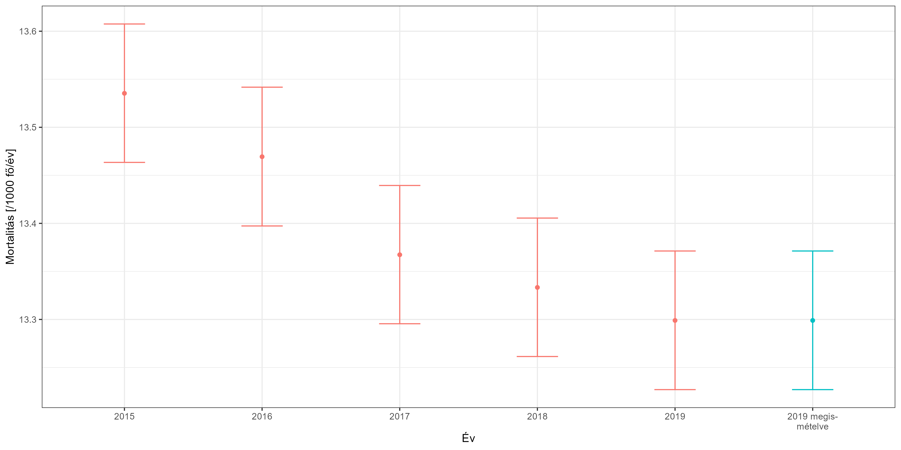<!-- -->

Ennek a módszernek az előnye, hogy mivel a legközelebbi értéket veszi
át, így nem érinti annyira érzékenyen, ha a mortalitásoknak hosszútávú
trendje van – márpedig általában van. (Bár azért érezhető, hogy még így
sem tökéletes a helyzet, hiszen a példában azt érzi az ember, hogy
valójában még ennél is lejjebb volt a várható, mivel egy folyamatos
csökkenésben vagyunk.) A hátránya, hogy egyetlen év adatait használja,
így nagyobb a bizonytalansága: a mortalitási adatokban lényeges
évről-évre történő véletlen ingadozás van (mikor volt épp egy rosszabb
influenza-szezon, mikor egy jobb stb.); emiatt egy év adata szükségképp
nagyobb bizonytalanságot jelent.

A második tipikus módszer, hogy a néhány – például öt – megelőző év
átlagát veszik várt halálozásnak:

``` r
SimData <- rbind(SimData, data.table(year = "2015-2019\nátlagolva", type = "pred",
                                     mort = sum(SimData[type=="fact"]$mort),
                                     pop = sum(SimData[type=="fact"]$pop),
                                     with(binom.test(sum(SimData[type=="fact"]$mort),
                                                     sum(SimData[type=="fact"]$pop)),
                                          t(c(fit = unname(estimate), lwr = conf.int[1],
                                              upr = conf.int[2])))))
ggplot(SimData, aes(x = year, y = fit*1000, ymin = lwr*1000, ymax = upr*1000, color = type)) +
  geom_point() + geom_errorbar(width = 0.3) + labs(x = "Év", y = "Mortalitás [/1000 fő/év]") +
  guides(color = "none")
```

<!-- -->

Ez olyan szempontból jobb, hogy az eredmény biztosabb, mivel a több év
átlagolása lecsökkenti a véletlen ingadozásokat. (Jól látszik, hogy a
konfidenciaintervallum is szűkebb, jelezve, hogy pontosabban becsült
értéket kaptunk.) A nagy problémája is látszik azonban az ábrán: ha
hosszú távú trendje van a halálozásoknak, akkor az átlag nagyon
félrevezető lehet; jelen esetben a korábbi nagy értékek miatt torz módon
magas lesz.

Így jutunk el a harmadik megoldási lehetőség ötletéhez: rakjunk egy
vonalzót a megelőző 5 év adatára és hosszabbítsuk meg ezt az egyenest!
Egyszerűen a halálozási rátákkal elvégezve ezt az alábbi eredményhez
jutunk:

``` r
SimData <- rbind(SimData, data.table(year = "2015-2019\nmeghosszabbítva", type = "pred", mort = NA, pop = NA,
                                     predict(lm(fit ~ as.numeric(as.character(year)),
                                                data = SimData[type=="fact"]),
                                             data.frame(year = 2020), interval = "prediction")))
ggplot(SimData, aes(x = year, y = fit*1000, ymin = lwr*1000, ymax = upr*1000, color = type)) +
  geom_point() + geom_errorbar(width = 0.3) + labs(x = "Év", y = "Mortalitás [/1000 fő/év]") +
  guides(color = "none")
```

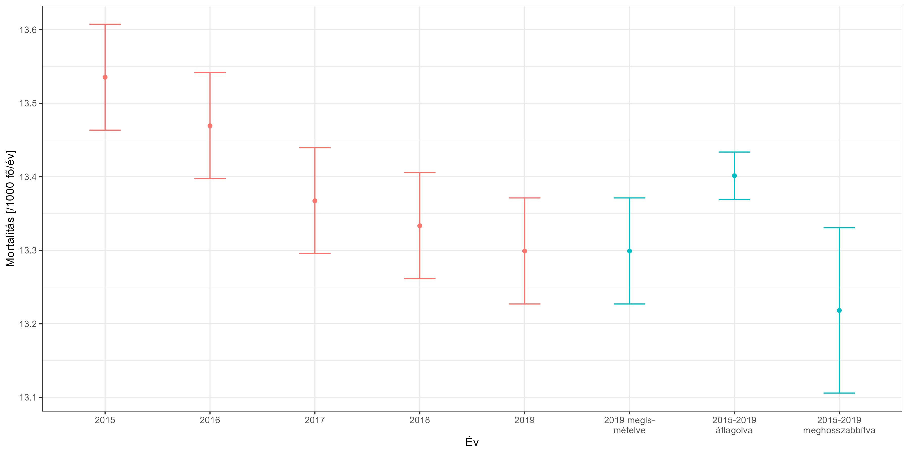<!-- -->

Ez megfelel a „szabad szemre” történő várakozásunknak arra, hogy hol
lenne a következő évi eredmény, viszont cserében a bizonytalansága is a
legnagyobb.

A jelen esetben, mivel rengeteg adat áll rendelkezésre, így a fenti
értelmű – mintavételi – bizonytalanság kevésbé fontos szempont, viszont
az kritikus, hogy a torzítottságot igyekezzünk elkerülni. Emiatt a
harmadik megoldás tűnik a legszerencsésebbnek.

Természetesen a valóságban egy sor bonyolító tényezővel kell számolni.
Egyrészt nem éves adataink vannak, hanem haviak, jobb esetben hetiek
(legjobb esetben napiak), ilyenkor el kell számolni az éven belüli
mintázattal. A mortalitásnak ugyanis van egy jellegzetes éven belüli
alakulása, úgy szokták mondani, szezonalitása; az alábbi ábra ezt
szemlélteti a járvány előtti magyar adatokkal (a kék görbe mutatja az
összes adat simítását, a halvány fekete görbék az egyes évek adatait):

``` r
ggplot(RawData[age=="TOTAL"&geo=="HU"&year<=2019], aes(x = week, y = outcome/population*1000*52, group = year)) +
  geom_line(alpha = 0.2) +
  geom_line(data = data.frame(week = 1:53,
                              mort = predict(mgcv::gam(outcome ~ s(week, bs = "cc"),
                                                       offset = log(population),
                                                       data = RawData[age=="TOTAL"&geo=="HU"&year<=2019],
                                                       family = quasipoisson),
                                             newdata = data.frame(week = 1:53), type = "response")*1000*52),
            aes(x = week, y = mort), color = "blue", inherit.aes = FALSE) +
  labs(x = "Hét", y = "Mortalitás [/1000 fő/év]")
```

<!-- -->

Heti adatok használatánál tehát ezzel a mintázattal el kell számolni.
(Napi adatok használatánál még a héten belüli mintázattal is.)

A második probléma, hogy a valóságban nem pontosan az évhatárnál van a
járvány kezdete. A gyakorlatban ez általában azt jelenti, hogy a
számítási algoritmusnak meg kell adni, hogy teljesen pontosan mely
adatokat használja fel a várt halálozás becslésére. Semmiféle problémát
nem jelent, ha ez nem az évhatár: ha 2020 márciusig használjuk fel az
adatokat, akkor azokból becsüljük a hosszú távú trendet és a
szezonalitást, nincs jelentősége, hogy ez nem évhatárra esik. (A
becsléshez így minden információt kinyerünk, például még 2020 első két
hónapját is a szezonális mintázat becsléséhez.) Adott esetben még az sem
kötelező, hogy ez a fenti módon nézzen ki, tehát, hogy egy ideig
használjuk az adatokat, utána meg nem, nyugodtan megadhatunk több
tartományt is, amiket használunk a modell – és ebből fakadóan a várt
halálozás – becsléséhez.

És végezetül egy általános megjegyzés. A fentiekből is látható, hogy a
többlethalálozás módszere nem alkalmazható akkor, ha nagyon hosszú
időtartamú a járvány. Ekkor ugyanis nagyon messzire távolodunk a
tényadatoktól és lehetetlen lesz értelmes előrejelzést tenni, amivel a
várt halálozást felállíthatnánk. Ha – persze csak elméleti példaként… –
10 évig tart egy járvány, akkor a végén már nagyon megkérdőjelezhető
lesz a többlethalálozási eredmény, hiszen a járvány nélküli adat
becsléséhez 10 évvel korábbi adatokat fogunk felhasználni, ami alapján
aligha lehet kijelenteni, hogy mi a várt érték, annyira odébbmászhattak
a járványtól független mortalitási tényezők.

### Acosta és Irizarry módszerének technikai részletei

Az általam a számításokra használt eljárás a fenti harmadik módszer
(görbeillesztés- és hosszabbítás) filozófiájának felel meg, csak azt
jóval szofisztikáltabban vitelezi ki; Rolando J. Acosta (Harvard
University) és Rafael A. Irizarry (Dana-Farber Cancer Institute)
2020-ban publikálta.

Nagyon röviden és nagyon technikai szinten a következő történik. Először
is kell egy valószínűségi modell, ez a következő lesz:
*Y*<sub>*t*</sub> ∣ *ε*<sub>*t*</sub> ∼ Poi(*μ*<sub>*t*</sub>\[1+*f*(*t*)\]*ε*<sub>*t*</sub>),
ahol *ε*<sub>*t*</sub> nem feltétlenül fehérzaj, lehet autokorrelált, az
adatok autokorreláltságának elszámolására (a napi adat erősen az, a heti
nem feltétlenül), legyen többváltozós normális AR(*p*) szerinti
kovarianciamátrixszal és
*μ*<sub>*t*</sub> = *N*<sub>*t*</sub>exp \[*α*(*t*)+*s*(*t*)+*w*(*t*)\],
ahol *α*(*t*) a hosszú távú – lassan változó – trend, *s*(*t*) az éven
belüli mintázat (szezonalitás), *w*(*t*) pedig a hét napja hatás (ha
napi adatunk van), és *N*<sub>*t*</sub> a háttérpopuláció.

A modell felállítása logikus, hiszen a halálozások száma darabszám
jellegű adat, erre csakugyan a Poisson a legszokványosabb választás. (A
Poisson az overdiszperzió kezelésére kvázi-Poisson eloszlásra
cserélhető; a lenti elemzés is így készült.) Látható, hogy *f*(*t*) a
keresett többlet (szorzóként lép be, hiszen log-link mellett
multiplikatív az egész modell). Explicite nem ráta van benne, de
lényegében igen, hiszen offszetként felhasználjuk a háttérpopuláció
lélekszámát.

Az *f*(*t*), tehát a (százalékos) többlet kapcsán fontos megemlíteni,
hogy ezt az eljárás igyekszik úgy becsülni, hogy bár az alakja
általános, akár még szakadása is előfordulhat, de ahol lehet, ott sima
legyen. A nyersen számolt többlet
(*Y*<sub>*t*</sub> − *μ*<sub>*t*</sub>) ugyanis a véletlen hatások miatt
elég zajos lehet, így az *f*(*t*) használata lényegében egy simítást
jelent. Ez szemléletesen látszik, ha ábrázoljuk a kettőt, például a
magyar adatokon:

``` r
ggplot(melt(res[age=="TOTAL"&geo=="HU", .(date, `Nyers` = y, `f(t)` = increase)], id.vars = "date"),
       aes(x = date, y = value, group = variable, color = variable)) + geom_line() +
  labs(x = "Dátum", y = "Százalékos többlet") +
  scale_x_date(date_breaks = "months", labels = scales::label_date_short()) +
  theme(legend.position = "bottom", legend.title = element_blank())
```

<!-- -->

A többlet abszolút értékének számítása természetesen már *f*(*t*)
alapján történik (tehát *μ*<sub>*t*</sub> ⋅ *f*(*t*) és nem
*Y*<sub>*t*</sub> − *μ*<sub>*t*</sub> alakban). A `res` adattáblában `y`
néven érhető el a nyersen számolt (százalékos) többlet, `increase` néven
*f*(*t*) és `excess` néven az – *f*(*t*)-vel számolt – többlet.

A modell becslése cseles, alapvetően maximum likelihood, de elég
komplex, mert óvatosan kell eljárni (*ε*<sub>*t*</sub> is elég
általános, és *f*(*t*) is nézhet ki furcsán, például lehet szakadása).

A modellt most összesített adatokon futtatom (tehát nem pedig rétegzett,
például életkor és nem szerint rétegzett adatokon). Szemben azzal, amit
az ember első ránézésre gondolna, hogy ti. az életkori és nemi
összetételek eltérése miatt ez hiba lehet, ez valójában nagy bajt nem
okoz, különösen, ha a várthoz viszonyított relatív eltéréseket
használjuk (lásd következő pont). Mégis lehet valamennyi értelme a
rétegzésnek, de egy kevésbé fontos ok miatt: ha a hosszú távú trend,
vagy szezonalitás eltér az egyes rétegek között.

### Relatív és abszolút eredmények

A többlethalálozást eddig úgy kezeltük mint a tényleges és a várt
halálozás különbsége, tehát egy – főben mért – abszolút szám. Csakugyan
ez az egyetlen, ami teljesen aggálytalanul kiszámítható, ám problémája,
hogy nem vethető össze országok között, hiszen a nagyobb országokban
nyilván nagyobb lesz a többlethalálozás, akkor is, ha valójában nem
rosszabb a helyzet. Mit tehetünk?

A természetes ötlet a relatív mutatóra való áttérés, ezen belül is a
legtermészetesebb gondolat az ország lélekszámával való leosztás; számos
más esetben is szinte automatikusan ezt tesszük. (Például a
fertőzött-számok vagy a halálozási számok esetében is!) Itt azonban nem
biztos, hogy ez a legszerencsésebb választás.

A probléma az, hogy a lélekszám érzéketlen arra, hogy mennyi az
alaphalandóság az adott országban. Tekintsünk két, 10 milliós országot,
amelyek egyikében évi 100, a másikban évi 150 ezer ember hal meg
(mondjuk mert az utóbbiban több a krónikus beteg, vagy akár csak azért,
mert idősebbek a lakosok). Ez esetben ugyanannyi többlethalálozás
relatívvá téve is ugyanolyan eredményre vezet, noha az ember azt érzi,
hogy adott többlethalál jobban számít az első országnál, mint a
másodiknál.

Éppen ezért gyakran a többlethalálozások számát nem a lakosság számára,
hanem a várt halálozás-számra osztják rá. Ez egyfelől ugyan bevisz a
dologba egy plusz bizonytalanságot, hiszen egy becsült,
bizonytalansággal terhelt értékkel osztunk, de cserében van egy hatalmas
előnye. Ez pedig az, hogy mivel a várt érték már *eleve* tükrözi az
ország alaphalandóságát, és így minden azt befolyásoló tényezőt (kezdve
a korfával, de nyugodtan felsorolhatjuk a krónikus betegségeket, a
környezeti tényezőket, szociális viszonyokat, egészségügyi
ellátórendszert stb.), így a hányadossal kapott relatív érték nagyon jól
összehasonlítható lesz országok között, még akkor is, ha ezek a tényezők
eltérnek (mint ahogy nagyon is el fognak térni minden valós esetben).

## A számítások részletei, kiegészítő elemzések

Ebben a szakaszban közlöm a teljes elemzést, mindenhol megadva a
számításokat végző kódot is, a nyílt – és reprodukálható – tudomány
filozófiájának megfelelően. Én általában is ennek vagyok a híve, de a
jelen esetben, egy népegészségügyileg kritikus helyzetben, azt gondolom,
hogy ez kiemelten fontos. Három ok miatt vagyok a híve ennek a
filozófiának: az első, hogy ez a fajta transzparencia növeli a bizalmat
a kutatási eredmények iránt, hiszen azok így többé már nem felkent
papoktól érkező kinyilatkoztatások, a második, hogy biztosabbá teszi az
eredményeket, mert így, ha elrontottam valamit, azt az egész világ látni
fogja, és így sokkal valószínűbb, hogy kiderül és hamar kiderül (igen,
rosszul fogom magam érezni, ha kiderül, hogy hibáztam, de még sokkal
rosszabbul érezném magam, ha *nem* derül ki, és mindenki elhiszi a rossz
eredményeket), végezetül a harmadik, hogy ezzel is szeretném segíteni a
többi kutatót és az érdeklődő laikusokat hasonló számítások
elvégézésében, mivel itt látnak egy lehetséges példát.

A számítások aktualizálásának dátuma: 2022-05-31. A többlethalálozást
számító csomag (`excessmort`) verziószáma 0.6.1, az Eurostat-tól
adatokat lekérő csomagé (`eurostat`) pedig 3.7.10.

### Adatok előkészítése

Elsőként betöltjük a szükséges könyvtárakat, elvégzünk pár egyéb
technikai előkészületet:

``` r
library(data.table)
library(excessmort)
library(ggplot2)
theme_set(theme_bw())
captionlab <- paste0("Ferenci Tamás, https://github.com/tamas-ferenci/ExcessMortEUR/\nAdatok forrása: ",
                     "Eurostat és STMF, lekérdezés dátuma: ")
    
pal <- scales::hue_pal()(3)
scalval <- c("Többlethalálozás" = pal[1], "Többlethalálozás az influenzára való korrekcióval" = pal[2],
             "Regisztrált koronavírus-halálozás" = pal[3])
```

A mortalitási adatokat az Eurostat-tól kérjük le (`demo_r_mwk_ts`
adatbázis), az `eurostat` csomag használatával. Leszűrjük, hogy mindkét
nem összesített adata legyen benne (ahogy életkor szerint sem bontunk),
és megszorítjuk magunkat az EU/EFTA-országokra és az Egyesült
Királyságra. Ez utóbbi sajnos az Eurostat adatbázisból problémás: az
adatsor 2020 végén megszakad, ráadásul félő lehet az is, hogy az Unióból
történő kilépés miatt végleg, éppen ezért az angol adatokat a Short Term
Mortality Fluctuations (STMF) adatbázisból kérjük le. Csak azokat az
országokat tartjuk meg, ahonnan legalább 250 hétnyi (tehát kb. 5 évnyi)
visszamenőleges adat elérhető:

``` r
RawData <- as.data.table(eurostat::get_eurostat("demo_r_mwk_ts", time_format = "raw"))
RawData <- RawData[sex=="T"]
RawData <- RawData[geo%in%eurostat::eu_countries$code|geo%in%eurostat::efta_countries$code]
RawData <- RawData[geo!="UK"]
RawDataUK <- fread("https://www.mortality.org/Public/STMF/Outputs/stmf.csv")
RawDataUK <- RawDataUK[Year>=2015&CountryCode%in%c("GBRTENW", "GBR_NIR", "GBR_SCO")&Sex=="b"][
  ,.(time = paste0(Year, "W", sprintf("%02d", Week)), values = sum(DTotal)),.(Year, Week)][
    ,.(sex = "T", unit = "NR", geo = "UK", time, values)][order(time)]
RawDataUK <- RawDataUK[1:(nrow(RawDataUK)-1)]
RawData <- rbind(RawData, RawDataUK)
RawDataHunNUTS <- as.data.table(eurostat::get_eurostat("demo_r_mwk3_ts", time_format = "raw"))
RawDataHunNUTS <- RawDataHunNUTS[sex=="T"&substring(geo, 1, 2)=="HU"&nchar(geo)==5]
RawDataHunNUTS[ , values := round(values*sum(values)/sum(values[geo!="HUXXX"])), .(time)]
RawDataHunNUTS <- RawDataHunNUTS[geo!="HUXXX"]
RawData <- rbind(RawData, RawDataHunNUTS)
RawData$age <- "TOTAL"
RawDataHunAge <- as.data.table(eurostat::get_eurostat("demo_r_mwk_05", time_format = "raw"))
RawDataHunAge <- RawDataHunAge[sex=="T"&geo=="HU"&age!="TOTAL"]
RawDataHunAge$age <- ifelse(RawDataHunAge$age=="Y_GE90", "Y85-89", RawDataHunAge$age)
RawDataHunAge <- RawDataHunAge[, .(values = sum(values)) , .(age, sex, unit, geo, time)]
RawDataHunAge[age=="Y85-89"]$age <- "Y_GE85"
RawDataHunAge[ , values := round(values*sum(values)/sum(values[age!="UNK"])), .(time)]
RawDataHunAge <- RawDataHunAge[age!="UNK"]
RawData <- rbind(RawData, RawDataHunAge)
RawData <- RawData[!is.na(RawData$values)]
RawData <- RawData[geo%in%(RawData[,.N,.(geo)][N>250]$geo)]
```

A megmaradt, és a későbbi elemzésben felhasznált országok listája, a
rövidítéseikkel együtt, amik az ábrákon a helytakarékosság végett
szerepelni fognak:

``` r
knitr::kable(unique(res[nchar(geo)==2, .(`Kód` = geo, `Angol név` = geoname)])[order(`Kód`)])
```

| Kód | Angol név      |
|:----|:---------------|
| AT  | Austria        |
| BE  | Belgium        |
| BG  | Bulgaria       |
| CH  | Switzerland    |
| CY  | Cyprus         |
| CZ  | Czechia        |
| DE  | Germany        |
| DK  | Denmark        |
| EE  | Estonia        |
| EL  | Greece         |
| ES  | Spain          |
| FI  | Finland        |
| FR  | France         |
| HR  | Croatia        |
| HU  | Hungary        |
| IS  | Iceland        |
| IT  | Italy          |
| LI  | Liechtenstein  |
| LT  | Lithuania      |
| LU  | Luxembourg     |
| LV  | Latvia         |
| MT  | Malta          |
| NL  | Netherlands    |
| NO  | Norway         |
| PL  | Poland         |
| PT  | Portugal       |
| RO  | Romania        |
| SE  | Sweden         |
| SI  | Slovenia       |
| SK  | Slovakia       |
| UK  | United Kingdom |

Kikódoljuk az évet és a hónapot:

``` r
RawData$year <- as.numeric(substring(RawData$time, 1, 4))
RawData$week <- as.numeric(substring(RawData$time, 6, 7))
```

Csinálunk egy átnevezést, hogy később egyszerűbb legyen az illesztés:

``` r
names(RawData)[names(RawData)=="values"] <- "outcome"
```

(Frissítés, 2021. június 27. Korábban az Eurostat 99-es hét alatt hozta
a héthez nem rendelt halálozásokat. (Ilyen csak kevés országnál fordul
elő, és ott sem sok halálesettel). Ez azonban június végén megszűnt, a
[leírás
alapján](https://ec.europa.eu/eurostat/cache/metadata/en/demomwk_esms.htm#coher_compar1626942947368)
ezek az adatok, ha kellenének is valamire, külön táblában vannak, így a
főtáblában 99-es hét már nem fordulhat elő. Emiatt ezek kezelésére sincs
többé szükség.)

<!-- ```{r} -->
<!-- <<het99statisztika>> -->
<!-- ``` -->
<!-- Éppen ezért -- hogy ne kelljen emiatt országokat elhagynunk -- egyszerűen szétosztjuk egyenletesen ezeket az eseteket a hetek között: -->
<!-- ```{r} -->
<!-- <<hetszetosztas>> -->
<!-- ``` -->

Dátumként az adott hét első napját használjuk; fontos, hogy az ISO 8601
szerinti hétbesorolást használja az Eurostat, amit az `ISOweek` csomag
kezel:

``` r
RawData[ , outcome := round(outcome*sum(outcome)/sum(outcome[week!=99])), .(geo, year)]
RawData <- RawData[week!=99]
RawData$date <- ISOweek::ISOweek2date(paste0(RawData$year, "-W", sprintf("%02d", RawData$week), "-1"))
```

A háttérpopuláció létszám adatait szintén az Eurostat-tól kérjük le
(`demo_pjan` adatbázis); szintén összes nemre és életkorra együtt:

``` r
PopData <- as.data.table(eurostat::get_eurostat("demo_pjangroup"))
PopData <- PopData[!age%in%c("UNK", "Y_GE75", "Y_GE80")]
PopDataHunNUTS <- as.data.table(eurostat::get_eurostat("demo_r_pjanaggr3"))
PopDataHunNUTS <- PopDataHunNUTS[substring(geo, 1, 2)=="HU"&nchar(geo)==5&geo!="HUXXX"]
PopDataHunNUTS <- PopDataHunNUTS[age=="TOTAL"]
PopData <- rbind(PopData, PopDataHunNUTS)
PopData <- PopData[sex=="T"]
# PopDataHunAge <- as.data.table(eurostat::get_eurostat("demo_pjan"))
# PopDataHunAge <- PopDataHunAge[sex=="T"&geo=="HU"&!age%in%c("TOTAL", "UNK")]
# PopDataHunAge$age <- ifelse(PopDataHunAge$age=="Y_LT1", 0,
#                             ifelse(PopDataHunAge$age=="Y_OPEN", 100,
#                                    substring(PopDataHunAge$age, 2)))
# PopDataHunAge$age <- as.numeric(PopDataHunAge$age)
# PopDataHunAge[age>=90]$age <- 90
# PopDataHunAge <- PopDataHunAge[, .(values=sum(values)), .(unit, age, sex, geo, time)]
# PopDataHunAge$age <- as.character(cut(PopDataHunAge$age, breaks = c(seq(0, 90, 5), Inf), 
#                                       labels = c("Y_LT5", paste0("Y", seq(5, 85, 5), "-",
#                                                                  seq(10, 90, 5)-1), "Y_GE90"),
#                                       right = FALSE))
# PopData <- rbind(PopData, PopDataHunAge)
PopData$numdate <- as.numeric(PopData$time-as.Date("1960-01-01"))
PopData$geo <- as.factor(PopData$geo)
```

Ez minden év január 1-re vonatkozóan tartalmazza a lélekszámokat, ebből
úgy kapjuk meg az egyes hetek adatait, hogy egy spline illesztünk rá, és
abból kérjük le a megfelelő napokat. Ehhez az `mgcv` csomagot
használjuk; a dátumot pedig numerikussá kell alakítanunk, hogy át tudjuk
adni magyarázó változóként.

``` r
RawData <- merge(RawData,
                 PopData[geo%in%unique(RawData$geo),
                         .(date = unique(RawData$date),
                           population = as.numeric(predict(mgcv::gam(values ~ s(numdate)),
                                                           data.frame(numdate = as.numeric(unique(RawData$date)-as.Date("1960-01-01")))))),
                         .(geo, age)], by = c("geo", "age", "date"))
```

### A többlethalálozás becslése

A többlethalálozás becsléséhez kizárjuk a mostani járvány időszakát (az
alapráta meghatározásához), majd az `excessmort` csomaggal elvégeztetjük
a számításokat. Kiszedjük a tényleges és a várt halálozást, a nyersen
számolt és modellel simított többletet, a többlet abszolút értékét,
illetve ez utóbbihoz standard hibát is számolunk (ezt kénytelenek
vagyunk kézzel megtenni), bár a mostani számításban nem lesz rá
szükségünk:

``` r
exclude_dates <- seq(as.Date("2020-03-01"), max(RawData$date), by = "day")

res <- RawData[, with(excess_model(.SD, start = min(date), end = max(date), exclude = exclude_dates,
                            frequency = .N/(as.numeric(diff(range(date)))/365.25)),
               list(date = date, observed = observed, expected = expected,
                    y = 100 * (observed - expected)/expected,
                    increase = 100 * fitted,  excess = expected * fitted,
                    se = sapply(1:length(date), function(i) {
                      mu <- matrix(expected[i], nr = 1)
                      x <- matrix(x[i,], nr = 1)
                      sqrt(mu %*% x %*% betacov %*% t(x) %*% t(mu))
                    }))), .(geo, age)]
```

Egyesítjük a többlethalálozási adatbázist a korábbi adatokkal, leszűrjük
a járvány időszakára, és kizárjuk az 1 millió lakosúnál kisebb
országokat (mert később lélekszámra akarunk osztani):

``` r
res <- merge(res, RawData, by = c("geo", "age", "date"))
res <- res[order(geo, age, date)]
res <- res[date>=as.Date("2020-03-01")]
```

Kiszámoljuk a – járvány eleje óta – kumulált többletet, illetve a
populációból is egy átlagot:

``` r
res[, cumexcess := cumsum(excess), .(geo, age)]
res[, meanpopulation := dplyr::cummean(population), .(geo, age)]
res[, cumexpected := cumsum(expected), .(geo, age)]
```

A `geo` átalakítjuk faktorrá, és beállítjuk, hogy Magyarország az utolsó
legyen, hogy az ábrázolásnál az kerüljön a legtetejére:

``` r
res$nuts_level <- nchar(res$geo)-2
res$geo <- forcats::fct_relevel(as.factor(res$geo), "HU", after = Inf)
```

A térkép-adatokkal összekapcsoljuk az eredményeket, illetve kibővítjük
azokat az országok és megyék elnevezéseivel, hogy ne csak kódjaink
legyenek:

``` r
geodata <- eurostat::get_eurostat_geospatial(output_class = "sf", resolution = "01", year = "2021",
                                             make_valid = TRUE)
geodata <- merge(geodata, res[, tail(.SD, 1), .(geo, age)][, .(y = cumexcess/meanpopulation*1e6,
                                                          geo, age, nuts_level)], by = "geo")
res <- merge(res,
             data.table(geo = c(unique(RawData[nchar(geo)==2]$geo),
                                c("HU110", "HU120", "HU211", "HU212", "HU213", "HU221", "HU222", "HU223",
                                  "HU231", "HU232", "HU233", "HU311", "HU312", "HU313", "HU321", "HU322",
                                  "HU323", "HU331", "HU332", "HU333")),
                        geoname = c(countrycode::countrycode(unique(RawData[nchar(geo)==2]$geo),
                                                             "eurostat", "country.name"),
                                    c("Budapest", "Pest", "Fejér", "KE", "Veszprém", "GyMS", "Vas", "Zala", "Baranya",
                                      "Somogy", "Tolna", "BAZ", "Heves", "Nógrád", "Hajdú-Bihar", "JNSz", "SzSzB",
                                      "Bács-Kiskun", "Békés", "Csongrád"))))
```

Most, hogy minden adatfeldolgozzásal végeztünk, az eredményeket
kimentjük, hogy más is kényelmesen fel tudja használni:

``` r
fwrite(res, "ExcessMortEUR_data.csv", sep = ";", dec = ",", row.names = FALSE)
```

### Az eredmények ábrázolása, a kétféle relatív mutató viszonya

A lélekszámra vetített ábrákat láthattuk az eredményeket bemutató
részben. Most nézzük meg kicsit közelebbről a kétféle relatívvá tétel
egymáshoz való viszonyát!

Emlékeztetőül, az aktuális többlethalálozás népességszámra vetített
relatív mutatóként:

``` r
ggplot(res[nuts_level==0&age=="TOTAL"], aes(x = date, y = excess/population*1e6, group = geo, label = geo)) +
  geom_line(aes(color = geo=="HU")) + geom_abline(slope = 0, intercept = 0, colour = "blue") +
  scale_color_manual(values = c("FALSE" = "gray", "TRUE" = "red")) + guides(color = "none") +
  labs(x = "", y = "Aktuális többlethalálozás [fő/1M fő]",
       caption = paste0(captionlab, format(Sys.Date(), "%Y. %m. %d."))) +
  scale_x_date(date_breaks = "months", labels = scales::label_date_short()) +
  directlabels::geom_dl(method = list("last.points", cex = 0.6)) +
  theme(plot.caption = element_text(face = "bold", hjust = 0), legend.position = "bottom",
        legend.title = element_blank())
```

<!-- -->

Ugyanez akkor, ha a várt halálozásra vetítünk:

``` r
ggplot(res[age=="TOTAL"&nuts_level==0], aes(x = date, y = increase, group = geo, label = geo)) + geom_line(aes(color = geo=="HU")) +
  scale_color_manual(values=c("FALSE" = "gray", "TRUE" = "red")) + guides(color = "none") +
  labs(x = "", y = "Aktuális többlethalálozás [%]",
       caption = paste0(captionlab, format(Sys.Date(), "%Y. %m. %d."))) +
  geom_abline(slope = 0, intercept = 0, colour = "blue") +
  scale_x_date(date_breaks = "months", labels = scales::label_date_short()) +
  directlabels::geom_dl(method = list("last.points", cex = 0.6)) +
  theme(plot.caption = element_text(face = "bold", hjust = 0), legend.position = "bottom",
        legend.title = element_blank())
```

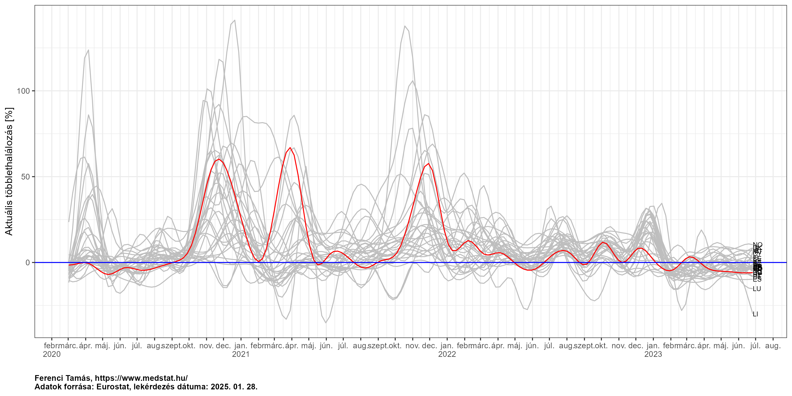<!-- -->

Látszik, hogy a kétféle relatív mutató között nincs nagy különbség.
Kicsit direktebben is összevethetjük őket, ha országonként külön-külön
ábrázoljuk, egymással szemben:

``` r
ggplot(res[age=="TOTAL"&nuts_level==0], aes(x = increase, y = excess/population*1e6)) + geom_line() +
  labs(x = "Aktuális többlethalálozás [%]", y = "Aktuális többlethalálozás [fő/1M fő]",
       caption = paste0(captionlab, format(Sys.Date(), "%Y. %m. %d."))) +
  facet_wrap(~geo) + geom_abline(intercept = 0, slope =  2, alpha = 0.3) +
  theme(plot.caption = element_text(face = "bold", hjust = 0), legend.position = "bottom",
        legend.title = element_blank())
```

<!-- -->

Az ábra az origón átmenő, 2 meredekségű egyenest tünteti fel a
viszonyítást segítendő. (Miért pont erre illeszkednek jól? E szerint a
100% többlet – azaz épp a halálozás – 200 fő/M főnek felel meg. De
vigyázat, ez heti adat, így az éves az 52 ⋅ 200 = 10400, ami ezer főre
vetítve 10,4, és csakugyan ennyi nagyjából az európai országok nyers
halálozási rátája.) Ez egyúttal arra a korábban is tárgyalt jelenségre
is rámutat, hogy mi a lélekszámra vetítés jellegzetessége: függ a nyers
halandóságtól. Ilyen szempontból a várt halálozásra való vetítés jobb,
de mint láthatjuk, a különbség európai viszonyokon belül nem nagy. A
várt értékre való vetítés hátránya, azon a már említett szemponton túl,
hogy egy eleve becsült értékkel oszt, egyrészt az, hogy nem vethető
közvetlenül össze a jelentett halálozással (hiszen más a mértékegységük
is), másrészt pedig az, hogy nem nyilvánvaló a kumulálása (de azért
megoldható, lásd következő pont).

Folytassuk most az összesített többlethalálozással. Emlékeztetőül a
népességszámra vetített ábra:

``` r
ggplot(res[nuts_level==0&age=="TOTAL"], aes(x = date, y = cumexcess/meanpopulation*1e6, group = geo, label = geo)) +
  geom_line(aes(color = geo=="HU")) + geom_abline(slope = 0, intercept = 0, colour = "blue") +
  scale_color_manual(values=c("FALSE" = "gray", "TRUE" = "red")) + guides(color = "none") +
  labs(x = "", y = "Összesített többlethalálozás [fő/1M fő]",
       caption = paste0(captionlab, format(Sys.Date(), "%Y. %m. %d."))) +
  scale_x_date(date_breaks = "months", labels = scales::label_date_short()) +
  directlabels::geom_dl(method = list("last.points", cex = 0.6)) +
  theme(plot.caption = element_text(face = "bold", hjust = 0),
        legend.position = "bottom", legend.title = element_blank())
```

<!-- -->

Kérdés, hogy mi a helyzet a várt értékre vetített mutatóval. A probléma
a kumulálás, hiszen a százalékok természetesen nem adhatóak egyszerűen
össze. Ha kicsit nyakatekertebb is, de van megoldás, külön kumuláljuk a
többletet és a várt értéket, majd ezeket osztjuk el egymással:

``` r
ggplot(res[age=="TOTAL"&nuts_level==0], aes(x = date, y = cumexcess/cumexpected, group = geo, label = geo)) +
    geom_line(aes(color = geo=="HU")) + geom_abline(slope = 0, intercept = 0, colour = "blue") +
    scale_color_manual(values = c("FALSE" = "gray", "TRUE" = "red")) + guides(color = "none") +
    labs(x = "", y = "Összesített többlethalálozás [%]",
         caption = paste0(captionlab, format(Sys.Date(), "%Y. %m. %d."))) +
    scale_x_date(date_breaks = "months", labels = scales::label_date_short()) +
    directlabels::geom_dl(method = list("last.points", cex = 0.6)) +
    theme(plot.caption = element_text(face = "bold", hjust = 0),
          legend.position = "bottom", legend.title = element_blank())
```

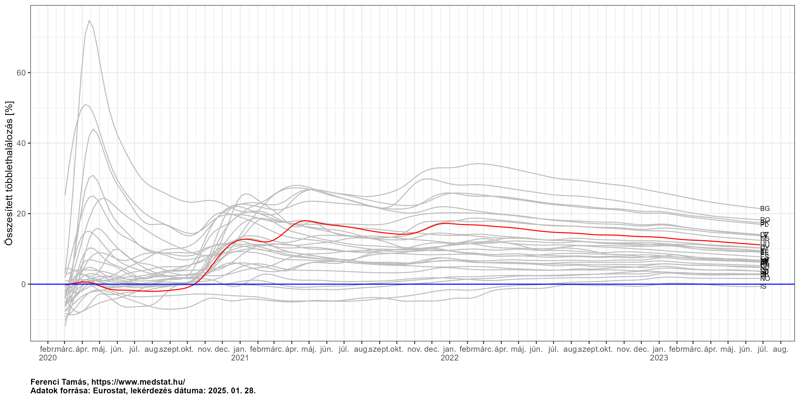<!-- -->

A kép természetesen itt is hasonló, de azért érdemes megnézni a
különbségeket, mert szépen illusztrálják az elméleti mondanivalót.
Vegyük például Olaszországot: a lélekszámra vetített ábrán jobb
helyzetben van mint mi, itt viszont rosszabban. A magyarázat pontosan
az, hogy más a nyers halandóság; az egész adatbázist tekintve
Olaszországban 10.8 /1000 fő/év, míg Magyaroszágon ugyanez 13.3 /1000
fő/év. Azaz Olaszországban kevesebben halnak meg lakosságarányosan, így
a várt halálozás is kisebb lakosságarányosan, és ez a magyarázat: ha
kisebb számmal osztunk, akkor nagyobb értéket kapunk, és ezért kerülnek
rosszabb helyzetbe mint mi.

(A mostani kérdés szempontjából nincs jelentősége, de azért fontos
megjegyezni, hogy az előbbi számok *nyers* halandóságok – mielőtt valaki
azt gondolja, hogy az, hogy nálunk nagyobb, önmagában azt jelenti, hogy
itt rosszabb a helyzet, járványtól függetlenül. Ez nem igaz, simán
lehetne még jó hír is, például ha nálunk idősebb a korfa; ezért van az,
hogy a nyers mutatók rendkívül félrevezetőek lehetnek.)

### Összevetés a jelentett halálozással

Következő lépésben kiszámoljuk a 3 betűs ISO-országkódot, a 2 betűs
Eurostat kódból, hogy később az OWID adatbázissal lehessen egyesíteni:

``` r
res$iso_code <- countrycode::countrycode(ifelse(res$nuts_level==3, NA_character_, res$geo),
                                         "eurostat", "iso3c")
```

A jelentett halálozás céljából letöltjük az OWID adatbázist, kikóduljuk
ott is az évet és a hetet, majd ott is áttérünk heti adatokra:

``` r
EpiData <- fread("https://covid.ourworldindata.org/data/owid-covid-data.csv")
EpiData$year <- lubridate::year(EpiData$date)
EpiData$week <- lubridate::isoweek(EpiData$date)
EpiData$new_deaths[is.na(EpiData$new_deaths)] <- 0
EpiData <- EpiData[,.(new_deaths = sum(new_deaths)) , .(iso_code, year, week)]
```

Egyesítjük az előbbi táblával, és a jelentett halálozásokat itt is
felkumuláljuk:

``` r
res <- merge(res, EpiData, by = c("iso_code", "year", "week"))
res[, cumnewdeaths := cumsum(new_deaths), .(geo, age)]
```

Megnézhetjük Magyarország példáján a kétféle adatsort:

``` r
ggplot(melt(res[age=="TOTAL"&geo=="HU", .(date, `Többlethalálozás` = excess/population*1e6,
                             `Regisztrált koronavírus-halálozás` = new_deaths/population*1e6)],
            id.vars = "date"), aes(x = date, y = value, group = variable, color = variable)) + geom_line() +
  labs(x = "", y = "Heti halálozás [fő/M fő]",
       caption = paste0(captionlab, format(Sys.Date(), "%Y. %m. %d."))) +
  scale_color_manual(values = scalval, limits = force) +
  scale_x_date(date_breaks = "months", labels = scales::label_date_short()) +
  theme(plot.caption = element_text(face = "bold", hjust = 0), legend.position = "bottom",
        legend.title = element_blank())
```

<!-- -->

Érdekes, hogy a két görbének mind a csúcsa, mind az időbeli felfutása
eltér egymástól, ráadásul az eltérés nem is egységes a különböző
hullámokban. Ennek pontosabb vizsgálata fontos kérdés lenne, itt most
csak néhány – vélhetően – fontos szerepet játszó szempontra hívnám fel a
figyelmet:

-   A többlethalálozás két előnye közül a haláloki besorolás nem
    valószínű, hogy egy országon belül lényegesen változott volna
    időben, de a tesztelési intenzitás már megváltozhat időben.
-   A járvány és annak kezelésének indirekt hatásai szintén nem biztos,
    hogy időben állandóak.
-   A múltbeli adatokból becsült várt halálozási adatoknál szintén
    változhat időben a becslés jósága. Ennek legkézenfekvőbb oka az
    influenza-szezon (mely a legvalószínűbb magyarázat például arra,
    hogy február elején hogyan lehet, hogy nulla a többlethalálozás,
    miközben nagyon is van koronavírusos halálozás). Erre a kérdésre még
    egy külön pontban, jóval részletesebben visszatérek később.
-   Végezetül fontos hangsúlyozni (sajnos a magyar adatközlés ezt nem
    teszi túl egyértelművé, így sokan félreértik), hogy a regisztrált
    magyar halálozásoknál a közlés dátuma az a halál *jelentésének* a
    dátuma, nem a *bekövetkezésének* a dátuma. Márpedig a kettő között
    akár tetemes különbség is lehet, pláne, ha épp a sok halálozás miatt
    elmarad az adminisztráció és torlódnak az adatok. Fontos lenne a
    kérdés számszerű vizsgálata is, tehát, hogy mikor mekkora különbség
    volt a kettő között és hogy nézne ki a halálozások görbéje a
    bekövetkezésük dátuma alapján megrajzolva; sajnos a magyar
    adatközlés ezt nem teszi lehetővé, ugyanis semmilyen adatot nem
    közöl nyilvánosan a bekövetkezés dátumáról. Megjegyzem, hogy ugyanez
    a kérdés a többlethalálozásnál is felmerül, szerencsére az [Eurostat
    adatainál](https://ec.europa.eu/eurostat/cache/metadata/en/demomwk_esms.htm#coher_compar1612863315336)
    mindegyik általunk használt ország esetében, így Magyarországnál is,
    a bekövetkezés dátuma alapján gyűjt és közöl adatokat. Az egyedüli
    kivétel Anglia, ahol nem az Eurostat, hanem az STMF adatai
    szerepelnek, és azok Anglia esetében a jelentés dátuma szerint
    mennek (és az Eurostathoz leadott régi adataik is ilyenek voltak).

Vagy a kétféle adat viszonyát, pontosabban annak alakulását időben az
összes országra:

``` r
ggplot(res[age=="TOTAL"], aes(x = date, y = cumexcess/cumnewdeaths, group = geo)) + geom_line() +
  coord_cartesian(xlim = c(as.Date("2020-07-01"), NA), ylim = c(-1, 3)) + facet_wrap(~geo) +
  geom_hline(yintercept = 1, col = "red") +
  labs(x = "", y = "Többlethalálozás / jelentett halálozás",
       caption = paste0(captionlab, format(Sys.Date(), "%Y. %m. %d."))) +
  scale_x_date(date_breaks = "2 months", labels = function(z) gsub("^0", "", strftime(z, "%m"))) +
  theme(plot.caption = element_text(face = "bold", hjust = 0), legend.position = "bottom",
        legend.title = element_blank())
```

<!-- -->

Ezen az ábrán a többlet és a jelentett halálozás hányadosa látható, a
piros vonal jelzi a kettő egyenlőségét, tehát a fölötte lévő érték
jelenti azt, hogy a többlet meghaladja a jelentett halálozást, az alatta
lévő azt, hogy kisebb a többlet, mint a jelentett.

Érdekes lehet összevetni a kétféle mutatót az aktuális helyzet szerint.
Amint korábban volt is róla szó, a többlethalálozás utolsó adatai nem
véglegesek, ezért korrektebb egy régebbi állapotot nézni; vegyük az egy
hónappal megelőzőt, amikor a regisztráltság már szinte tökéletes (a
fekete vonal az egyenlőség vonala, ahol a többlethalálozás egyezne a
jelentett halálozással):

``` r
ggplot(res[age=="TOTAL", .SD[nrow(.SD)-4], .(geo, age)], aes(x = cumexcess/population*1e6,
                                           y = cumnewdeaths/population*1e6, label = geo)) +
  geom_point(aes(col = geo=="HU")) + geom_abline() + geom_text(hjust = "left", nudge_x = 30) +
  scale_color_manual(values=c("FALSE" = "gray", "TRUE" = "red")) + guides(color = "none") +
  labs(x = "Összesített többlethalálozás [fő/1M fő]", y = "Összesített jelentett halálozás [fő/M fő]",
       caption = paste0(captionlab, format(Sys.Date(), "%Y. %m. %d."))) +
  theme(plot.caption = element_text(face = "bold", hjust = 0), legend.position = "bottom",
        legend.title = element_blank())
```

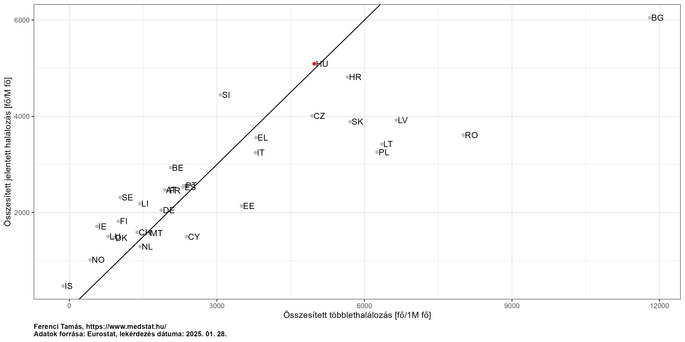<!-- -->

(Itt nem ugyanaz az időpont van az egyes országoknál, hiszen
mindegyiknél a saját legrégebbi közölt adata az alap.)

Látszik, hogy az országok többségében a többlethalálozás meghaladja a
jelentett (és ahol nem, ott is csak minimális a különbség). Ellenkező
irányban azonban akár nagyon komoly eltérések is lehetnek.

Zárásként nézzük meg az összesített magyar helyzetet mindkét mutatóval,
és a konkrét számokat is feltüntetve (szándékosan 100-ra kerekítve, hogy
elkerüljük a túlzott pontosság hamis érzetét), most kivételesen abszolút
skálán:

``` r
p <- ggplot(melt(res[geo=="HU"&age=="TOTAL", .(date, `Többlethalálozás` = cumexcess,
                                  `Regisztrált koronavírus-halálozás` = cumnewdeaths)],
                 id.vars = "date"), aes(x = date, y = value, group = variable, color = variable,
                                        label = round(value, -2))) + geom_line() +
  directlabels::geom_dl(data = melt(tail(res[geo=="HU"&age=="TOTAL",
                                             .(date, `Többlethalálozás` = cumexcess,
                                               `Regisztrált koronavírus-halálozás` = cumnewdeaths)], 1),
                                    id.vars = "date"), method = list("last.points", cex = 0.6)) +
  labs(x = "", y = "Halálozás [fő]", caption = paste0(captionlab, format(Sys.Date(), "%Y. %m. %d."))) +
  scale_color_manual(values = scalval, limits = force) +
  scale_x_date(date_breaks = "months", labels = scales::label_date_short()) +
  theme(plot.caption = element_text(face = "bold", hjust = 0), legend.position = "bottom",
        legend.title = element_blank())
p
```

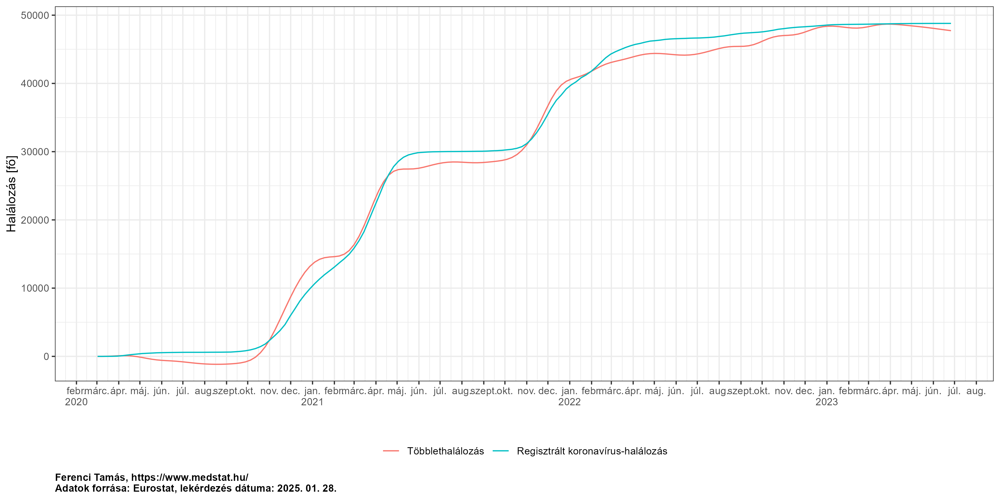<!-- -->

A korábban már felvázolt „lassú” adatszolgáltatási folyamatnak, tehát a
HVB-k alapján történő, az Egészségügyi Világszervezet protokollját
követő besorolásnak [egy eredménye van
meg](https://www.ksh.hu/stadat_files/nep/hu/nep0009.html): a 2020 évi
összesített adat, e szerint 8981 halálesetet soroltak a mostani
koronavírus miatt bekövetkezettnek. Érdemes – egy ponttal – ezt is
megjelölni az ábrán:

``` r
p + geom_point(data = data.frame(x = as.Date("2020-12-31"), y = 8981),
               inherit.aes = FALSE, aes(x = x, y = y, fill = "HVB-k szerinti koronavírus-halálozás"))
```

<!-- -->

Mint látszik, nagy különbség nincsen, az eredmény szépen egybecseng a
másik két adatsorral. Ez fontos abból a szempontból, hogy cáfolja azt a
vélekedést, miszerint a gyors regisztrálás „boldog-boldogtalant”
koronavírusos halottnak sorol, szemben a precíz besorolással; igazán
érdekes azonban a későbbi értéke lesz. Sajnos, mint volt is róla szó,
ezt legközelebb csak 2021 egész évre fogjuk megtudni, azt is csak
2022-ben (és nem az elején).

### Összevetés a jelentett halálozással – magyar megyei adatok

Bármennyire is kézenfekvőnek tűnik (és fontos is), ez sajnos nem oldható
meg, hiszen Magyarországon nincs nyilvános adatközlés a halálozások
területi eloszlásáról, még megyei szinten sem.

A fertőzöttekről ugyan van (mégpedig olyan módon, hogy a számokat egy
képfájlra (!) felírják…), de annak összevetése kérdésesebb, hiszen –
mint már volt róla korábban is szó – ott még közben van a halálozási
arány is, ami miatt ez a kapcsolat áttételes.

### Érzékenységvizsgálat

A korábbiakban is hangsúlyosan szerepelt, hogy az eredmény függ attól,
hogy milyen módszerrel jelezzük előre a várt halálozást. Érdemes azonban
még jobban megvizsgálni, hogy mennyire nem mindegy, hogy milyen módszert
választunk – adott esetben még apróságnak tűnő részletektől is nagyban
függhet az eredmény.

Vegyük például lerögzítettnek, hogy Acosta és Irizarry módszerét
használjuk, és csak azt módosítsuk, hogy mennyi múltbeli információt
használunk a modell felállításához. Az Eurostat adatbázisban
Magyarország adatai 2000-ig visszamenőleg érhetőek el; az fenti
elemzések mind úgy készültek, hogy az összes adatot használták. De mi
történik akkor, ha ezt leszűkítjük? A következő ábra azt mutatja, hogy
mennyi a járvány teljes időtartamára kapott (abszolút) többlethalálozás,
ha csak egy adott évig visszamenőleg használjuk fel az adatokat a várt
halálozást előrejelző modell becsléséhez:

``` r
SensDat <- data.table(year = 2000:2015)
SensDat$excess <- sapply(SensDat$year, function(y)
  tail(excess_cumulative(excess_model(RawData[geo=="HU"&age=="TOTAL"&year>=y], start = min(RawData[geo=="HU"&age=="TOTAL"]$date),
                                      end = max(RawData[geo=="HU"&age=="TOTAL"]$date), exclude = exclude_dates,
                                      frequency = nrow(RawData[geo=="HU"&age=="TOTAL"&year>=y])/
                                        (as.numeric(diff(range(RawData[geo=="HU"&age=="TOTAL"&year>=y]$date)))/365.25)),
                         min(exclude_dates), max(exclude_dates)), 1)[["fitted"]])
ggplot(SensDat, aes(x = year, y = excess)) + geom_line() + geom_point() +
  labs(x = "Kezdőév", y = "Összesített teljes többlethalálozás [fő]")
```

<!-- -->

Látható, hogy a teljes (2000-ben kezdődő) adatsort felhasználva kb. 22
ezer fő a becsült többlethalálozás, ezt eddig is tudtuk, de ha 2015-től
becsültetjük csak a várt halálozás előrejelző modellt, akkor máris több
mint 26 ezer! Ekkora különbséget okozhat az a – elsőre talán nem túl
nagynak tűnő – különbség, hogy felhasználunk 5 évnél is régebbi
adatokat.

Mi ennek az oka? Azonnal megértjük, ha megnézzük a mortalitás alakulását
Magyarországon. Az illusztráció kedvéért először számoljuk ki az éves
adatokat (nyers mortalitásokat):

``` r
ggplot(RawData[geo=="HU"&age=="TOTAL"&year<=2019, .(mort = sum(outcome)/sum(population)*1000*52), .(year)],
       aes(x = year, y = mort)) + geom_line() + geom_point() +
  labs(x = "Év", y = "Nyers mortalitás [/1000 fő/év]")
```

<!-- -->

Ha erre az egész, 2000-ben kezdődő adatbázisra illesztünk hosszú távú
görbét, akkor a legvégén egy gyorsan növekvő trendet fogunk látni:

``` r
fitSens <- mgcv::gam(outcome ~ s(year) + s(week, bs = "cc"), offset = log(population), family = quasipoisson,
                     data = RawData[geo=="HU"&age=="TOTAL"&year<=2019])
predgrid1 <- CJ(year = 2000:2019, week = 1:52)
predgrid1$pred <- predict(fitSens, newdata = predgrid1, type = "response")

ggplot(RawData[geo=="HU"&age=="TOTAL"&year<=2019, .(mort = sum(outcome)/sum(population)*1000*52), .(year)],
       aes(x = year, y = mort)) + geom_line() + geom_point() +
  labs(x = "Év", y = "Nyers mortalitás [/1000 fő/év]") +
  geom_line(data = predgrid1[,.(mort = sum(pred)*1000),.(year)], color = "blue")
```

<!-- -->

Ezt meghosszabbítva 2020-ra, 2021-re, pláne magasan levő alapvonalat
fogunk kapni, amihez viszonyítunk – így a különbözet is kisebb lesz.

Más azonban a helyzet, ha csak 2015-től nézzük a képet:

``` r
fitSens <- mgcv::gam(outcome ~ s(year, k = 3) + s(week, bs = "cc"), offset = log(population),
                     family = quasipoisson, data = RawData[geo=="HU"&age=="TOTAL"&year<=2019&year>=2015])
predgrid2 <- CJ(year = 2015:2019, week = 1:52)
predgrid2$pred <- predict(fitSens, newdata = predgrid2, type = "response")

ggplot(RawData[geo=="HU"&age=="TOTAL"&year<=2019&year>=2015, .(mort = sum(outcome)/sum(population)*1000*52), .(year)],
       aes(x = year, y = mort)) + geom_line() + geom_point() +
  labs(x = "Év", y = "Nyers mortalitás [/1000 fő/év]") +
  geom_line(data = predgrid2[,.(mort = sum(pred)*1000),.(year)], color = "blue")
```

<!-- -->

Ebben az esetben a végén csak egy sokkal-sokkal kisebb növekedés fog
látszódni, így azt meghosszabbítva egy alacsonyabban lévő várt
halálozást kapunk – amihez képest ugyanaz a tényleges halálozás
természetesen nagyobb többletet fog jelenti.

Még látványosabb, ha egy ábrán jelenítjük meg a kettőt:

``` r
ggplot(RawData[geo=="HU"&age=="TOTAL"&year<=2019, .(mort = sum(outcome)/sum(population)*1000*52), .(year)],
       aes(x = year, y = mort)) + geom_line() + geom_point() +
  labs(x = "Év", y = "Nyers mortalitás [/1000 fő/év]") +
  geom_line(data = predgrid1[,.(mort = sum(pred)*1000),.(year)], color = "blue") +
  geom_line(data = predgrid2[,.(mort = sum(pred)*1000),.(year)], color = "red")
```

<!-- -->

A dolognak van egy nagyon fontos általános tanulsága: kritikus, hogy az
ember érezze, hogy a többlethalálozási eredmények nem kőbevésettek. A
fenti megállapítás az volt, hogy 22 ezer fő a többlethalálozás, de
láthatjuk, hogy egy apró paraméter állításával, kicsit más előrejelző
modellel ehelyett 26 ezret kapunk. Természetesen ez nem jelenti azt,
hogy akkor ezekkel a kérdésekkel nem is érdemes foglalkozni, hiszen
bármi kijöhet, ellenkezőleg, nagyon is fontos végiggondolni, jelen
példában, hogy milyen kezdőévtől használjuk az adatokat, de mindez
felhívja a figyelmet arra, hogy túl nagy pontossággal nem érdemes
megadni az eredményeket. (És persze arra is, hogy igenis van jelentősége
a “technikai részletkérdéseknek” is!)

Az „érzékenységvizsgálat” kifejezés alatt tipikusan azt szokták érteni,
hogy a végeredmény hogyan függ a felhasznált paraméterek értékétől.
Természetesen nem csak a becsléshez használt adatbázis időtartama az
egyetlen ilyen paraméter: az Acosta-Irizarry eljárás egy sor további
paramétert is használ. Ugyanúgy megnézhetjük, hogy ezek változtatása
hogyan hat az eredményre, például, hogy milyen típusú modellt
választunk:

``` r
SensDat <- CJ(year = 2000:2015, model = c("quasipoisson", "correlated"))
SensDat$excess <- sapply(1:nrow(SensDat), function(i)
  tail(excess_cumulative(excess_model(RawData[geo=="HU"&age=="TOTAL"&year>=SensDat$year[i]],
                                      start = min(RawData[geo=="HU"&age=="TOTAL"]$date),
                                      end = max(RawData[geo=="HU"&age=="TOTAL"]$date), exclude = exclude_dates,
                                      control.dates = as.Date(setdiff(seq(min(RawData[geo=="HU"&age=="TOTAL"]$date),
                                                                          max(RawData[geo=="HU"&age=="TOTAL"]$date),
                                                                          by = "day"), exclude_dates),
                                                              origin = "1970-01-01"),
                                      model = SensDat$model[i], max.control = 10000,
                                      frequency = nrow(RawData[geo=="HU"&age=="TOTAL"&year>=SensDat$year[i]])/
                                        (as.numeric(diff(range(RawData[geo=="HU"&age=="TOTAL"&year>=
                                                                         SensDat$year[i]]$date)))/365.25)),
                         min(exclude_dates), max(exclude_dates)), 1)[["fitted"]])
ggplot(SensDat, aes(x = year, y = excess, color = model)) + geom_line() +
  labs(x = "Kezdőév", y = "Összesített teljes többlethalálozás [fő]", color = "Modell típusa")
```

<!-- -->

Ezt az eredményt úgy lehet leolvasni, hogy a kezdőévre érzékeny a
végeredmény, de a modell típusára gyakorlatilag nem. És persze az is
látszik, hogy mi a tartománya az eredményeknek: 22 ezer és 26 ezer fő
között van a többlethalálozás, és immár mondhatjuk, hogy minden
kezdőév-választás, és minden modelltípus-választás mellett.

Ez a fajta érzékenységvizsgálat volt a legáltalánosabb, mert a
paramétereket úgymond kombinatorikusan használtuk fel, tehát minden
lehetséges kombinációjukra kiszámítottuk a végeredményt. Ez ugyan
tényleg teljesen általános, viszont cserében nagyon gyorsan elszáll a
kombinációk száma, így néhány paraméternél többre már nem használható
(részint mert hatalmas lesz a számítási idő, részint mert nagyon nehezen
értelmezhető lesz a végeredmény).

Természetesen az sem kötelező, hogy csak az Acosta-Irizarry eljárás
paramétereit vizsgáljuk, elvileg mellé lehetne rakni a korábban
felvázolt egyéb modelleket is, ez is egyfajta érzékenységvizsgálat. Ez
azonban jelen helyzetben nem feltétlenül értelmes ötlet, hiszen az
érzékenységvizsgálatot olyan paraméterekre kell elvégezni, amelyek
értékét nem tudjuk biztosan jól megválasztani; arra nem illik
érzékenységvizsgálatot csinálni, amiről tudjuk, hogy nem jó választás
(pl. az elmúlt néhány év átlagát használni).

### A direkt hatás elkülönítése: egy kísérlet az influenza-járvány kezelésére

Láthattuk, hogy a többlethalálozási mutató legnagyobb baja, hogy
igazából *nem* a járvány direkt hatását méri. Szintén megbeszéltük, hogy
két nagy baja van: hogy függ a várt érték előrejelzésétől, és hogy
beleméri az eredménybe a járvány és kezelésének indirekt hatásait is.
Mindezeket összegezve úgy fogalmazhatnánk, hogy többlethalálozás =
direkt hatás + indirekt hatások + előrejelzés tévedése a járványtól
független halandóságról. A probléma épp az, hogy nekünk az elsőre lenne
szükségünk, de csak az összeget látjuk. Így nézve egy meglehetősen
kézenfekvő ötlet, hogy próbáljuk a másik két tényezőt számszerűsíteni,
mert ha azokat sikerülne meghatározni, akkor egyszerűen kivonva őket a
többlethalálozásból megkapjuk a keresett direkt hatást!

Jelen pont erre fog egy példát mutatni: a cél az lesz, hogy az
influenza-járvány hatását próbáljuk meg figyelembe venni, és ezzel
korrigálni a kapott becslést; más tényezővel nem foglalkozunk.
Előrebocsátom, hogy a terület egy aknamező, így ez hangsúlyozottan csak
kiegészítő elemzés. Első ránézésre meglepő lehet ez az állítás: miért
problémás ha valamivel korrigálunk? Persze, rendben, van még egy sor
másik tényező is, de így legalább eggyel beljebb vagyunk! – mondhatja
valaki. A probléma azonban épp ez: ha egyszer belekezdünk abba, hogy
elkezdünk korrigálgatni bizonyos tényezőkre, akkor nagyon ingoványos
talajra kerülünk: miért pont azokra korrigálunk? A többire miért nem?
Hol húzzuk meg a határt, hogy mire próbálunk korrigálni és mire nem?
Igen, lehet mondani, hogy így egy dologtól megtisztítottuk, míg az
eredeti attól az egytől sincs tisztítva, de így legalább az eredetinek
világos, egyértelmű, pontosan definiált a tartalma! Mindenki tudja, hogy
többlethalálozás, hogy az mit jelent, mit tartalmaz. A „részben
tisztított” mutató már egyáltalán nem egyértelmű, hogy mit jelent,
hogyan hasonlítható össze nemzetközileg stb.

Az, hogy mennyire erősek az ellenérvek a fentiekkel szemben, függ attól
is, hogy mennyire határozottan különíthető el az egyéb
mortalitás-befolyásoló ok, amit le akarunk választani a
többlethalálozásból. Egy elég meglepő, de valós kérdés: kivonjuk-e
Azerbajdzsán és Örményország többlethalálozásából a 2020 végi
hegyi-karabahi háború áldozatainak a számát…? Ez talán még a legjobban
védhető helyzet, hiszen ez teljesen egyértelműen az „előrejelzés
tévedése a járványtól független halandóságról” kategóriában van, mivel
ez nyilván nem volt előrejelezhető a múltbeli halálozási adatokból,
semmilyen módszerrel, másrészt elég jól meghatározható számú halálozást
jelentett. (És ugye ezek jelenleg növelik a koronavírusos halálozást, ha
a többlethalálozást használjuk!) De még így is óvatos lennék, még ezzel
is, épp a fenti okok miatt.

Hangsúlyozva tehát még egyszer az ezzel kapcsolatos fenntartásokat, egy
konkrét példát nézzünk meg: az influenza-járvány kezelését. Azért ezt,
mert magyar viszonyok között talán ez jelenti a legmarkánsabb olyan
forrását a mortalitásnak, ami évről-évre lényegesen változik, és
ráadásul indirekt hatásként is megjelenhet (a védekező intézkedések
természetesen minden légúti kórokozó ellen jót tesznek). A jelentősége
azonnal látható is, ha az ember ránéz az aktuális többlethalálozást és a
regisztrált halálozást egyszerre feltüntető ábrára: hogyan lehet, hogy
február elején szó szerint nulla volt a többlethalálozás, miközben
regisztrált halálozás volt, annyira nem is kevés…? Bizonyosan
természetesen nem lehet megválaszolni, pont a többlethalálozás fenti
nehézségei miatt, de nagyon erős lehet a gyanúnk, hogy az influenza a
magyarázat: 2020/21-ben az influenza-szezon praktikusan elmaradt, és ha
ennek valóban a védekezés az oka, akkor ez lényegében egy pozitív
indirekt hatás. Mivel azonban ez a többlethalálozásban benne van, így
valójában a járvány okozta halálozás *még több*, mint amit kimutattunk –
csak épp abból levonódik az influenza-járvány megúszása! (Úgy is
fogalmazhatnánk, hogy a koronavírus lecserélte az influenzát: igen,
nulla volt többlethalálozás, de a helyes megfogalmazás, hogy *annak
ellenére* is *csak* nulla volt a többlethalálozás, hogy kiesett az
influenza!)

Hogy tudnánk ezt valahogy kezelni, korrigálni? Az egyik lehetőség, hogy
megnézzük a múltbeli influenza-járványok halálozásaira vonatkozó
adatokat és azt egész egyszerűen hozzáadjuk a mostani
többlethalálozáshoz (mondván, hogy ennyit vontunk le szükségtelenül).
Eljárhatunk azonban jóval elegánsabban is. Mint már volt róla szó, a
várt halálozást előrejelző modellnek meg kell adni, hogy melyik adatok
vannak kizárva a modell becsléséből; ez jelenleg a 2020. március 1.
utáni dátumokat jelenti, hogy maga a vizsgált járvány ne legyen benne,
értelemszerűen. Igen ám, de megtehetjük, hogy ezeket a kizárt dátumokat
kibővítjük: szintén kivesszük az influenza-szezonokat, azaz a stratégia
az, hogy ilyen módon megbecslünk egy „influenza nélküli” alapvonalat, és
ezt vonjuk ki mint várt halálozást! Ezzel lényegében automatikusan
korrigálunk az influenza-járványra.

A dolog azonban ennél egy kicsit bonyolultabb: azt sem tehetjük meg,
hogy az összes influenza-szezont kivesszük, hiszen akkor meg nem lesz
miből megbecsülni ezen hetekre a szezonális mintázatot. A megoldást csak
az jelentheti, ha *kézzel* megnézzük a múltbeli adatokat, és ahol más
forrásból tudjuk, hogy nem, vagy nagyon enyhe influenza-szezon volt, azt
*mégis* visszatesszük, hogy a modell ebből meg tudja ezekre a hetekre is
becsülni a szezonális mintát. Magyarország esetében szerencsés a
helyzet, mert a 2019/2020 pont jó példa erre.

(Valójában ez nem teljesen igaz. Mivel Acosta és Irizarry eljárása egy
meghatározott formájú – szép hullámosan ingadozó – függvényt illeszt a
szezonális mintázatra, így akkor is működni fog, ha egy adott
időintervallumra egyáltalán semelyik évben nincs megfigyelésünk, mert ha
a többiből meg tudja ezen függvényforma paramétereit becsülni, akkor az
kiad valamilyen lefutást erre az intervallumra is. Mindazonáltal
biztosabb a becslés, ha mindenhol és minél több adatunk van.)

Az egyszerűség kedvéért mondjuk, hogy Magyarországon a
január-február-március az influenza-szezon, ezt a három hónapot zárjuk
ki minden évben (kivéve tehát 2020-at). Hogy látható legyen ennek a
hatása, érdemes megnézni, hogy mi a várt halálozás becsült görbéje a két
módon

``` r
exclude_dates_flu <- c(do.call(c, sapply(2000:2019, function(i) seq(as.Date(paste0(i, "-01-01")),
                                                                    as.Date(paste0(i, "-03-31")),
                                                                    by = "day"))),
                       seq(as.Date("2020-03-01"), max(RawData$date), by = "day"))

exp_orig <- with(compute_expected(RawData[geo=="HU"&age=="TOTAL"], exclude = exclude_dates,
                             frequency = nrow(RawData[geo=="HU"&age=="TOTAL"])/
                               (as.numeric(diff(range(RawData[geo=="HU"&age=="TOTAL"]$date)))/365.25)),
                 data.table(type = "Eredeti többlethalálozás", date, expected))
exp_flu <- with(compute_expected(RawData[geo=="HU"&age=="TOTAL"], exclude = exclude_dates_flu,
                             frequency = nrow(RawData[geo=="HU"&age=="TOTAL"])/
                               (as.numeric(diff(range(RawData[geo=="HU"&age=="TOTAL"]$date)))/365.25)),
                data.table(type = "Többlethalálozás az influenza-szezonok kizárásával", date, expected))

ggplot(rbind(exp_orig, exp_flu), aes(x = date, y = expected, color = type)) + geom_line() +
  labs(x = "Év", y = "Várt heti halálozás [fő/hét]", color = "") +
  theme(legend.position = "bottom")
```

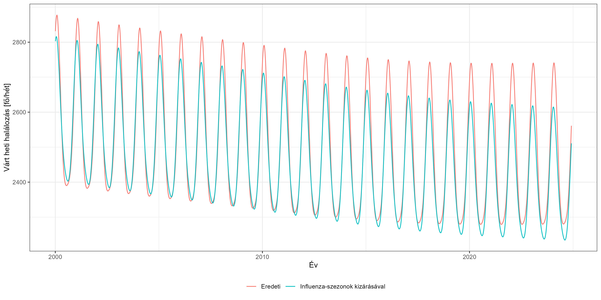<!-- -->

Szépen látszik, hogy az influenza-szezonok nélkül becsültetett modell
kevésbé fut fel magas értékekre – hiszen nem kell ráilleszkednie az
akkori magasabb halálozásokra.

És itt már látszik az ötlet működése: ha ehhez a – 2021 elején is
alacsonyabban lévő – értékhez viszonyítunk, akkor nem fogja
lecsökkenteni a többlethalálozást az, hogy a viszonyítási alapérték
tartalmazza az – abban az évben be sem következett – influenza-szezont.
Nézzük az eredményeket:

``` r
res_flu <- rbindlist(lapply(list(`Többlethalálozás` = exclude_dates,
                                 `Többlethalálozás az influenzára való korrekcióval` = exclude_dates_flu),
                            function(ed)
                              with(excess_model(RawData[geo=="HU"&age=="TOTAL"], start = min(RawData[geo=="HU"&age=="TOTAL"]$date),
                                                end = max(RawData[geo=="HU"&age=="TOTAL"]$date), exclude = ed,
                                                frequency = nrow(RawData[geo=="HU"&age=="TOTAL"])/
                                                  (as.numeric(diff(range(RawData[geo=="HU"&age=="TOTAL"]$date)))/365.25)),
                                   data.table(date = date, observed = observed, expected = expected,
                                              y = 100 * (observed - expected)/expected,
                                              increase = 100 * fitted,
                                              excess = expected * fitted,
                                              se = sapply(1:length(date), function(i) {
                                                mu <- matrix(expected[i], nr = 1)
                                                x <- matrix(x[i,], nr = 1)
                                                sqrt(mu %*% x %*% betacov %*% t(x) %*% t(mu))
                                              })))), idcol = TRUE)
res_flu <- res_flu[date>=as.Date("2020-03-01")]
res_flu[, cumexcess := cumsum(excess), .(.id)]

ggplot(res_flu, aes(x = date, y = cumexcess, group = .id, color = .id, label = round(cumexcess, -2))) +
  geom_line() +
  directlabels::geom_dl(data = res_flu[,tail(.SD, 1), .(.id)], method = list("last.points", cex = 0.6)) +
  labs(x = "", y = "Halálozás [fő]", caption = paste0(captionlab, format(Sys.Date(), "%Y. %m. %d."))) +
  scale_color_manual(values = scalval, limits = force) +
  scale_x_date(date_breaks = "months", labels = scales::label_date_short()) +
  theme(plot.caption = element_text(face = "bold", hjust = 0), legend.position = "bottom",
        legend.title = element_blank()) +
  coord_cartesian(ylim = ggplot_build(p)$layout$panel_scales_y[[1]]$range$range) +
  geom_point(data = data.frame(x = as.Date("2020-12-31"), y = 8981),
             inherit.aes = FALSE, aes(x = x, y = y, fill = "HVB-k szerinti koronavírus-halálozás"))
```

<!-- -->

Látszik, hogy így számolva a többlethalálozás 22 ezerről 27 ezer főre
emelkedik, amiben az a nagyon szép, hogy bár teljesen máshogy
dolgoztunk, de tökéletesen visszajött az influenza-szezon 4-5 ezer fős –
teljesen reális értékű – halálozása.

Érdemes ezt egybevetni a jelentett halálozással is:

``` r
res_flu <- rbind(res_flu[, .(.id, date, cum = cumexcess)],
                 res[geo=="HU"&age=="TOTAL", .(.id = "Regisztrált koronavírus-halálozás", date, cum = cumnewdeaths)])

ggplot(res_flu, aes(x = date, y = cum, group = .id, color = .id, label = round(cum, -2))) + geom_line() +
  directlabels::geom_dl(data = res_flu[,tail(.SD, 1), .(.id)], method = list("last.points", cex = 0.6)) +
  labs(x = "", y = "Halálozás [fő]", caption = paste0(captionlab, format(Sys.Date(), "%Y. %m. %d."))) +
  scale_color_manual(values = scalval, limits = force) +
  scale_x_date(date_breaks = "months", labels = scales::label_date_short()) +
  theme(plot.caption = element_text(face = "bold", hjust = 0), legend.position = "bottom",
        legend.title = element_blank()) +
  coord_cartesian(ylim = ggplot_build(p)$layout$panel_scales_y[[1]]$range$range) +
  geom_point(data = data.frame(x = as.Date("2020-12-31"), y = 8981),
             inherit.aes = FALSE, aes(x = x, y = y, fill = "HVB-k szerinti koronavírus-halálozás"))
```

<!-- -->

Az ábra erősen azt sugallja, hogy így már „rendben vagyunk” (azaz, hogy
ezután a korrekció után már a jelentett és a többlethalálozás
gyakorlatilag egybeesik, ezáltal kölcsönösen megerősítve egymást),
azonban nem lehet elégszer hangsúlyozni, hogy ezzel nagyon óvatosnak
kell lenni: most csak egyetlen tényezőt korrigáltunk, miközben rengeteg
további elképzelhető, amik ráadásul lehetnek pozitívak vagy negatívak
is.

## Továbbfejlesztési ötletek

-   [ ] Életkori és nemi lebontás. (Hátha mások a mortalitási trendek! +
    elvesztett életév aspektus)
-   [ ] Életkorra és nemre standardizálás. (van bármi értelme??)
-   [x] A jelentés teljességének a vizsgálata (mennyire nőnek még az
    utolsó adatok, és meddig?). Válasz: Eurostat metadata 13.1-es pont.
-   [ ] Területi adatok használata.
-   [x] Egyszeri hatások kiküszöbölése (influenza!) kiegészítő
    elemzésként.

## Irodalmi hivatkozások

-   Ariel Karlinsky, Dmitry Kobak. “The World Mortality Dataset:
    Tracking excess mortality across countries during the COVID-19
    pandemic.” Elife. 2021 Jun 30;10:e69336. DOI: 10.7554/eLife.69336.
    [Link](https://elifesciences.org/articles/69336).
-   Nazrul Islam, et al. “Excess deaths associated with covid-19
    pandemic in 2020: age and sex disaggregated time series analysis in
    29 high income countries.” BMJ. 2021 May 19;373:n1137. DOI:
    10.1136/bmj.n1137.
    [Link](https://www.bmj.com/content/373/bmj.n1137).
-   Vasilis Kontis, et al. “Magnitude, demographics and dynamics of the
    effect of the first wave of the COVID-19 pandemic on all-cause
    mortality in 21 industrialized countries.” Nat Med. 2020
    Dec;26(12):1919-1928. DOI: 10.1038/s41591-020-1112-0.
    [Link](https://www.nature.com/articles/s41591-020-1112-0).
-   Janine Aron, John Muellbauer. “A pandemic primer on excess mortality
    statistics and their comparability across countries.” Our World in
    Data. 2020 June 29. Preprint.
    [Link](https://ourworldindata.org/covid-excess-mortality).
-   Tóth G. Csaba. “Többlethalandóság a koronavírus-járvány miatt
    Magyarországon 2020-ban.” Korfa. 2021 March;21(2):1-4.
    [Link](https://demografia.hu/kiadvanyokonline/index.php/korfa/article/view/2812/2700).
-   Rolando J Acosta, Rafael A Irizarry. “A Flexible Statistical
    Framework for Estimating Excess Mortality.” medRxiv. 2021 November
    22;2020.06.06.20120857v3. DOI: 10.1101/2020.06.06.20120857.
    Preprint.
    [Link](https://www.medrxiv.org/content/10.1101/2020.06.06.20120857v3).
